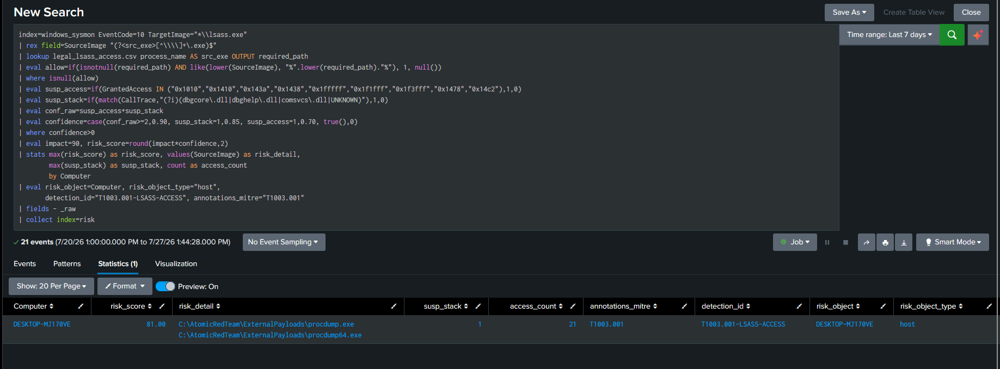
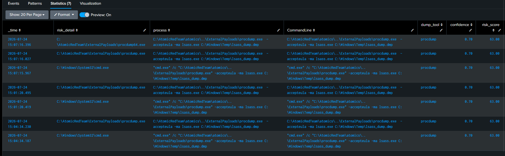
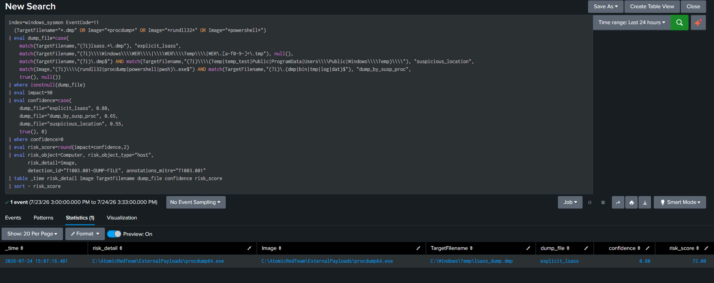
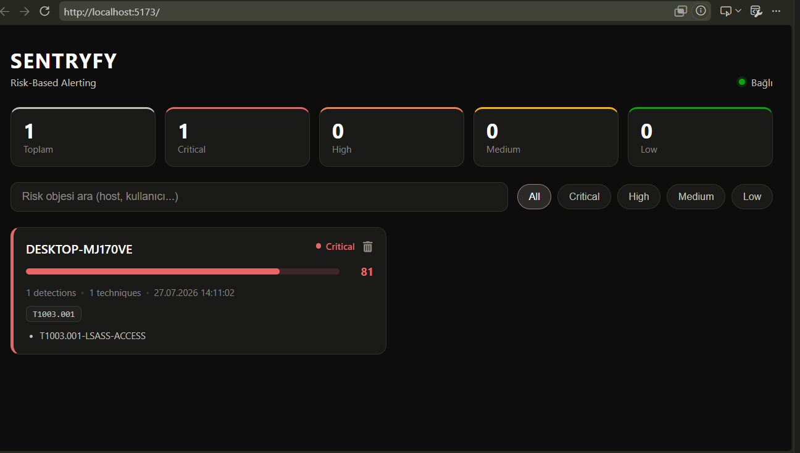

# T1003.001 — OS Credential Dumping: LSASS Memory as a Three-Phase Kill Chain


# 1. Scenario

An operator with local admin runs ProcDump against `lsass.exe`, writing a full memory dump to `C:\Windows\Temp\lsass_dump.dmp` — the raw material for offline credential extraction.

The detection thesis is that **no single event proves this**, but three do together. LSASS is accessed thousands of times a day by legitimate Windows components — `svchost`, `wininit`, `csrss`, Defender, even the SIEM's own forwarder. A rule tuned to alert on LSASS access alone drowns in those. So instead of one detection, the technique is scored across three independent telemetry sources that a real dump touches in sequence:

```
procdump -ma lsass   (EID 1, process create)   ← the command
      │
      ▼
handle to lsass.exe  (EID 10, process access)  ← the access
      │
      ▼
lsass_dump.dmp       (EID 11, file create)     ← the artefact
```

Each phase is a separate feeder writing to a risk index. None alerts on its own. A correlation rule sums them by host: when the same host shows all three phases, `detection_count=3` — a kill chain, not a coincidence. This writeup builds the three feeders, hardens them against the false positives real Windows telemetry produces, and carries the risk score end-to-end to a webhook backend.

---

# 2. Lab Setup

| Component | Detail |
|---|---|
| Target | Windows 11 (`DESKTOP-MJ170VE`), Sysmon (SwiftOnSecurity config) |
| Telemetry | Sysmon EID 10 (ProcessAccess), EID 1 (ProcessCreate), EID 11 (FileCreate) |
| SIEM | Splunk 10.4.0, `index=windows_sysmon` |
| Attack tooling | Atomic Red Team `T1003.001-1` (ProcDump) |
| Risk store | `index=risk` (custom event index) |
| Allowlist | `legal_lsass_access.csv` (process name + required path) |
| Correlation | RBA alert → webhook → local backend |

### Preconditions verified

- **EID 10 is logged.** SwiftOnSecurity configs often disable ProcessAccess (it is noisy). Confirmed present and populating before writing any rule — without it the primary feeder sees nothing.
- **LSASS protection.** Windows 11 may run LSASS as PPL (`RunAsPPL=1`), which blocks even an admin ProcDump with `0x5 Access Denied`. The initial test hit exactly this; PPL was temporarily disabled in the lab to generate baseline dump telemetry. In production, a PPL-enabled host would push this to a PPL-bypass detection (out of scope here).

> Microsoft Defender real-time protection was disabled for telemetry generation. Offensive tools like Mimikatz are quarantined on write otherwise; ProcDump (a signed Sysinternals tool) generally survives, which is one reason attackers favour it.

---

# 3. The Scoring Model

Framework: `risk = impact × confidence`, held constant across techniques.

**Impact = 90 for all three feeders.** LSASS credential material is domain-wide leverage — the highest-impact class in the model. The phase doesn't change the stakes; a dump file is as damaging as the access that produced it.

**Confidence** is where the three feeders differ, because each sees a different quality of evidence:

| Phase | Signal | Max confidence | Reasoning |
|---|---|---|---|
| Access (EID 10) | GrantedAccess mask + CallTrace | 0.90 | Mask + call stack together is near-certain |
| Command (EID 1) | Dump-tool command line | 0.85 | Offensive tool named explicitly |
| File (EID 11) | Dump artefact created | 0.80 | Artefact strong, but name can be masqueraded |

No single feeder reaches a direct-alert score. The alert emerges from their **sum** in the risk layer — which is the entire point of the three-phase design.

---

# 4. Baseline — Who Legitimately Touches LSASS

Before writing the access rule, a 30-day baseline of every process accessing LSASS:

```spl
index=windows_sysmon EventCode=10 TargetImage="*lsass.exe"
| stats count by SourceImage GrantedAccess
```

The result is the whole detection problem in one table:

| SourceImage | GrantedAccess | count |
|---|---|---|
| `svchost.exe` | `0x1000` | 399 |
| **`splunkd.exe`** | **`0x1fffff`** | **31** |
| `MsMpEng.exe` (Defender) | `0x1000`, `0x1010`, `0x1400` | ~28 |
| **`csrss.exe`** | **`0x1fffff`** | 1 |
| **`wininit.exe`** | **`0x1fffff`** | 1 |
| **`procdump64.exe`** (attack) | **`0x1fffff`** | 2 |

The critical finding: **`splunkd`, `csrss`, and `wininit` request `0x1fffff` (PROCESS_ALL_ACCESS) — the identical mask ProcDump uses.** The access mask alone cannot separate the attack from the SIEM's own forwarder. The discriminator is *which process*, not *what access* — which is exactly why an allowlist is mandatory, proven by the lab's own baseline rather than asserted.

---

# 5. Phase 1 — LSASS Access (EID 10)

## 5.1 The Rule

[SPL_Query](../../Rules/Splunk-SPL/Credential-Access/lsass-access.spl)

## 5.2 Signals

| Signal | Weight | Meaning |
|---|---|---|
| `susp_access` | 1 | GrantedAccess is a known dump mask (`0x1010`, `0x1410`, `0x1fffff`, …) |
| `susp_stack` | 1 | CallTrace passes through `dbgcore.dll` / `dbghelp.dll` / `comsvcs.dll` / `UNKNOWN` |

Confidence is tiered so the call stack carries weight the mask can't:

| Condition | Confidence | Catches |
|---|---|---|
| mask **and** call stack | 0.90 | ProcDump, comsvcs — the obvious case |
| call stack only | 0.85 | mask-spoofing tools that fake a benign `0x1000` but can't hide `dbghelp` |
| mask only | 0.70 | noisy-but-plausible access |

The `susp_stack=0.85` tier is the point: advanced tooling can request a low, innocent-looking mask, but the call stack physically routes through the debug libraries — CallTrace is harder to forge than GrantedAccess.



## 5.3 The CallTrace False Positive

The first `susp_stack` pattern included `ntdll.dll+`. Result: **every** access fired — svchost, Defender, everything. `ntdll.dll+` appears in every process's call stack because every Windows call routes through ntdll; it is not a discriminator, it is a constant. Removing it (keeping only the actual dump libraries) dropped the noise instantly. A signal that fires on everything scores nothing.

## 5.4 Validated Output

Post-fix, the entire benign baseline is gone — svchost, splunkd, csrss, wininit, Defender all allowlisted — leaving only:

| risk_detail | GrantedAccess | susp_stack | risk_score |
|---|---|---|---|
| `...\procdump64.exe` | `0x1fffff` | 1 | **81.00** |
| `...\procdump64.exe` | `0x1fffff` | 0 | 63.00 |
| `...\procdump.exe` | `0x1fffff` | 0 | 63.00 |

Two rows for procdump64 — it opens LSASS via two call paths, one through `dbgcore` (0.90) and one direct (0.70). Both are real; both are the same dump.

---

# 6. The Allowlist Bug That Silently Disabled Everything

The allowlist matches process **name and required path** — a fake `C:\temp\svchost.exe` shares the name but not the path, so it can't hide behind the allowlist. The first implementation:

```spl
| eval allow=if(isnotnull(required_path)
    AND match(lower(SourceImage), lower(required_path)), 1, null())
```

**This never matched anything.** `match()` treats its second argument as a regex, and the path values are full of regex metacharacters: `\windows\system32\` becomes `\w` (word-char) + `indows` + `\s` (whitespace) + …; `\program files\splunk\` has `\p` and `\s`. None of these ever matched a literal Windows path. `allow` stayed null for every row, so the allowlist filtered **nothing** — yet threw no error. The rule looked like it worked; it just quietly let everything through.

The fix is `like()`, which treats the pattern as a literal string:

```spl
| eval allow=if(isnotnull(required_path)
    AND like(lower(SourceImage), "%".lower(required_path)."%"), 1, null())
```

This same bug existed in the T1059 parent allowlist (`\AppData\Local\Discord\` → `\A` string-anchor, `\D` non-digit). Its apparent success there was luck — those apps hadn't run in the test window. **A regex-metacharacter path silently disabling an allowlist is the worst failure class: no error, correct-looking output, wrong logic.**

---

# 7. Phases 2 & 3 — Command and Artefact

## 7.1 Phase 2 — Dump-Tool Command Line (EID 1)

[SPL_Query](../../Rules/Splunk-SPL/Credential-Access/t1003-dump-cmdline.spl)

Tool families scored by offensiveness, not treated identically:

| dump_tool | Match | Confidence |
|---|---|---|
| `offensive` | mimikatz, sekurlsa, pypykatz, handlekatz, dumpert, nanodump | 0.85 |
| `comsvcs` | `rundll32 comsvcs.dll MiniDump` | 0.80 |
| `livedump_abuse` | `werfault` / `createdump` **with lsass** | 0.80 |
| `procdump` / `generic` | `procdump -ma lsass`, `-ma lsass` | 0.70 |

`werfault` and `createdump` are legitimate Windows binaries — they only score when the command line also references LSASS, never on their own. Without that gate every application crash would fire the rule.




## 7.2 Phase 3 — Dump-File Creation (EID 11)

[SPL_Query](../../Rules/Splunk-SPL/Credential-Access/t1003-dump-file.spl)

The naive rule keys on `lsass.dmp`, but an attacker renames the output (`chrome.tmp`, `abc.bin`). So the strongest tier keys on **which process wrote the file**, not its name:

| dump_file | Logic | Confidence |
|---|---|---|
| `explicit_lsass` | filename contains `lsass*.dmp` | 0.80 |
| `dump_by_susp_proc` | `rundll32`/`procdump`/`powershell` writes `.dmp`/`.bin`/`.tmp` | 0.65 |
| `suspicious_location` | any `.dmp` in Temp/Public/ProgramData | 0.55 |

`dump_by_susp_proc` defeats filename masquerading — a `.tmp` written by rundll32 is suspicious regardless of what it's called, because those processes don't normally write dump files.




### The WerFault false positive

Phase 3 initially flagged `C:\ProgramData\Microsoft\Windows\WER\Temp\WER.xxx.tmp.dmp` — a benign Windows Error Reporting crash dump, caught by the `suspicious_location` tier. The fix excludes the WER path *before* the location tier but *after* `explicit_lsass`, so a genuine `lsass.dmp` inside WER (WerFault abuse) is still caught while normal crash dumps are dropped. WerFault-against-LSASS remains covered by Phase 2's `livedump_abuse`.

## 7.3 Chain Validation

All three feeders fired on the single ProcDump execution:

| Phase | detection_id | Evidence | risk_score |
|---|---|---|---|
| Command | `T1003.001-DUMP-CMDLINE` | `procdump -ma lsass.exe` | 63 |
| Access | `T1003.001-LSASS-ACCESS` | `0x1fffff` + dbgcore | 81 |
| File | `T1003.001-DUMP-FILE` | `lsass_dump.dmp` | 72 |

Same host, three detections, one attack — the kill chain the design targets.

---

# 8. The `collect` Bug — Events Written Without Their Scores

The three feeders wrote to `index=risk` but the correlation rule couldn't see them — `stats ... by detection_id` returned nothing for T1003 even though events were present. Inspecting the raw risk events showed why:

```
_raw: <Event xmlns=...><EventID>10</EventID>...<GrantedAccess>0x1fffff</GrantedAccess>...
```

The **raw Sysmon XML** was written — but no `risk_score`, `detection_id`, or `risk_object`. The `eval`-computed fields were gone.

The cause is a difference in search shape:

- The working brute-force feeder started `tstats | stats` — a **transforming** search, so `collect` writes the computed fields as key=value.
- The T1003 feeders were `index=... | eval` — raw events still carrying `_raw`, so `collect` wrote `_raw` and discarded the eval fields.

The fix drops `_raw` before `collect`:

```spl
| fields - _raw
| collect index=risk
```

**This is the same reason a `| table` before `collect` works** — it drops `_raw` too. The lesson: `collect` on raw events preserves `_raw` and loses derived fields unless `_raw` is explicitly removed. Like the allowlist bug, it fails silently — events land in the index, just uselessly.

---

# 9. Architecture — Feeder to Webhook

```
EID 10 access  ─┐
EID 1 command  ─┼─→ collect index=risk ─→ RBA correlation alert ─→ webhook ─→ backend
EID 11 file    ─┘
```

All three feeders emit the shared contract — `risk_object`, `risk_score`, `detection_id`, `annotations_mitre` — so the one universal correlation rule consumes them with no per-technique changes. A new technique feeder joins the pipeline simply by writing the same fields.

The alert fires to a webhook, and the backend receives a clean JSON payload:

```json
{
  "search_name": "RBA-Alert",
  "result": {
    "risk_object": "DESKTOP-MJ170VE",
    "total_risk": "81.00",
    "detection_count": "1",
    "detections": "T1003.001-LSASS-ACCESS",
    "techniques": "T1003.001"
  }
}
```

---


# 10. False-Positive Summary

| Class | Feeder | Fired via | Resolution |
|---|---|---|---|
| svchost/csrss/wininit/splunkd LSASS access | Phase 1 | `0x1fffff` (same as ProcDump) | Name+path allowlist |
| `ntdll.dll+` in every call stack | Phase 1 | `susp_stack` | Removed — not a discriminator |
| WerFault crash dump | Phase 3 | `suspicious_location` | WER path excluded before location tier |
| Application crash (WerFault) | Phase 2 | — | `werfault` gated on LSASS context |
| Renamed dump file | Phase 3 | (would evade) | `dump_by_susp_proc` keys on writer, not name |

The allowlisting of `splunkd` is a genuine production tension worth naming: the SIEM forwarder accesses LSASS with `0x1fffff` as part of its own function, so it must be allowlisted — but that creates a blind spot if an attacker masquerades as or injects into splunkd. Path-anchoring (`^C:\Program Files\Splunk\`) mitigates the masquerade; injection would need EDR-grade telemetry beyond this lab. Privileged monitoring agents are a real allowlist hazard, not a lab artefact.

---

# 11. ATT&CK Mapping

| Technique | Relationship |
|---|---|
| [T1003.001](https://attack.mitre.org/techniques/T1003/001/) | Primary — three-phase coverage |
| [T1036.005](https://attack.mitre.org/techniques/T1036/005/) | Masquerading — dump-file rename defeated by writer-based scoring; allowlist defeated by path anchor |
| [T1070.004](https://attack.mitre.org/techniques/T1070/004/) | Indicator Removal — WerFault/createdump live-dump abuse |
| [T1078](https://attack.mitre.org/techniques/T1078/) | Downstream — dumped credentials feed Valid Accounts; `technique_count>=2` correlates T1003 + T1078 as a kill chain |

---

# 12. Limitations & Production Readiness

**Validated:** three-phase kill chain on real ProcDump telemetry; access/command/file feeders each tuned against genuine Windows noise; allowlist proven against the lab's own `0x1fffff` baseline; end-to-end risk score carried to a webhook backend.

**Three bugs found and fixed — each failed silently:**
1. `match()` vs `like()` — regex metacharacters in paths disabled the allowlist with no error
2. `collect` on raw events — wrote `_raw`, discarded eval fields; correlation saw nothing
3. scan window ≠ cron — triple-counted events, inflated risk 3×

**Not production-ready:**
- `Computer=`/host hardcoded to one machine; fleet FP surface unseen
- PPL disabled for testing — a PPL-enabled fleet needs a bypass detection (Phase 4)
- `splunkd` allowlist is a blind spot; production needs signature/injection-aware handling
- Thresholds derived from one host; base rate shifts on a real fleet
- Mimikatz/pypykatz/comsvcs paths written but only ProcDump validated live

**Next:** validate offensive-tool paths (Mimikatz, comsvcs) against Defender-bypassed runs; PPL-bypass feeder; ProcessGuid-based chain correlation (tie the three phases to one process, not just one host); off-hours weighting.

