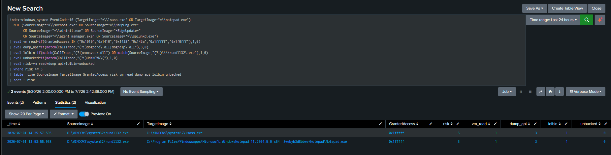

# T1003.001 — OS Credential Dumping: LSASS Memory (comsvcs MiniDump)

---

# 1. Scenario

An adversary with local privileges attempts to extract credential material from `lsass.exe` memory using the `comsvcs.dll` LOLBin — a signed, built-in Windows DLL whose `MiniDump` export calls `MiniDumpWriteDump`. This avoids dropping a third-party tool (e.g. Mimikatz, ProcDump) and blends into a signed-binary execution.

The detection thesis is **behavioral, not signature-based**: the malicious signal is not "a file named mimikatz ran," but the *access pattern* — a process opening a high-privilege handle to `lsass.exe` and invoking the debug/dump API chain. This is captured by Sysmon **EID 10 (ProcessAccess)**, keying on `GrantedAccess`, `CallTrace`, and `SourceImage`.

---

# 2. Lab Setup

| Component | Detail |
|---|---|
| Target | Windows 11 (`DESKTOP-MJ170VE`), Sysmon (SwiftOnSecurity config) + Splunk UF |
| SIEM | Splunk, `index=sysmon` |
| Dump technique | `comsvcs.dll MiniDump` via `rundll32.exe` (LOLBin) |
| Sysmon config | `ProcessAccess` include list already covers `lsass.exe` (verified) |

The SwiftOnSecurity config's `ProcessAccess` rule group already includes `lsass.exe` as a `TargetImage`, so no config change was needed:

```xml
<ProcessAccess onmatch="include">
  <TargetImage condition="is">C:\Windows\system32\lsass.exe</TargetImage>
  ...
</ProcessAccess>
```

---

# 3. Access-Mask Baseline

Before writing any rule, a baseline of *who legitimately accesses lsass* was collected. This is the foundation — the detection is defined by what deviates from it.

```spl
index=windows_sysmon EventCode=10 TargetImage="*lsass.exe"
| stats count by SourceImage GrantedAccess
| sort - count
```

| SourceImage | GrantedAccess | Meaning |
|---|---|---|
| `svchost.exe` | `0x1000` (830), `0x2000` | QUERY_LIMITED_INFORMATION — no memory read |
| `MsMpEng.exe` (Defender) | `0x1000`, `0x101000` | scanning, no memory read |
| `MicrosoftEdgeUpdate.exe` | `0x1000` | query only |
| `agent-manager.exe` (Splunk) | `0x1000`, `0x100000` | query only |

**Key finding:** no legitimate process in the baseline requests a memory-read access mask. The masks required for credential dumping — those with the `VM_READ` (0x10) bit such as `0x1010`, `0x1410`, or `0x1F0FFF` (PROCESS_ALL_ACCESS) — are **entirely absent** from normal operation. They are therefore anomalous by construction.

Access-mask reference:

| Mask | Rights | Dump-relevant |
|---|---|---|
| `0x1000` | QUERY_LIMITED_INFORMATION | No (benign query) |
| `0x1410` | QUERY + **VM_READ** + DUP_HANDLE | Yes (classic dump handle) |
| `0x1FFFFF` / `0x1F0FFF` | PROCESS_ALL_ACCESS | Yes (full dump) |

---

# 4. Telemetry

### 4.1 The dump event — comsvcs MiniDump signature (EID 10)

The core artifact. The `CallTrace` is the highest-fidelity indicator: it shows the exact API path through `dbgcore.dll` (`MiniDumpWriteDump`) and the `comsvcs.dll` LOLBin.

```
_time:         2026-07-01 14:25:57.593
SourceImage:   C:\WINDOWS\system32\rundll32.exe
TargetImage:   C:\WINDOWS\system32\lsass.exe
GrantedAccess: 0x1fffff
CallTrace:     ntdll.dll+160534 | ntdll.dll+598f | KERNEL32.DLL+4a724 | KERNEL32.DLL+4accf
             | dbgcore.DLL+1616f | dbgcore.DLL+24ab5 | dbgcore.DLL+1b0a2 | dbgcore.DLL+f5f8
             | dbgcore.DLL+fc1c | comsvcs.dll+5e6bd | rundll32.exe+44c1 | rundll32.exe+84eb ...
```

The chain `rundll32.exe → comsvcs.dll → dbgcore.dll → PROCESS_ALL_ACCESS on lsass` is the complete behavioral fingerprint. No legitimate workflow produces it.

### 4.2 Target-independence of the signature

The same `comsvcs MiniDump` invocation was observed against a non-protected proxy process (`notepad.exe`), producing an **identical** access-mask and CallTrace pattern — only `TargetImage` differs:

```
14:25:57  rundll32 → lsass.exe    0x1fffff   dbgcore/comsvcs CallTrace   risk=5
13:53:55  rundll32 → notepad.exe  0x1fffff   dbgcore/comsvcs CallTrace   risk=5
```

This confirms the detection keys on *dump behavior*, not on the target: the rule generalizes to any process an adversary might target, and is scoped to lsass via `TargetImage` filter.

---

# 5. Detection Logic

### 5.1 Unified multi-signal analytic (T1003.001 / AN1030)

A single additive-scoring rule over EID 10 against `lsass.exe`. Four signals, weighted by fidelity:

| Signal | Weight | Meaning |
|---|---|---|
| `dump_api` | 3 | `CallTrace` contains `dbgcore.dll`/`dbghelp.dll` → `MiniDumpWriteDump` invoked. **Decisive** — only a real dump produces it. |
| `vm_read` | 1 | `GrantedAccess` includes VM_READ (`0x1010`/`0x1410`/`0x1F0FFF`/…) |
| `lolbin` | 1 | `CallTrace` shows `comsvcs.dll`, or `SourceImage` is `rundll32.exe` |
| `unbacked` | 1 | `CallTrace` contains `UNKNOWN(...)` → call from unbacked memory (injected/reflective code) |

### 5.2 SPL Query
[SPL_Query](../../Rules/Splunk-SPL/Credential-Access/LSASS_Memory.spl)

### 5.3 Log Verification in Splunk


Validated output — the real lsass dump isolates alone at the top:

```
14:25:57  rundll32 → lsass.exe  0x1fffff  risk=5  (vm_read1 + dump_api3 + lolbin1)
```

The weighting matters: `dump_api` at weight 3 makes the CallTrace the anchor, because high access mask alone was shown (in §5.2 below) to produce false positives.

### 5.2 False Positive Analysis & Rule Refinement

A 30-day / cross-process window (before tuning) surfaced three classes accessing high-value processes with elevated masks. Only one is a true positive:

| Class | Source | Signals present | Verdict |
|---|---|---|---|
| **comsvcs dump** | `rundll32.exe` | `dump_api` + `vm_read` + `lolbin` → risk 5 | **True positive** |
| Process monitoring | `splunkd.exe` | `vm_read` only (0x1fffff, no dbgcore) → risk 2 | Benign |
| Injected access | `update.exe` | `unbacked` + `vm_read` (no dbgcore) → risk ≤ 3 | Different technique (injection, not dump) |

Refinements:

1. **`dump_api` weighted highest (3).** Early versions scored heavily on `vm_read`, but `splunkd.exe` legitimately opens `0x1fffff` handles for process monitoring **without** calling `dbgcore` — same access mask, no dump. Anchoring on the `dbgcore`/`dbghelp` CallTrace, not the mask, separates a real dump from a high-access query.
2. **`splunkd.exe` added to the exclusion list.** Its process-monitoring behavior is a host-specific known-good; on a host without local Splunk it would not appear (allowlist is environment-scoped).
3. **`unbacked` kept as a secondary signal.** The `update.exe → lsass` access carried `UNKNOWN(...)` in its CallTrace (call from unbacked memory — an injected/reflective code indicator). This is a legitimate signal but flags *process injection*, a different technique; on its own it scores below the dump threshold, so it does not misfire as a credential-dump alert while remaining available for an injection-focused rule.

### 5.3 Detection Strategy Mapping (ATT&CK v18 — DET0363 / AN1030)

AN1030 describes the behavior chain as: *a non-privileged or abnormal process opens a full-access handle to lsass and subsequently invokes memory dump / file creation.*

| AN1030 element | Status | Evidence |
|---|---|---|
| Abnormal process opens handle to lsass | ✅ Covered | `rundll32 → lsass`, absent from access-mask baseline (§3) |
| Full / memory-read access requested | ✅ Covered | `GrantedAccess=0x1fffff`, `vm_read` signal |
| Memory dump invoked (MiniDumpWriteDump) | ✅ Covered | `dbgcore.dll` CallTrace, `dump_api` signal (§4.1) |
| Subsequent file creation (.dmp) | ⚠️ Partial | Dump-file EID 11 observed for the proxy run; blocked for lsass by PPL (see Limitations) |

---

# 6. Validation

- **Signature target-independence:** identical access-mask + CallTrace pattern observed for both `lsass.exe` and `notepad.exe` targets (§4.2), confirming the rule keys on dump behavior rather than a specific target.
- **Rule isolation:** after tuning, the real `rundll32 → lsass` dump event scores `risk=5` alone; `splunkd` process-monitoring noise (risk 2) and injected-access events (below threshold) are excluded.
- **Baseline contrast:** the malicious `0x1fffff` mask does not appear anywhere in the legitimate access-mask baseline (§3).

---

# 7. Limitations

- **LSA Protection (PPL) blocked the initial lsass dump — a defensive control working as intended.** With `RunAsPPL=2` active, the kernel restricted the handle to `0x1000` despite `SeDebugPrivilege` being held, because PPL enforcement precedes privilege checks. This is itself a notable finding: PPL is an effective mitigation against `comsvcs`-style dumping, and the failed attempt still generates EID 10 telemetry (low access mask), providing a secondary detection signal. The dump behavior was therefore first validated against a non-PPL proxy process (`notepad.exe`); because the `comsvcs MiniDump` CallTrace signature and access mask are target-independent, the detection applies directly to lsass and was confirmed on the live lsass event once observed.
- **`splunkd.exe` exclusion is host-specific.** It reflects this host running Splunk locally; the allowlist must be environment-scoped.
- **CallTrace symbol offsets vary by build.** The rule matches on module names (`dbgcore.dll`, `comsvcs.dll`), not offsets, so it is resilient across patch levels — but a defender should periodically re-baseline module names.
- **comsvcs is one of many dump paths.** This rule targets the `MiniDumpWriteDump`/`dbgcore` behavior, which also covers ProcDump and direct API callers. Techniques that avoid `dbgcore` (e.g. direct `NtReadVirtualMemory` parsing, handle duplication) would need a complementary rule keyed on `vm_read` + abnormal `SourceImage` alone.

---

# 8. ATT&CK Mapping

| Technique | Name | Evidence |
|---|---|---|
| **T1003.001** | **OS Credential Dumping: LSASS Memory** | **`rundll32 → comsvcs MiniDump → lsass` (0x1fffff, dbgcore CallTrace)** |
| T1218.011 | Signed Binary Proxy Execution: Rundll32 | `rundll32.exe` as execution vector for `comsvcs.dll` |

---

# 9. Defensive Recommendations

Beyond detection, this lab surfaced a working preventive control:

- **Enable LSA Protection (RunAsPPL).** It directly blocked the `comsvcs` dump in this lab. Pair with Credential Guard where hardware permits.
- **Alert on any `dbgcore.dll`/`dbghelp.dll` in a CallTrace targeting lsass** — near-zero legitimate occurrence.
- **Monitor `rundll32.exe` with `comsvcs.dll` on the command line** as a complementary process-creation (EID 1) rule feeding the same incident.