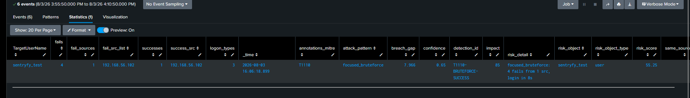
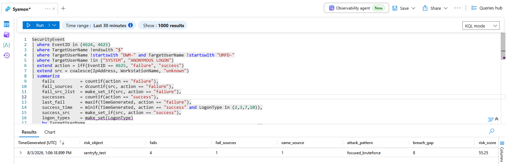
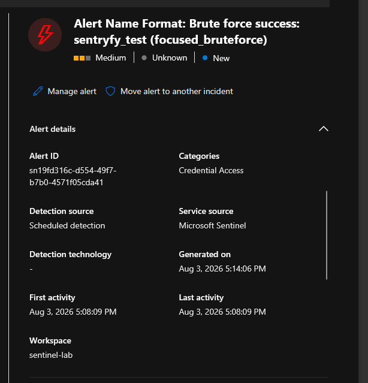

# T1110 → T1078 — When Brute Force Succeeds: Source-Correlated Credential Compromise (Splunk + Sentinel)

---

# 1. Scenario

An attacker runs SMB password-guessing against `sentryfy_test` from Kali. After a burst of failures, one attempt succeeds — and the successful login comes **from the same IP as the failures**. Seconds later the account is authenticated. This is the moment a brute force stops being noise and becomes a breach.

The thesis that separates this from a plain failed-login counter:

> Counting failures tells you someone is *trying*. It says nothing about whether they *got in*. The signal that matters is a failure burst **immediately followed by a success from one of the same sources** — brute force that crossed from attempt to compromise.

Two design decisions carry the rule, and both are built twice — once in Splunk SPL, once in Sentinel KQL:

1. **Source correlation (`same_source`)** — the successful login's source is checked against the failure sources. A legitimate user logging in from their own machine while an unrelated brute force runs against them must not alert.
2. **Temporal proximity + isolation** — the success must follow the last failure within minutes *of the same attack*, not be stitched together from two separate incidents against the same account (see §5, the grouping bug).

This writeup builds the detection on both platforms and closes with what porting it revealed about where SPL and KQL differ.

---

# 2. Lab Setup

| Component | Splunk | Sentinel |
|---|---|---|
| Source events | Windows Security 4625 (fail) + 4624 (success) | same, via `SecurityEvent` |
| Auth | NTLM, LogonType 3 (SMB / network) | same |
| Detection form | Scheduled Report → `collect index=risk` | Scheduled Analytics rule → Incident/Alert |
| Correlation output | `risk_object` field in risk index | Account entity mapping + custom details |
| Aggregation | universal RBA correlation search | Sentinel UEBA / incident engine |

### Attack generation

```bash
# Failure burst — wrong passwords
crackmapexec smb 192.168.56.101 -u sentryfy_test -p wrong1,wrong2,wrong3,wrong4,wrong5
# Success — correct password, same source, within seconds
crackmapexec smb 192.168.56.101 -u sentryfy_test -p <correct>
```

Real telemetry captured exactly this: five 4625 events (14:07:50–14:08:04, all from `192.168.56.102`, NTLM, Type 3), then a 4624 success at 14:08:09 **from the same Kali IP** — a ~5-second gap between the last failure and the breach.

---

# 3. The Grouping Problem — Source Is Analysis, Not a Group Key

The obvious approach is to group by user *and* source. But that silently breaks one of the two attack shapes:

| Attack shape | group-by `user, source` |
|---|---|
| **Focused brute force** (one IP, many tries) | ✅ Works |
| **Distributed / password spray** (many IPs, one try each) | ❌ **Broken** — each source has 1 failure, none reaches threshold, the attack is invisible |

So the rule groups by **user only** and treats source as an *analysis dimension inside the group*:

- `fail_sources` — count of distinct failure sources (1 = focused, 5+ = spray)
- `same_source` — is the success's source among the failure sources?

This keeps a spray intact while still answering "did the login come from the attack?"

---

# 4. The Rule — Both Platforms

### 4.1 Splunk SPL

[SPL_Query](../../Rules/Splunk-SPL/Credential-Access/brute-force.spl)


### 4.2 Sentinel KQL

[KQL_Query](../../Rules/Sentinel-KQL/Credential-Access/bruteforce.kql)


Three gates on both: `fails>=3` (a real burst), success within 300s of the last failure (proximity), `LogonType in (2,3,7,10)` (a genuine session).

---

# 5. The Time-Grouping Bug — Why the Rule Silently Returned Nothing

This is the most important part, and it only surfaced on Sentinel — because that's where the lab had many test runs stacked up against one account.

The first version grouped **by user only**:

```kql
summarize last_fail = maxif(TimeGenerated, action=="failure"),
          success_time = minif(TimeGenerated, action=="success" ...)
          by TargetUserName
```

With multiple brute-force tests against `sentryfy_test` over a day, this collapsed *all* of them into one row:

- `last_fail = max(all failures)` → **14:08** (the latest test)
- `success_time = min(all successes)` → **13:06** (the earliest test)

Then the proximity gate:

```kql
| where success_time >= last_fail        // 13:06 >= 14:08 ?  FALSE
```

`13:06 >= 14:08` is false, the row dropped, and the rule returned **zero results** — no error, no alert, just silence. The success from one attack was being paired with the failures from a completely different attack.

The fix is to bin time so each attack lands in its own bucket:

```kql
... by TargetUserName, bin(TimeGenerated, 10m)     // Sentinel
```
```spl
| bin _time span=10m ... by TargetUserName, _time  // Splunk
```

After binning, the 13:06 test and the 14:08 test fall into separate 10-minute windows; within each, `last_fail` and `success_time` belong to the same attack, and `success_time >= last_fail` holds.

**The lesson generalizes to every correlation rule**: when you take `min()` of one event type and `max()` of another over the same entity, a single group spanning multiple incidents stitches the wrong halves together. `min`/`max` across an unbounded window is only safe if the entity can hold at most one incident — otherwise bin by time.

> The Splunk version carried the *same latent bug*. It never showed there because the Splunk lab ran one test at a time, so the user's group only ever contained one attack. The `bin _time span=10m` above is the corrected Splunk rule — the bug was real on both platforms, just invisible on the one with sparser test data.

Binning has its own edge: an attack straddling a bin boundary (failures in one bucket, success in the next) can be split. Both rules run on short windows (Splunk feeder 5-min, Sentinel lookback 15-min) where a single fast brute force rarely crosses a 10-minute boundary; a production hardening would use a sessionizing approach (`transaction` / `row_window_session`) instead of fixed bins.

---

# 6. The Scoring Model

Framework: `risk = impact × confidence`, identical on both platforms.

| Pattern | Impact | | Condition | Confidence |
|---|---|---|---|---|
| Focused, `same_source=1` | 85 | | `same_source` + `fails>=10` | 0.90 |
| Distributed spray (`fail_sources>=5`) | 80 | | `same_source` + `fails>=5` | 0.80 |
| Mixed / uncertain | 70 | | spray | 0.75 |
| | | | base (3–4 fails) | 0.65 |

`same_source` is the FP control made numeric: a login from an unrelated source scores low even after a failure burst, because the burst didn't produce that login. Larger bursts raise confidence — 3 failures is "maybe," 10 is "certain."

---

# 7. Validation — Same Result, Both Platforms

The lab attack produced one detection on each platform, identical:

| field | value |
|---|---|
| risk_object | `sentryfy_test` |
| fails | 5 |
| fail_sources | 1 (`192.168.56.102`) |
| **same_source** | **1** |
| breach_gap | **~5 s** |
| risk_score | **55.25** (`85 × 0.65`) |

- **Splunk:** feeder wrote `risk_score=55.25` to `index=risk`; the RBA correlation search picked it up under `risk_object=sentryfy_test`.
- **Sentinel:** the Analytics rule produced a **Medium alert**, Credential Access, product Microsoft Sentinel, impacted asset `sentryfy_test` — the entity mapping resolved `risk_object` to an Account entity.

The counter-case makes the rule sound: had `sentryfy_test` logged in from their own workstation during an unrelated brute force from Kali, `same_source` would be 0 and the score would drop — no false alarm on a legitimate login that merely coincided with an attack.

### 7.1 Splunk 



### 7.2 Sentinel



### 7.3 Alert in Sentinel 



---

# 8. Platform Portability — Where SPL and KQL Diverge

Porting the same logic surfaced concrete differences worth recording:

| Concern | Splunk | Sentinel | Verdict |
|---|---|---|---|
| Source-set membership | `mvfind(list, val)` — fragile with multivalue `success_src` | `set_intersect(a, b)` — true set operation | **KQL cleaner** — `set_intersect` handles multi-success correctly; `mvfind` needs `mvindex(...,0)` pinning |
| Time semantics | epoch numbers, arithmetic on `_time` | native `datetime`, `datetime_diff('second',...)` | KQL more readable; Splunk needs no unit conversion |
| Multi-value dedup | `values()` (dedups) | `make_set()` (dedups) | Equivalent |
| Risk aggregation | manual: `collect index=risk` + correlation search | native: entity mapping → UEBA/incident engine | Splunk = full control; Sentinel = less code, less control |
| Result surfacing | risk index fields | Custom details + Alert/Incident | Sentinel richer out-of-the-box |

The `same_source` implementation is the sharpest example: SPL's `mvfind(fail_src_list, success_src)` misbehaves when `success_src` is itself multivalue, so it needs pinning to a single element; KQL's `set_intersect(fail_src_list, success_src)` is a genuine set-intersection that's correct regardless of cardinality. Same detection intent, and KQL expresses it more safely.

---

# 9. Scheduling — Both Platforms

| | Splunk | Sentinel |
|---|---|---|
| Feeder / query frequency | cron `*/5 * * * *` | run every 5 min |
| Scan / lookback window | Last 5 minutes (= cron, no double-count) | Last 15 minutes (covers `bin(10m)` + ingest lag) |
| Correlation / alerting | separate RBA alert, `earliest=-24h`, throttle by `risk_object` | Analytics rule → alert/incident, incident settings |

Two platform-specific notes. On **Splunk**, feeder window must equal cron interval or `collect` re-counts events across runs. On **Sentinel**, the lookback must exceed the `bin(10m)` span plus ingest lag (observed ~30–48 s in this lab) — otherwise a fresh attack's events aren't yet queryable when the rule runs. A 15-minute lookback with a 10-minute bin gives both room.

---

# 10. ATT&CK Mapping

| Technique | Relationship |
|---|---|
| [T1110](https://attack.mitre.org/techniques/T1110/) | Primary — the failure burst |
| [T1078](https://attack.mitre.org/techniques/T1078/) | The success — brute force resolving into valid-account access |
| [T1021.002](https://attack.mitre.org/techniques/T1021/002/) | SMB vector; network logon (Type 3) over NTLM |

---

# 11. Limitations & Production Readiness

**Validated:** source-correlated brute-force success on real SMB telemetry, identical 55.25 result on Splunk and Sentinel; `same_source` confirmed (Kali → Kali, ~5s gap); the time-grouping bug found and fixed on both platforms; the counter-case (legitimate login from a different source) confirmed to score low.

**Not production-ready:**

- **`same_source` on NAT/proxy** — many legitimate users share an egress IP; source matching weakens where "source" is a shared gateway.
- **5-minute proximity window** — a patient attacker who waits between burst and login evades it.
- **Local account only** — domain environments add concurrent multi-host sessions per user.
- **NTLM-specific** — Kerberos brute force (4771/4768) needs a parallel feeder.
- **SPL `mvfind`** still needs multi-success pinning (the KQL `set_intersect` version is already robust).

