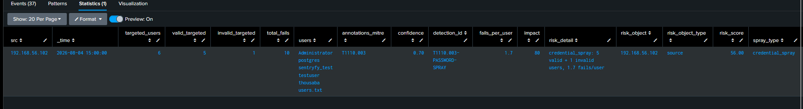
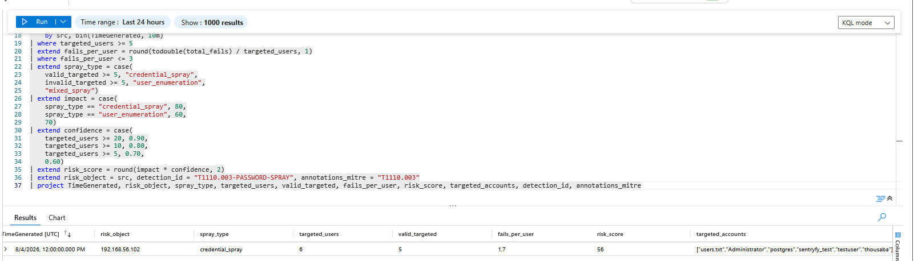

# T1110.003 — Password Spraying: One Password, Many Accounts (Splunk + Sentinel)

# 1. Scenario

An attacker takes one common password — `Welcome2023`, `WrongPassword`, whatever the seasonal guess is — and tries it against *many* accounts from a single source. One or two attempts per account, so no individual account crosses a lockout threshold, but dozens of accounts get hit in a short window. This is the horizontal mirror of brute force.

The thesis is that **the detection axis flips**:

> Brute force is one account, many passwords — you group by *user* and count *failures*. Password spraying is one password, many accounts — you group by *source* and count *distinct users*. A brute-force rule (`fails >= 3` per user) is blind to spraying, because a spray never gives any single user 3 failures. Without a spray rule, this attack walks straight past a brute-force detector.

This writeup builds the spray detection on both platforms, splits the failures into *valid* versus *non-existent* accounts (credential spray vs user enumeration) using the logon SubStatus, and records two silent-failure bugs found along the way.

---

# 2. Why Brute Force Can't See This

The [T1110 brute-force-success rule](./T1110-Brute_Force.md) groups `by TargetUserName` and gates on `fails >= 3`. A spray defeats both:

| | Brute force | Password spray |
|---|---|---|
| Shape | one user, many passwords | one password, many users |
| Group key | `TargetUserName` | `src` (source IP) |
| Threshold metric | `count(failures)` per user | `dcount(TargetUserName)` per source |
| Per-user failures | high (≥3) | **low (1–2)** — evades lockout *and* the brute-force threshold |
| `risk_object` | the targeted user | the **source IP** |

The spray's defining signature is the inverse of brute force: **many distinct users, few failures each**. So the rule keys on `targeted_users >= 5` (breadth) and `fails_per_user <= 3` (the spray's low-and-wide fingerprint) — the second gate is what distinguishes a spray from a brute force that happened to hit several accounts.

`risk_object` changes accordingly: in brute force the victim is one account, so the account is the risk object; in a spray the victim is a dozen accounts and the constant is the **attacking source**, so the source IP is the risk object.

---

# 3. Lab Setup

| Component | Detail |
|---|---|
| Source events | Windows Security 4625 (failed logon) |
| SubStatus field | `Sub_Status` (Splunk) / `SubStatus` (Sentinel) — valid vs non-existent user |
| Attacker | Kali `192.168.56.102`, `nxc smb` with a user list, one password |
| Risk object | source IP (not user) |
| Correlation | `by src, bin(_time, 10m)` |

### Attack generation

```bash
# One password, many users, from one source
nxc smb 192.168.56.1 -u user.txt -p WrongPassword --continue-on-success
```

Two operational snags worth noting, because they cost real time:

- **CRLF in the user list** — a `user.txt` saved on Windows carries `\r`, so `nxc` tries `Administrator\r` and the attempts misfire. `dos2unix` / `sed -i 's/\r$//'` fixes it.
- **SMB connection throttling** — Windows rate-limits rapid successive failed auth from one source, so a fast parallel `nxc` run returns NETBIOS timeouts rather than `STATUS_LOGON_FAILURE`. Slowing it down (`-t 1 --jitter 3`, or a bash loop with `sleep 3`) both defeats the throttle and mirrors how a real sprayer paces itself to stay under lockout and detection thresholds.

---

# 4. The Rule — Both Platforms

### 4.1 Splunk SPL

[SPL_Query](../../Rules/Splunk-SPL/Credential-Access/password-spraying.spl)


### 4.2 Sentinel KQL

[KQL_Query](../../Rules/Sentinel-KQL/Credential-Access/password-spraying.kql)


---

# 5. Valid vs Non-Existent Accounts — SubStatus Splits the Threat

A naive spray rule counts every 4625 the same. But 4625 fires whether the account exists or not, and the SubStatus code tells them apart:

| SubStatus | Meaning | Signal |
|---|---|---|
| `0xC000006A` | wrong password | account **exists** → credential spray |
| `0xC0000064` | no such user | account **doesn't exist** → username guessing |

This isn't noise to filter — it's two distinct threats worth separating:

- **`credential_spray`** (≥5 valid accounts) → impact **80**. The accounts are real; one weak password away from compromise.
- **`user_enumeration`** (≥5 non-existent accounts) → impact **60**. The attacker is guessing usernames they don't know yet — reconnaissance, less immediate but still hostile.

An attacker who doesn't know the org's usernames sprays a guess list, most of which don't exist. Flagging non-existent-user attempts is a *feature*: it catches enumeration before the attacker has valid targets. Keeping both, split by SubStatus, means the analyst sees which one they're facing rather than a blurred count.

---

# 6. Two Silent-Failure Bugs

### 6.1 Hex case-sensitivity

The SubStatus values arrive **lowercase** in this environment (`0xc000006a`), but the rule was first written with uppercase constants (`0xC000006A`). Splunk's `case()` comparison is case-sensitive, so every row fell through to `"other"` — the valid/invalid split silently produced all-zeros, no error, correct-looking output. Fix: normalize with `lower()` / `tolower()` before comparing.

This is the same failure class as the [`match()` regex bug in T1003](./T1003.001-OS_Credential_Dumping_LSASS_Memory.md) and the [`collect` `_raw` bug](./T1003.001-OS_Credential_Dumping_LSASS_Memory.md): the query runs, returns plausible output, and is quietly wrong. **Normalize case before comparing hex/string codes** — never trust the casing a field arrives in.

### 6.2 Time-grouping (inherited)

The same `min`/`max` stitching risk documented in the [brute-force writeup](./T1110-Brute_Force.md) applies here — `by src, bin(_time, 10m)` keeps each spray window isolated so failures from separate sprays against the same source don't merge into one inflated count.

---

# 7. Validation — Same Result, Both Platforms

Six accounts targeted from Kali, one password, one 10-minute window:

| field | value |
|---|---|
| risk_object | `192.168.56.102` (source IP) |
| spray_type | `credential_spray` |
| targeted_users | 6 |
| valid_targeted | 5 (real accounts) |
| invalid_targeted | 1 (`users.txt` — a filename accidentally in the list, correctly classified as no-such-user) |
| fails_per_user | 1.7 |
| risk_score | **52.50 → 56.00** |

`fails_per_user = 1.7` is the spray fingerprint — nobody was brute-forced, but six accounts were hit. The SubStatus split worked exactly as designed: five real accounts landed in `valid_targeted` driving `credential_spray`, while the stray `users.txt` (a non-existent user) was isolated in `invalid_targeted` rather than inflating the verdict. **Splunk** wrote `risk_object=192.168.56.102` to `index=risk`; **Sentinel** produced the identical row, differing only in that its entity mapping resolves `risk_object` to an **IP** entity (not Account — the actor here is a source, not a victim).

### 7.1 Validation in Splunk 




### 7.2 Validation in Sentinel



---

# 8. Platform Portability

| Concern | Splunk | Sentinel |
|---|---|---|
| Distinct-count with condition | `dc(eval(if(...)))` | `dcountif(field, cond)` — one function |
| Case normalization | `lower(Sub_Status)` | `tolower(SubStatus)` |
| Entity | risk index field | **IP entity** mapping |
| Field name | `Sub_Status` (underscore) | `SubStatus` (no underscore) |

The field-name difference (`Sub_Status` vs `SubStatus`) is a real porting trap — the same logical field is named differently by the two ingestion paths, so a copy-pasted query fails silently on the wrong platform. `dcountif` is the cleaner expression: KQL folds the conditional distinct-count into one function where SPL needs the `dc(eval(if(...)))` nesting.

---

# 9. RBA Integration

The feeder emits `risk_object=src` (source IP), where the brute-force and valid-account feeders emit `risk_object=user`. These are different entity types on purpose, and together they cover both faces of an attack:

- Spray flags the **source** (`risk_object=IP`) — "this address is spraying."
- If the spray then succeeds against one account, the [brute-force-success feeder](./T1110-Brute_Force.md) flags the **user** (`risk_object=account`) — "this account was compromised."

An analyst pivoting from the sprayed IP to the compromised account sees the full horizontal-then-vertical progression. The two rules don't merge on a single `risk_object` (different entity types), but they describe two views of one campaign.

---

# 10. ATT&CK Mapping

| Technique | Relationship |
|---|---|
| [T1110.003](https://attack.mitre.org/techniques/T1110/003/) | Primary — one password across many accounts |
| [T1589.002](https://attack.mitre.org/techniques/T1589/002/) | Gather Victim Identity Info — the `user_enumeration` path (guessing usernames) |
| [T1078](https://attack.mitre.org/techniques/T1078/) | Downstream — a successful spray yields valid-account access |
| [T1021.002](https://attack.mitre.org/techniques/T1021/002/) | SMB vector; network logon over NTLM |

---

# 11. Limitations & Production Readiness

**Validated:** source-axis spray detection on real SMB telemetry, identical result on Splunk and Sentinel; `fails_per_user` fingerprint separating spray from brute force; SubStatus split cleanly classifying credential_spray vs user_enumeration; the hex case-sensitivity bug found and fixed on both platforms.

**Not production-ready:**
- **`targeted_users >= 5` threshold** is lab-tuned; a large enterprise sees benign multi-account failures (shared kiosks, misconfigured service accounts hitting many resources) that need allowlisting.
- **Misconfigured service accounts** are the primary FP — an app authenticating to many hosts with a stale credential looks like a spray. Source allowlisting or account-type filtering is required in production.
- **Single-source assumption** — a *distributed* spray (many source IPs, one password) splits across `src` groups and evades this rule; DET0487's distributed variant needs correlation by password/signature across sources, not by source.
- **Fixed 10-minute bins** can split a slow spray straddling a boundary.
- **NTLM/SMB only** — DET0487 spans SSH/PAM, SSO/SaaS, OWA, container APIs, network devices; each needs its own source-and-distinct-account feeder on its log source, but the logic (`by source, dcount(distinct accounts)`) ports directly.

**Next:** distributed-spray variant (correlate by password/signature across sources); service-account allowlist; extend the same axis to Entra ID SigninLogs (SSO spray) and SSH/PAM.
