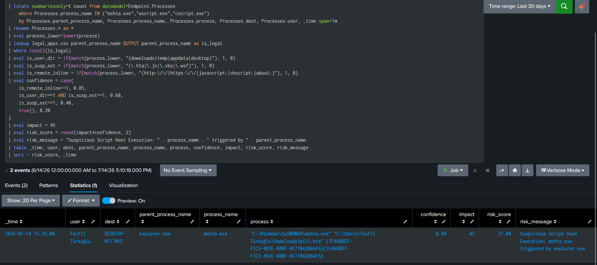

# T1218.005 — System Binary Proxy Execution: Mshta (+ Script Host Abuse)


# 1. Scenario

An adversary abuses a signed, built-in Windows binary — `mshta.exe` (or `wscript`/`cscript`) — to execute a script payload while blending into legitimate signed-binary activity. `mshta` is a favourite because it runs `.hta` applications *and* can execute inline `javascript:`/`vbscript:` or fetch a remote `.hta` over HTTP, all under a Microsoft-signed process.

The detection thesis is **behavioral risk scoring, not a single indicator**: a user double-clicking a `.hta` from Downloads is *possibly* malicious; `mshta` fetching a remote URL or running inline script is *almost certainly* malicious. Rather than a binary alert, the rule assigns a graded `risk = impact × confidence` so that the most dangerous variants surface at the top of an RBA feed while low-signal events accrue only minor risk.

---

# 2. Lab Setup

| Component | Detail |
|---|---|
| Target | Windows 11 (`DESKTOP-MJ170VE`), Sysmon + Splunk, CIM-mapped to `Endpoint.Processes` data model |
| SIEM | Splunk, `datamodel=Endpoint.Processes` (tstats-accelerated) |
| Trigger | User double-click of a `.hta` file staged in `Downloads` |
| Supporting infra | `legal_apps.csv` allowlist lookup; `transforms.conf` lookup + field-extraction definitions |

---

# 3. Execution

The tested variant: a `.hta` file placed in the user's Downloads and double-clicked, causing `explorer.exe` to launch `mshta.exe` against it. This is the classic phishing-delivery execution path — the user is tricked into opening what looks like a document, and the signed `mshta.exe` runs the embedded script.

The detection is deliberately **not** limited to this one path (see §5.1) — it also scores remote-fetch (`mshta http://...`) and inline-script (`mshta javascript:...`) variants, which are higher-fidelity indicators.

---

# 4. Telemetry

`Endpoint.Processes` (CIM) record for the tested execution:

```
_time:                2026-07-14 15:29:00
parent_process_name:  explorer.exe
process_name:         mshta.exe
process:              "C:\Windows\SysWOW64\mshta.exe" "C:\Users\...\Downloads\bill.hta"
dest:                 DESKTOP-MJ170VE
user:                 Tevfil Türkoğlu
```

Key fields: `parent_process_name` (lineage), `process` (full command line with the payload path), and the `SysWOW64\mshta.exe` image. The command line is where the risk signals live — path location, file extension, and any remote URL / inline protocol.

---

# 5. Detection Logic

### 5.1 Multi-signal RBA rule (T1218.005 / T1059.005 / T1059.007)

A single `tstats`-accelerated rule over `Endpoint.Processes`, scoring three script hosts (`mshta`, `wscript`, `cscript`). Rather than filtering on a fixed parent (which would miss macro- and chain-driven execution), it scores the *command-line shape*:

| Signal | Meaning | Fidelity |
|---|---|---|
| `is_remote_inline` | command line contains `http(s)://`, `javascript:`, `vbscript:`, or `about:` | **Highest** — near-zero benign use |
| `is_user_dir` + `is_susp_ext` | script (`.hta`/`.js`/`.vbs`/`.wsf`) run from `Downloads`/`Temp`/`AppData`/`Desktop` | Medium — the double-click phishing case |
| `is_susp_ext` alone | suspicious extension, standard location | Low |

[SPL_Query](../../Rules/Splunk-SPL/Defense-Evasion/system_binary_proxy_execution.spl)


### 5.2 Log Verification in Splunk



Validated output — the tested double-click event:

```
15:29:00  explorer.exe → mshta.exe   Downloads\bill.hta   confidence 0.60  impact 45  risk 27.0
```

### 5.3 False Positive Suppression — allowlist lookup

`mshta`/`wscript`/`cscript` have legitimate callers: software updaters, management agents, and OS scripts. Two complementary allowlist mechanisms suppress them:

1. **Parent-process allowlist** (`legal_apps.csv`, matched via `lookup`): `GoogleUpdate.exe`, `MicrosoftEdgeUpdate.exe`, `Teams.exe`, `Slack.exe`, `CcmExec.exe` (SCCM). These legitimately spawn script hosts; a match sets `is_legal` and the event is dropped by `where isnull(is_legal)`.
2. **Path allowlist** (`is_legal_path` eval): scripts running from `Program Files`, `ccmcache` (SCCM cache), or `printing_admin_scripts` (built-in Windows print scripts) are legitimate and excluded.

> **Design note:** the parent-name allowlist is applied by `lookup`, but path-based allowlisting cannot be expressed through the same `parent_process_name` join — so it is implemented as an explicit `is_legal_path` eval over the command line. An earlier version relied on the CSV's path column alone, which never fired because the lookup only keyed on parent name. Splitting the two mechanisms (lookup for parent, eval for path) makes both actually take effect. This mirrors the environment-scoped allowlist tuning used in the cmd.exe and Run-key labs.

### 5.4 Detection Strategy Notes

- **Parent lineage as a secondary axis.** For `mshta`, the command line (remote/inline) is the strongest signal. For `wscript`/`cscript`, an anomalous parent (`winword.exe → wscript.exe` = macro-driven script) is often the more discriminating indicator. A future refinement could weight parent anomaly higher for the script-host pair while keeping command-line weighting for `mshta`.
- **Threat-intel enrichment hook.** The environment already defines a `threat_intel` lookup in `transforms.conf`. A remote-fetch `mshta` URL can be correlated against it; a match against a known-bad domain should escalate the event to a direct alert rather than a mere RBA feeder.

---

# 6. Validation

- **Real telemetry:** the double-click `mshta → Downloads\bill.hta` event scored `risk=27` as designed (`is_user_dir` + `is_susp_ext`, confidence 0.60, impact 45).
- **Graded ordering confirmed:** after grading `impact`, remote/inline variants score ~72 versus ~27 for the double-click, correctly ranking the higher-fidelity case above the ambiguous one.
- **Allowlist effective:** parent-name matches (updaters, Teams, Slack, SCCM) and path matches (Program Files, ccmcache) are excluded before scoring.

---

# 7. Limitations

- **Coverage scoped to `mshta`/`wscript`/`cscript`.** Other LOLBin script proxies (`regsvr32`, `rundll32`, `msbuild`) need companion rules; this one does not cover them.
- **Command-line-dependent.** Detection relies on the full `process` command line being populated in the data model. If a sensor truncates or omits arguments, the `is_remote_inline` and path signals degrade — parent lineage would then be the only remaining axis.
- **Allowlist is environment-specific.** `Teams.exe`/`Slack.exe`/`CcmExec.exe` reflect this environment's legitimate software; on a locked-down server those parents would themselves be anomalous and should not be allowlisted. The list must be scoped per host role and re-baselined as software changes.
- **`is_user_dir` includes `desktop`**, a weak signal — legitimate `.hta`/scripts can live on the Desktop. It only contributes at the medium tier (confidence 0.60) and never fires alone, so its FP contribution is bounded, but it should be reviewed if Desktop-based FPs appear.

---

# 8. ATT&CK Mapping

| Technique | Name | Evidence |
|---|---|---|
| **T1218.005** | **System Binary Proxy Execution: Mshta** | **`explorer.exe → mshta.exe` = `Downloads\bill.hta`** |
| T1059.005 | Command and Scripting Interpreter: Visual Basic | `wscript`/`cscript` executing `.vbs`/`.wsf` (rule coverage) |
| T1059.007 | Command and Scripting Interpreter: JavaScript | `mshta javascript:` / `wscript .js` (rule coverage) |
| T1204.002 | User Execution: Malicious File | double-click of `.hta` from Downloads (delivery path) |

---

# 9. Defensive Recommendations

- **Alert directly on `mshta` with `http(s)://` or `javascript:`/`vbscript:` in the command line** — near-zero legitimate use; escalate above RBA-feeder into a standalone alert, especially when the URL matches threat intel.
- **Consider disabling or restricting `mshta.exe`** via WDAC/AppLocker where business use is absent — it is a high-value LOLBin with few legitimate needs on modern endpoints.
- **Feed graded `risk_score` into RBA** so double-click ambiguity accumulates alongside other per-identity/per-host signals rather than alerting in isolation.
- **Re-baseline the allowlist periodically** — new legitimate script-host callers appear as software is installed, and a stale allowlist silently widens the gap.