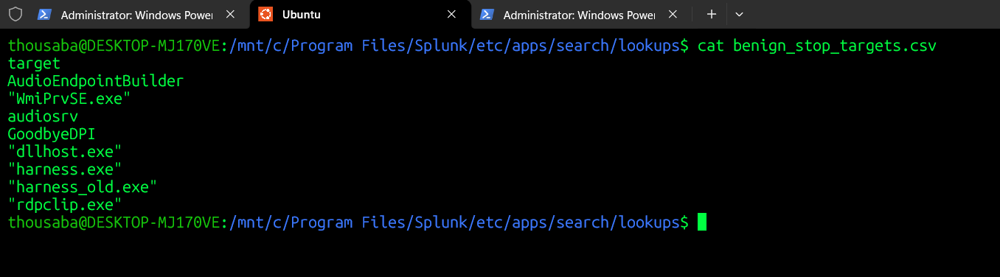
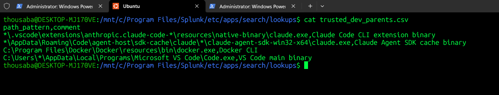
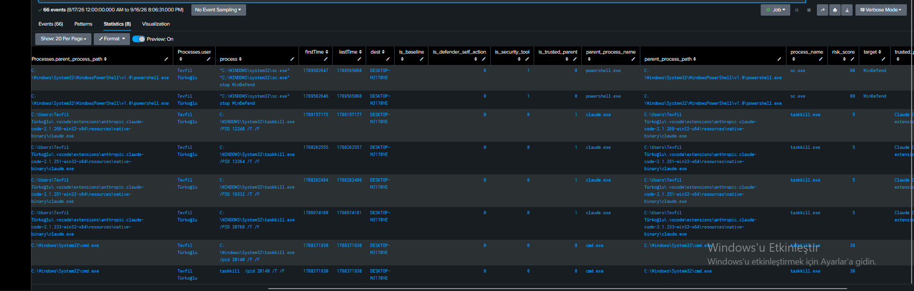

# T1562.001 · Process Termination — Service/Process Kill Detection

## 1. Where This Sits

T1562.001 (Impair Defenses: Disable or Modify Tools) covers several distinct adversary methods that share one goal — get a security tool out of the way — but leave completely different telemetry footprints. This lab splits the technique into clusters by *primitive*, the same discipline used for T1055:

| Cluster | Method | Primitive | Status |
|---|---|---|---|
| **C1 Process Termination** | `sc stop`, `net/net1 stop`, `taskkill`, `Stop-Service` | Sysmon EID 1 → `Endpoint.Processes` CIM | **this file** |
| C2 Feature/Registry Tamper | `Set-MpPreference`, `reg add` on Defender keys | Sysmon EID 13 → `Endpoint.Registry` | not built |
| C3 Service-Stop Event | native `StopService()`/`ServiceController.Stop()` | System log EventCode 7036 | attempted, blocked (§9) |
| C4 API/WMI-level stop | `.Stop()` via .NET/WMI, no subprocess | none available to Sysmon | out of scope (§9) |

C1 is the cluster actually generated, tested, and hardened against false positives in this lab. It is process-creation-based by construction, which is both its strength (works today, on the telemetry already collected) and its structural ceiling (§9) — anything that impairs a security tool without spawning a process is invisible to it.

---

## 2. Scenario and Detection Thesis

An adversary needs a security tool disabled before a payload can run undetected. The crudest and most common method — seen in real intrusions (TrickBot disabling Defender via registry+service, Ryuk scripting `net stop`/`taskkill` ahead of encryption, APT29 using PowerShell to kill logging) — is to spawn a command that stops or kills the tool directly:

```
sc stop WinDefend
net stop WinDefend
taskkill /IM MsMpEng.exe /F
Stop-Service -Name WinDefend
```

The detection thesis is **effect-based, not method-based**: rather than trying to enumerate every calling convention, the rule watches for **any of these four launchers producing a `stop` action or a kill against a security-tool target name**, and separates "this specific tool was targeted" (high confidence) from "some process was targeted, but not one we recognize" (low confidence, surfaced for review rather than dropped).

---

## 3. Lab Setup

| Component | Detail |
|---|---|
| Host | Windows 11, `DESKTOP-MJ170VE`, TR locale |
| Sysmon config | SwiftOnSecurity base, EID 1 (Process Creation) unrestricted |
| Datamodel | `Endpoint.Processes`, CIM-mapped from Sysmon EID 1 |
| Acceleration | `datamodels.conf` — `acceleration=1`, window extended 7d → 30d during baseline work |
| Splunk | 10.4.0, `security_content_summariesonly` / `security_content_ctime` / `drop_dm_object_name` macros ported from the ESCU pattern, `process_net` / `process_sc` macros hand-defined (not present by default in this environment) |
| Target processes tested | `WinDefend` (via `sc.exe`), `GoodbyeDPI`, `audiosrv`, `AudioEndpointBuilder`, `WmiPrvSE.exe` (as a bystander, see §5) |

### A macro/acceleration bootstrapping note worth recording

None of the ESCU macros (`process_net`, `process_sc`, `security_content_summariesonly`, `security_content_ctime`, `drop_dm_object_name`) existed in this environment; they had to be written from scratch in `macros.conf`. Two mistakes during that process are worth flagging for future cluster builds:

- `security_content_summariesonly` was initially left at `summariesonly=false` — this makes `tstats` scan **raw indexed events**, not the accelerated tsidx summary. It silently "works" but is orders of magnitude slower (one search: *59 of 1,061,913 events matched* — the full raw scan). It only becomes a true accelerated lookup once `Endpoint` is added to `datamodels.conf` acceleration **and** the macro is flipped to `summariesonly=true` **after** the initial tsidx build completes — flipping it before the build finishes returns silently incomplete results, not an error.
- `drop_dm_object_name(1)` was initially copy-pasted with a malformed `foreach` (a trailing `, (replace(...))` outside the bracket) — `foreach` requires its bracket to close on a valid search pipeline. Fixed to a single well-formed `foreach [...]` block.

---

## 4. The Telemetry — One Primitive, Four Callers

All four launchers (`sc.exe`, `net.exe`/`net1.exe`, `taskkill.exe`, `powershell.exe` running `Stop-Service`) resolve to Sysmon EID 1 → `Processes.process` in the CIM. A single `tstats` against `Endpoint.Processes` with an `OR` across the four surfaces captures all of them in one query — no need for four separate rules. First live capture, from the lab's own `sc stop WinDefend`:

```
Processes.process        = "C:\WINDOWS\system32\sc.exe" stop WinDefend
Processes.parent_process  = powershell.exe
Processes.process_hash    = SHA256=A452BFCB...
Processes.user            = Tevfik Türkoğlu
```

This confirmed the pipeline end-to-end (macro expansion, CIM mapping, field extraction) before any FP-reduction logic was added.

---

## 5. Baseline — Why the First Result Was Nearly Useless

The naive rule (`(net OR sc) process="* stop *"` OR `Stop-Service` OR `taskkill.exe`) returns **every service stop and every process kill on the host**, security-relevant or not. The 30-day baseline surfaced four distinct false-positive sources, each requiring a different fix — not one generic tune:

| Source | Example | Root cause | Fix |
|---|---|---|---|
| Unrelated legitimate services | `net stop audiosrv`, `net stop AudioEndpointBuilder` (Windows audio troubleshooting) | rule has no target-awareness | `benign_stop_targets.csv` — a seen-before-and-cleared lookup, gated by an `is_security_tool` allowlist match so security-tool targets can never enter it even if a test run pollutes the window (see below) |
| A known but non-security tool | `sc stop GoodbyeDPI` (a DPI-bypass utility, unrelated to defenses) | same as above | same baseline lookup |
| Dev-tooling PID kills | `taskkill /PID 12248 /T /F`, parent `claude.exe` / `Code.exe` | `taskkill /PID` carries no name in the command line at all — the rule cannot tell what was killed without resolving the PID | see below — PID resolution attempted, abandoned as unreliable; handled by parent-process trust instead |
| **Defender's own remediation** | `taskkill /f /FI "MODULES eq protectionmanagement.dll" /IM WmiPrvSE.exe`, parent `MsMpEng.exe`, user `SYSTEM` | Defender killing a WMI provider host it flagged internally — **this is the security tool acting, not being attacked** | explicit exclusion: `parent_process_name="MsMpEng.exe" AND user="SYSTEM"` |

**A baseline-poisoning trap, caught mid-build:** an early `outputlookup` of "safe" targets accidentally included `WinDefend` itself, because the lab's own `sc stop WinDefend` test run happened to fall inside the 30-day window used to build the baseline. This produced a rule that treated `WinDefend` as *known-benign* — the exact inverse of intended behavior. Corrected by hand-editing the lookup CSV to remove it, and noted as a standing rule for future clusters: **baseline lookups must be built only from traffic that has already passed the security-tool filter (`is_security_tool=0`), never from raw unfiltered history**, or the simulation's own attack traffic silently whitelists itself.

**PID resolution — attempted and deliberately abandoned.** A `join`-based approach to resolve `taskkill /PID N` back to a process name failed: Splunk's subsearch `maxout` (10,000 rows by default) truncated the lookup before the target PIDs were reached. A `map`-based per-row resolution was sketched but rejected as needless complexity for what it would buy — **Windows PID reuse means a single PID can legitimately belong to a dozen-plus different binaries across a 30-day window**, so even a working resolution query returns an ambiguous list, not a clean answer. PID-based kills are instead left **visible at a suppressed risk score** rather than resolved or dropped — visible because dropping them silently creates a detection gap a real attacker could use, suppressed because with no target and no window-scoped resolution the false-positive rate on raw PID kills is very high.

---

## 6. RBA Scoring — Effect Over Method, With a Trust Layer That Downgrades, Never Excludes

Framework: `risk = impact × confidence`, additive across clusters. The scoring here is intentionally layered rather than binary allow/deny:

| Condition | risk_score | Rationale |
|---|---|---|
| Target matches a known security-tool name (`WinDefend`, `MsMpEng`, `Sysmon`, `wscsvc`, …) | **80** | effect-based — true regardless of launcher, parent, or whether the target is also in the benign-baseline (a WinDefend stop is never "known-safe") |
| Target unresolved (PID-based kill) **and** parent process is on the trusted-dev-parent path list | **5** | low but non-zero — trust is *evidence*, not proof |
| Target unresolved (PID-based kill), untrusted parent | **30** | ambiguous, surfaced for manual review |
| Target resolved, not in baseline, untrusted parent | **30** | new/unseen target — worth a look, not worth an alert alone |
| Target resolved, not in baseline, trusted parent | **10** | mild discount for context |
| `is_defender_self_action=1` (parent `MsMpEng.exe`, user `SYSTEM`) | *excluded before scoring* | not an attack signal at all |

**The one design mistake made and corrected here is worth recording on its own.** The first version of the "dev context" exception was a hard `where`-clause exclusion: `NOT (target_type="pid" AND parent_process IN (claude.exe, cmd.exe, powershell.exe, ...))`. This is exactly the pattern that quietly defeats detection — the same PID-kill-from-PowerShell shape a legitimate dev tool uses is **also** what a real attacker's PowerShell-launched `taskkill /PID` would look like, and the exclusion would have hidden it completely, not just deprioritized it. The fix was to move the exception from a filter into the risk-scoring `case()` — the event stays visible at `risk_score=5`, so a correlation alert can still catch it in combination with other signals, but it does not fire alone.

---

## 7. The Rule

[t1562_001_defense_tool_termination.spl](../../Rules/Splunk-SPL/Defense-Evasion/defense_tool_termination.spl)

Supporting lookups:

- `benign_stop_targets.csv` — seen-before, cleared targets (`audiosrv`, `AudioEndpointBuilder`, `GoodbyeDPI`, dev-harness binaries), built from 30 days of the *filtered* (`is_security_tool=0`) event stream, never from raw history



- `trusted_dev_parents.csv` (wildcard match, `transforms.conf`: `match_type = WILDCARD(path_pattern)`) — path-anchored, not name-anchored, and deliberately **not** hash-anchored




Two design notes:

- **The dev-context trust discount is a risk-score adjustment, not a filter** (§6) — this is the single correction that most changed the rule's shape, and the lesson generalizes to every future cluster in this program: an FP-reduction heuristic that excludes an event can hide the exact attack it was tuned against; a heuristic that only downgrades the score cannot.
- **`is_security_tool` matches on `target`, independent of `is_baseline`.** A security-tool name is never allowed to be "safe" even if a lab test run accidentally taught the baseline lookup otherwise (§5) — the two checks are intentionally decoupled so a poisoned baseline lookup cannot mask a real target match.

---

## 8. Validation

| Test | Launcher | Target/Context | is_security_tool | is_baseline | is_trusted_parent | risk_score | Verdict |
|---|---|---|---|---|---|---|---|
| `sc stop WinDefend` | `sc.exe` via `powershell.exe` | `WinDefend` | 1 | — | 0 | **80** | alerts |
| `sc stop GoodbyeDPI` | `sc.exe` | `GoodbyeDPI` | 0 | 1 | — | — | suppressed (baseline) |
| `net stop audiosrv` / `AudioEndpointBuilder` | `net.exe`/`net1.exe` | audio services | 0 | 1 | — | — | suppressed (baseline) |
| `taskkill /PID N /T /F` | `taskkill.exe` via `claude.exe` / `Code.exe` | unresolved (PID) | 0 | n/a | **1** (path wildcard, versions 2.1.233→2.1.268) | **5** | visible, low-risk |
| `taskkill /pid N /T /F` | `taskkill.exe` via `cmd.exe` | unresolved (PID) | 0 | n/a | **0** (removed from whitelist, §9) | **30** | visible, review-worthy |
| `taskkill /f /FI "MODULES eq protectionmanagement.dll" /IM WmiPrvSE.exe` | `taskkill.exe` via `MsMpEng.exe`, user `SYSTEM` | `WmiPrvSE.exe` | — | — | — | *excluded* | never reaches scoring — Defender self-action |

`cmd.exe` was deliberately removed from the trusted-parent whitelist during validation (§9) — its own row confirms the removal took effect (`is_trusted_parent` flips 1→0, `risk_score` reverts 5→30 across the same two events, before/after).



---

## 9. What This Cannot Catch

| Evades C1 | Why | Mitigation |
|---|---|---|
| **Any stop that never spawns a process** — `(New-Object System.ServiceProcess.ServiceController('WinDefend')).Stop()`, or WMI `Win32_Service.StopService()` | Both execute as a method call inside the existing `powershell.exe` process. No child process, no `stop`/`/IM` string anywhere in `Processes.process`. This is DS0009's structural ceiling, not a tuning gap. | PowerShell Script Block Logging (EventID 4104) or EDR — out of Sysmon's reach entirely |
| **Encoded/obfuscated PowerShell** (`powershell -enc <base64>`) | `Stop-Service` never appears as plaintext in the command line | Script Block Logging (post-decode content), not process-creation telemetry |
| **A renamed whitelisted binary, or a legitimate binary copied to an untrusted path with a trusted name** | trust is path-pattern-based, not signature-based | code-signing certificate thumbprint — see below |
| **Hash-pinning was attempted for the trusted-parent list and abandoned** | A 30-day pull of `Code.exe` hashes returned **~140 distinct SHA256 values, one occurrence each** — the binary's hash changes essentially every run/update cycle. `claude.exe` returned 15 distinct hashes, each tied to a distinct version-numbered install path. Both make hash-pinning an unsustainable maintenance burden for actively-updated dev tooling; only `docker.exe` (single stable hash across the window) would have been a realistic hash-pinning candidate. | path pattern with a wildcarded version segment was the pragmatic trade-off actually shipped; a code-signing certificate thumbprint would be more attacker-resistant than either and is the correct answer for a production deployment, but requires confirming Sysmon's signature-verification fields are populated in this config — not yet checked |
| **PID-based kills, unresolved** | Windows PID reuse means a 30-day-scoped resolution attempt returns a dozen-plus ambiguous candidate binaries per PID, not one answer (§5) | left visible at low risk rather than resolved or dropped; a production system would need a narrow, event-time-scoped PID resolution (±minutes, not ±30 days), not attempted here |
| **`cmd.exe` was considered for the trust whitelist and rejected** | its path (`C:\Windows\System32\cmd.exe`) is system-fixed and requires no spoofing — an attacker doesn't need to fake the path, they can simply *use* `cmd.exe`, which every attacker already does; "trusting" a universally available, unmodified system binary's path provides no discriminating value | kept out of the whitelist entirely; `cmd.exe`-parented PID kills score at the untrusted tier (30) |
| **The System-log EventCode 7036 cluster (C3) is not built** | Attempted, then blocked on a discovery: **EventCode 7036 is not unique to the Service Control Manager.** In this lab's System log, the same code is emitted by `VfpExt` (Hyper-V's Virtual Filtering Platform driver) for unrelated filter-restart events — a naive `EventCode=7036 ServiceName=... State=stopped` query returns zero real service-stop events and a wall of VfpExt noise instead, because `ServiceName`/`State` are not even parsed fields on this provider's raw `EventData_Xml`. A working C3 needs an explicit `Name="Service Control Manager"` provider filter plus a `rex` against `EventData_Xml` (no pre-extracted fields available in this environment). This was the intended resilience layer — the one source that survives Sysmon being killed — and it remains open. | rebuild with the provider filter; this is the next concrete task for this technique, not this cluster |

---

## 10. ATT&CK Mapping

| Technique | Relationship |
|---|---|
| [T1562.001](https://attack.mitre.org/techniques/T1562/001/) | Impair Defenses: Disable or Modify Tools — parent, C1 covers the process-termination method |
| [T1489](https://attack.mitre.org/techniques/T1489/) | Service Stop — adjacent technique, same `sc`/`net stop` surface, different target scope (any service vs. security tooling specifically) |
| [T1055](../T1055/) | Process injection lab (same program) — shares the CIM/RBA scaffolding and the "trust downgrades, never excludes" lesson learned in that cluster's own hardening |

---

## 11. Limitations & Production Readiness

**Validated.** Real `sc stop WinDefend` traffic captured and scored at 80. A 30-day baseline of legitimate service stops (`audiosrv`, `AudioEndpointBuilder`), a known-but-irrelevant tool (`GoodbyeDPI`), dev-tooling PID kills (`claude.exe`, `Code.exe`, versions spanning 2.1.233→2.1.268), and Defender's own internal remediation (`MsMpEng.exe` killing `WmiPrvSE.exe`) were each individually identified, traced to root cause, and suppressed or excluded correctly — verified by re-running after each fix and confirming the specific rows changed as expected, not just that total counts dropped.

**Not production-ready:**

- **No coverage for API/WMI-level service stops**  — the technique's most evasive variant produces no process-creation event at all; this is a hard DS0009 ceiling, not a tuning gap, and requires Script Block Logging or EDR.
- **No coverage for encoded/obfuscated command lines** — string-matching on `Processes.process` is trivially defeated by `-enc`.
- **Trust is path-based, not signature-based** — a write-capable attacker with access to a trusted directory can defeat it; hash-pinning was tried and found operationally unworkable against actively-updated tooling (§9), and code-signing verification was identified as the correct fix but not implemented.
- **PID-based kills are surfaced, not resolved** — Windows PID recycling makes reliable resolution across a wide time window infeasible; a narrower, event-time-scoped resolution was scoped out as future work.
- **The System-log resilience layer (C3) does not exist yet** — the one detection path designed to survive Sysmon itself being stopped is blocked on a provider-filtering fix, not yet rebuilt.
- **Single host, manual trigger, one user context.** Fleet baselines will carry far more legitimate service-management traffic (patch management agents, RMM tools, other EDR/AV coexistence) than this single-developer-workstation lab captured.