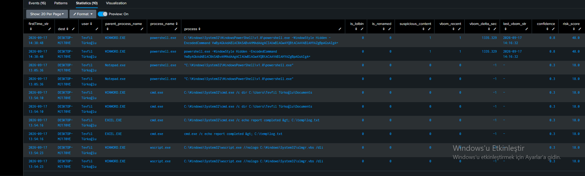

# T1204.002 · Office Application Spawning Suspicious Child Process

## 1. Where This Sits

This detection is not built around one ATT&CK ID — it targets the **execution moment of an attack chain**: an Office application (via macro or COM automation) spawning a shell interpreter or LOLBin. That single behavior sits at the intersection of several techniques and tactics:

| Tactic | Technique | Role |
|---|---|---|
| Initial Access | T1566 / T1566.001 (Phishing / Spearphishing Attachment) | delivery of the malicious document |
| Execution | **T1204.002** (User Execution: Malicious File) | **primary label** — the user opening the file / triggering the macro |
| Execution | T1059.001 / T1059.003 (Command and Scripting Interpreter) | the spawned shell itself |
| Defense Evasion | T1218.x (System Binary Proxy Execution) | LOLBin use (mshta, regsvr32, rundll32, etc.) |
| Defense Evasion / Persistence | T1559.001 (Inter-Process Communication: COM) | `AccessVBOM` abuse enabling COM automation — a context signal, not the primary label |

This rule is an extended, risk-scored evolution of Splunk ESCU's "Office Product Spawn CMD Process" and "Office Application Spawning Suspicious Child Process" analytics.

---

## 2. Scenario and Detection Thesis

An adversary delivers a weaponized Office document; the user opens it, a macro (or COM automation) fires, and the Office process spawns a shell interpreter or a living-off-the-land binary to run the next stage. The detection thesis has three layers, and the **load-bearing design principle carried over from T1562.001** governs how they compose:

> **Every layer must be able to fire alone.** Layer 1 (the core parent→child match) is a complete, standalone detection. Layers 2 and 3 only ever *multiply* confidence — they never gate it. No attack path is made dependent on a signal (like the `AccessVBOM` correlation) that might simply not be present.

```
Layer 1 (PRIMARY ANALYTIC, stands alone)
   Office/Notepad → shell/LOLBin spawn
   └─ Layer 2 (risk multiplier, stacks on Layer 1)
        content analysis: LOLBin? suspicious command line? renamed binary?
        └─ Layer 3 (context multiplier, optional enrichment)
             was AccessVBOM opened in the preceding window? (nearest-prior correlation)
```

---

## 3. Lab Setup

| Component | Detail |
|---|---|
| Host | Windows 11, `DESKTOP-MJ170VE` |
| Platform | Splunk, ATT&CK v19 |
| Data source | `Endpoint.Processes` CIM datamodel, fed from Sysmon EventCode=1 |
| Parent scope (12) | `winword.exe`, `excel.exe`, `powerpnt.exe`, `outlook.exe`, `mspub.exe`, `onenote.exe`, `onenotem.exe`, `msaccess.exe`, `visio.exe`, `winproj.exe`, `Graph.exe`, `notepad.exe` |
| Child scope (13, matched on both `process_name` and `original_file_name`) | `cmd.exe`, `powershell.exe`, `pwsh.exe`, `wscript.exe`, `cscript.exe`, `mshta.exe`, `regsvr32.exe`, `rundll32.exe`, `certutil.exe`, `bitsadmin.exe`, `msbuild.exe`, `installutil.exe`, `cmstp.exe` |

---

## 4. The Telemetry — Parent/Child Match, Two Name Fields

Matching on both `process_name` and `original_file_name` for the child set closes an obvious rename-bypass gap at the query level — `regsvr32.exe` renamed to `update.exe` still carries `original_file_name="REGSVR32.EXE"` in its PE metadata, so the `OR` on `original_file_name` still catches it even when the on-disk name is spoofed. This is a direct application of a lesson from the T1562.001 cluster: prefer PE-metadata fields over the mutable on-disk filename wherever the data model exposes them.

---

## 5. Baseline — Simulated, Not Organic, and Two Mistakes It Exposed

No organic corporate Office traffic existed to baseline against (single-workstation lab, low volume) — unlike T1562.001, where a real 30-day window surfaced FP sources directly. Here, both benign and malicious traffic had to be **deliberately simulated**, with COM access to the VBA project object model opened via the `AccessVBOM` registry key:

**Simulated benign traffic (FP-source modeling):**
- Word → `cmd.exe /c dir ...Documents` (approximating a mail-merge automation)
- Excel → `cmd.exe /c echo ... > log.txt` (approximating report logging)
- Word → `wscript.exe slmgr.vbs /dli` (approximating a legacy system-query script)

**Simulated malicious traffic (TP modeling):**
- Word → `powershell.exe -WindowStyle Hidden -EncodedCommand ...`, launched via COM `Shell()` from a genuine `AutoOpen()` macro call

Building this synthetic baseline surfaced two real methodology bugs, caught only because the *expected* answer for each simulated event was known in advance:

1. **A false correlation, caught by checking raw content instead of trusting name-matching.** The first test run flagged a `Notepad.exe → powershell.exe` event as "our encoded-command test," based purely on parent/child name resemblance. Checking the raw `CommandLine` showed this event was an unrelated **UWP (Microsoft Store) Notepad platform artifact** — the actual encoded-command test had run through a completely different, non-Notepad path. Lesson: parent/child name matching alone is never proof; `CommandLine` content must always be verified.

2. **The CIM `"unknown"` placeholder silently broke rename detection.** `original_file_name` is filled with the literal string `"unknown"` by the datamodel's own normalization layer on some event instances — not something present in the raw Sysmon event. Left unhandled, the naive `is_renamed` logic (`original_file_name != process_name`) flagged roughly every other event as "renamed," producing systematic false positives across the 30-day pull. Fixed by explicitly excluding the `"unknown"` sentinel before the comparison.

---

## 6. RBA Scoring

Locked framework: `risk = impact × confidence` (impact 0–100, confidence 0.0–1.0, additive).

- **Impact: fixed at 60** — an execution-stage technique; it grants shell access but is not by itself lateral movement or exfiltration.
- **Confidence: additive, starting at a 0.3 baseline**

| Signal | Confidence delta | Rationale |
|---|---|---|
| Baseline (any match at all) | 0.3 | a legitimate-automation explanation is plausible, so start low |
| `is_lolbin=1` | +0.2 | mshta/regsvr32/rundll32/certutil/bitsadmin/msbuild/installutil/cmstp are far rarer in legitimate use than cmd/powershell |
| `suspicious_content=1` | +0.3 | command line contains `-enc`, `iex`, `downloadstring`, `http(s)://`, `hidden`, `bypass`, `frombase64string` |
| `is_renamed=1` | +0.3 | `original_file_name` ≠ `process_name` (rename-bypass detection) |
| `vbom_recent=1` (Layer 3) | +0.2 | `AccessVBOM` was set within the preceding hour (nearest-prior correlation) |

Confidence caps at 1.0. Maximum theoretical risk: 60.

---

## 7. The Rule

[Malicious File SPL](../../Rules/Splunk-SPL/Execution/malicious-file.spl)

Three design notes:

- **`append` + `streamstats`, not `join`.** Chosen specifically to avoid the subsearch `maxout` (10,000-row) truncation risk documented in T1562.001's PID-resolution attempt — `join`'s subsearch silently truncates on large datasets, `append` does not carry that ceiling.
- **`streamstats last(...)` implements nearest-prior correlation**, not "most recent VBOM event in the whole dataset." Each process event is matched against the closest VBOM event that occurred *before* it, not the dataset's global latest VBOM timestamp — a distinction that only shows its teeth with more than one VBOM cluster in the window (§8, mistake 4).
- **The `"unknown"` string is a CIM normalization artifact, not raw Sysmon content** — it is inserted by the datamodel's own field-mapping layer when `original_file_name` genuinely isn't present in a given event, not something the sensor itself emits. Any rename-detection logic built on this field must filter it explicitly, or every unmapped event becomes a false "renamed" positive.

---

## 8. Validation

| Scenario | Parent | Child | suspicious_content | vbom_recent | confidence | risk_score | Expected | Result |
|---|---|---|---|---|---|---|---|---|
| Word→cmd (dir) | WINWORD.EXE | cmd.exe | 0 | 0 | 0.3 | 18.0 | Low | ✅ |
| Excel→cmd (echo) | EXCEL.EXE | cmd.exe | 0 | 0 | 0.3 | 18.0 | Low | ✅ |
| Word→wscript (slmgr) | WINWORD.EXE | wscript.exe | 0 | 0 | 0.3 | 18.0 | Low | ✅ |
| Word→powershell (encoded, macro-triggered) | WINWORD.EXE | powershell.exe | 1 | 1 | 0.8 | 48.0 | High | ✅ |

The encoded-command scenario separated from the benign scenarios by **2.67×** in risk score, driven by the additive stack of content + VBOM context — no single signal alone would have produced that separation.



---

## 9. A Discovered Blind Spot: AccessVBOM Was Never Monitored

The existing Sysmon config (SwiftOnSecurity-based `sysmonconfig-export.xml`) **had no `AccessVBOM` registry path in its include list at all** — its RegistryEvent (EID 12/13/14) coverage handles the usual persistence surfaces (Run keys, service persistence, RDP settings, Office Click-to-Run) but had never accounted for this specific COM-automation security setting. Closed by adding:

```xml
<TargetObject name="T1559.001,AccessVBOM" condition="contains">AccessVBOM</TargetObject>
```

This is a direct consequence of the config being general-purpose by design — it requires continuous, scenario-driven extension, and this cluster is the second time in this program a gap has been found this way (Registry coverage here; the System-log provider-collision found while building T1562.001's C3 is the first).

---

## 10. What This Cannot Catch

| Evades this rule | Why | Mitigation |
|---|---|---|
| **Any ancestry deeper than one hop** — this is the most significant gap | The rule matches only the **direct parent**. If the adversary interposes any process (`winword.exe → conhost.exe → cmd.exe`, or an indirect WMI-based spawn), the direct parent is no longer an Office process and the rule is completely blind. | requires a `process_guid`/`parent_process_guid` self-join to walk ancestry — the same technical shape (and the same subsearch-scale risk) as the PID-resolution problem deliberately deferred in T1562.001; knowingly postponed here as well |
| **Duplicate rows (cosmetic, not a detection gap)** | the same process event sometimes surfaces under two different `CommandLine` representations (full path vs. bare command), likely from how Sysmon or a shell wrapper double-logs the command line | does not affect scoring; needs a `dedup` pass for readability |
| **No organic baseline exists** | unlike T1562.001, where a real 30-day window surfaced genuine FP sources, every FP scenario here was hand-simulated — real corporate Office usage patterns (legitimate mail-merge macros, IT automation scripts) were never observed | needs validation against real organizational traffic before production use |
| **No RBA-alert threshold defined** | the rule produces risk scores (18/36/48/60 in practice) but no threshold above which a correlation alert should actually fire | needs to be set against real alert volume, not assumed |
| **Process lists are inline `IN()`, not lookup-driven** | adding a new parent or LOLBin requires an SPL edit; a `tstats`-level inline filter is also *faster* than a post-search lookup join, so moving to a lookup is a real performance trade-off, not a free improvement | worth revisiting for a production deployment where the list changes more often than the query should |
| **Single telemetry source — full dependency on Sysmon** | validation found that the `windows_security` index (Event ID 4688) returned **no data at all** — likely because "Audit Process Creation" was never enabled via GPO on this host | this is a concrete instance of the "if Sysmon goes silent, you're blind" risk already flagged in T1562.001's C4 (System log resilience layer); this detection currently has no second process-creation source to fall back on |

---

## 11. ATT&CK Mapping

| Technique | Relationship |
|---|---|
| [T1204.002](https://attack.mitre.org/techniques/T1204/002/) | User Execution: Malicious File — primary label |
| [T1566](https://attack.mitre.org/techniques/T1566/) / [T1566.001](https://attack.mitre.org/techniques/T1566/001/) | Phishing / Spearphishing Attachment — delivery stage, upstream of this detection |
| [T1059.001](https://attack.mitre.org/techniques/T1059/001/) / [T1059.003](https://attack.mitre.org/techniques/T1059/003/) | Command and Scripting Interpreter — the spawned shell itself |
| [T1218.x](https://attack.mitre.org/techniques/T1218/) | System Binary Proxy Execution — the LOLBin branch of the child-process scope |
| [T1559.001](https://attack.mitre.org/techniques/T1559/001/) | Inter-Process Communication: COM — `AccessVBOM` abuse, Layer 3 context signal |
| [T1562.001](../T1562.001/) | shares this program's "context multiplies, never gates" scoring discipline and the `append`-over-`join` pattern |

---

## 12. Limitations & Production Readiness

**Validated.** Layer 1 (parent/child match) confirmed standalone. Layer 2 (content + rename analysis) confirmed additive, with the `"unknown"`-placeholder bug caught and fixed before it could poison every future run. Layer 3 (`AccessVBOM` nearest-prior correlation) confirmed to compose correctly on top of Layers 1–2, with the false global-max correlation bug caught and fixed. Four validation scenarios (three benign, one malicious) produced the expected risk separation (2.67× between the malicious and benign clusters).

**Not production-ready:**

- **No multi-hop ancestry detection** — the single biggest blind spot; any interposed process between the Office parent and the shell child defeats the rule entirely.
- **No organic baseline** — every benign scenario was simulated, not observed; real Office usage in a production environment (legitimate macros, IT automation) has not been tested against this rule.
- **No RBA-alert threshold set** — risk scores are produced but not yet mapped to an actual alerting decision.
- **Single telemetry source** — no 4688 fallback confirmed working on this host; a genuine Sysmon outage removes this detection's only signal, same structural risk already identified in T1562.001.
- **Process/LOLBin lists are inline, not lookup-driven** — a deliberate performance trade-off, not an oversight, but one to revisit if the list needs to change frequently in production.
- **Single host, simulated traffic only.** No fleet-scale or organic-traffic validation has been performed.