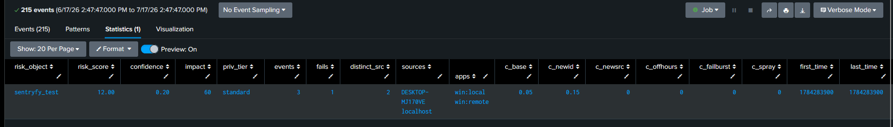

# T1078 — Valid Accounts

## 1. Scenario

T1078 is the hardest technique in ATT&CK to separate from benign activity: there is no malware, no exploit, no anomalous binary — only a valid credential being used. Every observable signal (off-hours logon, a new source host, a burst of failures) is individually explainable by remote work, a replaced laptop, or a fat-fingered password. ATT&CK v19 reflects this directly: confidence starts at **0.05 for a generic logon** and is capped at **0.70** even when every signal aligns.

The detection thesis follows from that ceiling: **a single rule cannot detect T1078.** Any rule tuned tightly enough to alert on its own will miss the technique; any rule loose enough to catch it will alert on the whole directory. The resolution is not a better rule — it is splitting scoring from alerting across separate layers, which is what Risk-Based Alerting (RBA) exists to do.

This writeup builds that split: a **core feeder** that scores logon anomalies and writes to a risk index without alerting, and a **single universal correlation rule** that consumes every feeder and makes the alerting decision. It also documents the scoring bug that made the architecture necessary, and an asset-normalization defect surfaced by the lab's own data.

---

## 2. Lab Setup

| Component | Detail |
|---|---|
| Host | `DESKTOP-MJ170VE` (Windows 11), Splunk Universal Forwarder |
| Telemetry | Windows Security — EventCode 4624 / 4625, Logon Types 2, 3, 10 |
| SIEM | Splunk 10.4.0, `index=windows_security` |
| Data model | CIM Authentication (`Splunk_TA_windows`), `summariesonly=f` (unaccelerated) |
| Risk store | `index=risk` (custom event index — not Splunk ES) |
| Lookups | `identity_normalize`, `identity_lookup` (file-based, case-insensitive) |
| Baseline | 2026-06-17 → 2026-07-17, ~6,280 authentication events across 29 active days |

> **Note:** This is a single-host lab without a domain controller. Impossible travel (AN1546) and cross-host lateral movement cannot be validated here. What *can* be validated — and is — is the scoring model, the identity resolution layer, and the feeder/aggregator contract. The limitations are enumerated in §10 rather than hidden.

---

## 3. The Scoring Model

The portfolio-wide framework is `risk = impact × confidence`, held constant across every technique so scores stay comparable.

**Impact** is a property of the compromised account, not of the observed event. Per ATT&CK v19:

| Account class | Impact | Rationale |
|---|---|---|
| Standard user | 60 | Foothold established |
| Local admin (reuse potential) | 65 | Pass-the-Hash → lateral movement if no LAPS |
| Privileged / DA / cloud admin / service account | 90 | Tenant- or domain-wide control |

**Confidence** is the probability the observation is malicious. ATT&CK v19 gives three reference points, and the model is calibrated to hit them:

| Reference | Calculation | Meaning |
|---|---|---|
| `60 × 0.05 = 3` | Standard user, one logon | Pure noise |
| `90 × 0.60 = 54` | Privileged, overlapping anomalies | Real signal |
| `90 × 0.70 = 63` | AN1545 (service account interactive + child process) | Near direct-alert |

The 0.70 ceiling is a **budget**, and it gets divided across the detections that contribute to it:

| Layer | Confidence cap | Max score (impact 90) |
|---|---|---|
| Core feeder (this rule) | 0.45 | 40.5 |
| Windows extension | 0.25 | 22.5 |
| **Combined ceiling** | **0.70** | **63** |

That split is a design decision, not a value from ATT&CK. What matters is that the sum respects the documented ceiling — no single identity can exceed 63 from the T1078 family, which is exactly the doc's "near direct-alert" reference point. §9 derives the alerting threshold from that ceiling.

---

## 4. Why a Single Rule Fails

The first iteration attempted scoring and alerting in one search. It used a frequency-based rarity term applied per event, then summed:

```spl
| eventstats count as user_total by TargetUserName
| eval rarity=1/(user_total+1)
| eval conf_rare=rarity*3
| eval confidence=min(0.70, conf_fail+conf_rare+conf_src+conf_rdp)
| eval signal_risk=round(impact*confidence,2)
| stats sum(signal_risk) as total_risk ... by TargetUserName
| where total_risk >= 30
```

Output:

| TargetUserName | total_risk | outcomes | distinct_src | events |
|---|---|---|---|---|
| `lab_user` | **154.26** | Success | 1 | 6 |
| `sentryfy_test` | 84.00 | Failed, Success | 2 | 2 |

**The cleanest account in the dataset scored highest.** Six successful logons, one source, zero failures — ranked above an account with mixed failures from two sources.

The algebra explains it. With `n` events for a user, rarity is computed per-user but multiplied per-event and then summed over all `n`:

```
total_risk = n × impact × 3/(n+1)
```

As `n` grows this converges toward `3 × impact`. The `n` in the numerator cancels the `n+1` in the denominator — **the rarity term does no work.** The more normal a user's behaviour, the higher their score. Verifying against the output: `min(0.70, 3/7) = 0.42857`, `60 × 0.42857 = 25.71` per event, `25.71 × 6 = 154.26`. Exact.

Two further defects followed from the same root:

1. **The cap silenced every other signal.** For `n ≤ 3`, `conf_rare = 3/(n+1) ≥ 0.75` — above the 0.70 cap on its own. `conf_fail`, `conf_src`, and `conf_rdp` were dead code. `sentryfy_test` being a failed logon from two distinct sources contributed exactly nothing to its score.
2. **The threshold filtered nothing.** Minimum possible score for a single-event user was `60 × 0.70 = 42`, so `where total_risk >= 30` always passed. Every user in the search window produced an alert.

The root cause is a category error: **raw authentication events were treated as risk events and summed.** `sum(risk_score)` is an operation on a risk index, not on `index=windows_security`. Six normal logons are one entity's behaviour, not six independent risk contributions.

The fix is structural, not a coefficient adjustment:

> **Collapse to the entity first, score once.** `stats ... by identity` runs *before* any confidence evaluation. Event volume can no longer inflate the score, because volume is consumed by the aggregation. Summation moves to a separate layer that operates on risk events, where it is the correct operation.

---

## 5. Architecture

ATT&CK v19 documents five analytics for T1078 — AN1543 (Windows), AN1544 (Linux/mac), AN1545 (service account), AN1546 (IdP), AN1547 (Kubernetes). These describe *detection opportunities per platform*; they are not an implementation blueprint. Mirroring them 1:1 into five saved searches duplicates the shared logic — new source, off-hours, failure burst — across four codebases with four maintenance points.

The shared fields (`user`, `src`, `dest`, `action`, `app`) are already normalized by the CIM Authentication data model. So the split is not by platform but by **what the data model can see**:

```
CORE (CIM Authentication DM) ──┐
  + Windows extension          │
  + Entra extension            ├──→ index=risk ──→ correlation rule ──→ ALERT
  + Linux extension            │
  + Kubernetes feeder          ─┘
AN1545 (svc account + child process) ────────────────────→ ALERT (standalone)
```

**Core** owns everything computable from `user` / `src` / `action` / `_time` alone, across all platforms. One implementation, one place to fix off-hours logic.

**Extensions** score *only* what the DM cannot represent — Logon Type, NTLM package, MFA state, sudo escalation. Their confidence is **marginal, not total**: for "RDP from a source the user has never used," the *new source* half belongs to core and the *it was RDP* half belongs to the extension. Re-scoring a signal core already covered double-counts one anomaly and inflates the risk sum past a meaningful threshold.

**AN1545 sits outside the architecture entirely.** It requires joining Sysmon EID 1 (or 4688) to the logon via `LogonId` — the Authentication DM has no concept of a child process. It cannot be core, and it cannot be an extension. Per the v19 doc it is one of two family members that approaches direct-alert confidence on its own (`90 × 0.70 = 63`), so it alerts standalone and skips RBA.

The core model also yields a signal that per-platform rules structurally cannot produce: `values(app)`. **An identity showing anomalies on both `win:remote` and `entra` is a far stronger indicator than the same score accumulated on one platform.** That cross-platform correlation is the real argument for the core, not the reduction in code duplication.

---

## 6. Writing the Splunk Query 

[SPL_Query](../../Rules/Splunk-SPL/Initial-Access/valid-accounts.spl)


### 6.1 Signals

| Signal | Weight | Meaning |
|---|---|---|
| `c_base` | 0.05 | An authentication occurred. ATT&CK's stated noise floor — present on every identity, sufficient for none. |
| `c_newid` | 0.15 | Identity absent from the 30-day baseline. Newly created or newly used account. |
| `c_newsrc` | 0.15 | **Established** identity authenticating from a source it has never used. The lateral-movement signature. |
| `c_offhours` | 0.10 | Activity outside 07:00–19:00 or on a weekend. |
| `c_failburst` | 0.15 | ≥5 failures **and** >50% failure ratio. Ratio gate prevents a busy account's normal typo rate from firing. |
| `c_spray` | 0.10 | More than 3 distinct sources in the window. |

Two design points are load-bearing:

**`c_newsrc` requires `fs_identity < -24h`.** Without that gate, `c_newid` and `c_newsrc` score the same anomaly twice — *every* source is new for a new account, by definition. The signals are only independent once "new account" and "established account, new location" are mutually exclusive. Removing the gate inflated `sentryfy_test` from 12.00 to 21.00 on identical evidence.

**`max(fs_pair)`, not `min(fs_pair)`.** `fs_pair` is the first-seen time per (identity, source). An identity using an established host *and* a new one produces two values; `min()` returns the established one and `c_newsrc` never fires — silently missing the exact scenario the signal exists to catch. `max()` returns the newest pair. This bug was masked in single-source lab data where `fs_pair` collapses to `fs_identity`.


### 6.2 Observed Output



Last-24h window, 768 events, 30-day baseline:

| risk_object | risk_score | confidence | impact | c_base | c_newid | c_newsrc | events | fails |
|---|---|---|---|---|---|---|---|---|
| `sentryfy_test` | **12.00** | 0.20 | 60 | 0.05 | 0.15 | 0 | 3 | 1 |

One identity from 768 events. `lab_user` — 154.26 in the broken version — no longer appears: its confidence sits at the 0.05 floor and `where confidence>0.05` discards it. This is the correct behaviour, and it is what makes the rule a feeder: **12.00 is a contribution, not a verdict.**

`sentryfy_test` is a mechanical true positive and a benign one — it is the lab's own test account, freshly created, which is precisely `c_newid`'s definition. This is the "massive false positive surface" the v19 doc cites as the reason confidence stays low. The resolution is not a suppression list: at 12.00 the RBA layer never alerts on it. The system behaves as designed.

---

## 7. Asset & Identity Normalization

The core aggregates `by identity` and counts `dc(src)`. Both depend on one machine having one representation and one account having one name. Querying a single account's last 24 hours returned:

| host | src | dest | app | action |
|---|---|---|---|---|
| `DESKTOP-MJ170VE` | `::1` | `DESKTOP-MJ170VE` | `win:local` | success |
| `DESKTOP-MJ170VE` | `::1` | `localhost` | `win:remote` | success |
| `DESKTOP-MJ170VE` | `DESKTOP-MJ170VE` | `DESKTOP-MJ170VE` | `win:local` | failure |

**One machine, three representations.** Note row 3: on 4625 Windows populates the workstation name, while 4624 reports `::1`. Same host, same session, different event code, different `src` semantics.

Left unnormalized, this single host yields `hist_srcs=2`. `c_newsrc` gates on `hist_srcs>1` — so a phantom source satisfies the gate for free, and a lateral-movement signal fires on an account that never left the machine. In the current data `c_newid` masks it; once `sentryfy_test` ages into the baseline it would surface as a false positive with no obvious cause.

The fix normalizes loopback tokens to the receiving host, **in order** — `dest` first, then `src` referencing the cleaned `dest`:

```spl
| eval loopback="^(::1|127\.0\.0\.1|0\.0\.0\.0|-|localhost|localhost\.localdomain)$"
| eval dest_clean=if(match(lower(coalesce(dest,"-")),loopback), host, dest)
| eval src=if(match(lower(coalesce(src,"-")),loopback), coalesce(dest_clean,host,"unknown"), src)
| eval src=upper(src)
```

Order matters: an earlier version mapped `::1` to `dest`, but `dest` was itself `localhost` — one loopback token exchanged for another. `upper(src)` prevents case variants from splitting one host into two.

`win:local` and `win:remote` now collapse to the same `src`. That is correct for the core: console-vs-network is a Logon Type distinction owned by the Windows extension. Core's question is only *"has this identity used this machine before?"* — and there is one machine.


### 7.1 Identity Resolution

The same problem in the identity dimension is worse, because it defeats RBA outright. `TEVFIK` (sAMAccountName), `tevfik@corp.local` (UPN), and `tevfik` (Linux) are one person; as three `risk_object` values they are three low-scoring identities that never correlate. **Cross-platform correlation is the entire point of the core model, and inconsistent identity resolution silently removes it.**

Mechanical variants are stripped with `eval` before the lookup, keeping the CSV small:

```spl
| eval acct=lower(replace(replace(user,"@.*$",""),"^.*\\\\",""))
| lookup identity_normalize alias AS acct OUTPUT identity
| eval identity=coalesce(identity, acct)
```

Two file-based lookups, both case-insensitive, both with permissions set to global — a lookup readable only by the authoring user resolves to null under a scheduled search's context, and `case` never matches null, so the row vanishes with no error. Both `coalesce()` calls are mandatory for the same reason.

**`identity_normalize.csv`** — genuine cross-platform aliases only, not mechanical variants:

```csv
alias,identity
tevfik.turkoglu,tevfik
t.turkoglu,tevfik
svc-sql-01,svc_sql
sqlservice,svc_sql
```

`da_tevfik` is deliberately **not** mapped to `tevfik`. Same human, different account, different privilege tier — merging them makes `priv_tier` ambiguous. This lookup resolves representations of one account, not accounts of one person.

**`identity_lookup.csv`** — privilege tier, sourced from group membership rather than inferred from the account name:

```csv
identity,priv_tier,owner,watchlist
administrator,tier0,lab,true
da_tevfik,tier0,tevfik,true
svc_sql,service,app,false
svc_backup,service,app,false
localadmin,tier1,lab,false
```

Naming conventions are not an authorization model. A regex like `match(user,"(admin|svc|sql)")` scores `sqlreader` at 90 and misses `tk-adm-01` at 60. In production this file is generated from AD group membership via a scheduled `outputlookup`.

Verified in isolation before touching the core:

```spl
| makeresults
| eval user="CORP\\DA_TEVFIK"
| eval acct=lower(replace(replace(user,"@.*$",""),"^.*\\\\",""))
| lookup identity_normalize alias AS acct OUTPUT identity
| eval identity=coalesce(identity, acct)
| lookup identity_lookup identity OUTPUT priv_tier
| eval priv_tier=coalesce(priv_tier,"standard")
| table user acct identity priv_tier
```

→ `da_tevfik` / `tier0`. Domain prefix stripped, case-insensitive match confirmed, tier resolved.

---

## 8. Unit Testing the Scoring Model

Scoring logic is tested in isolation from telemetry using `makeresults format=csv`. Each row is a scenario; the expected scores are a regression baseline.

```spl
| makeresults format=csv data="identity,events,fails,offhours_events,distinct_src,hist_srcs,off_id,off_src,priv_tier
clean_user,8,0,0,1,1,-25d,-25d,standard
new_account,3,0,0,1,1,-1h,-1h,standard
lateral_da,4,0,2,2,3,-20d,-2h,tier0
brute_force,12,9,0,1,2,-15d,-15d,standard
spray_bot,20,18,5,6,6,-1h,-1h,standard"
| eval fs_identity=relative_time(now(),off_id), fs_src=relative_time(now(),off_src)
| eval impact=case(priv_tier="tier0",90, priv_tier="service",90, priv_tier="tier1",65, true(),60)
| eval c_base=0.05
| eval c_newid=if(fs_identity>=relative_time(now(),"-24h"),0.15,0)
| eval c_newsrc=if(fs_src>=relative_time(now(),"-24h") AND fs_identity<relative_time(now(),"-24h") AND hist_srcs>1,0.15,0)
| eval c_offhours=if(offhours_events>0,0.10,0)
| eval c_failburst=if(fails>=5 AND fails/events>0.5,0.15,0)
| eval c_spray=if(distinct_src>3,0.10,0)
| eval confidence=min(0.45, c_base+c_newid+c_newsrc+c_offhours+c_failburst+c_spray)
| eval risk_score=round(impact*confidence,2)
| table identity priv_tier impact c_newid c_newsrc c_offhours c_failburst c_spray confidence risk_score
```

| identity | confidence | risk_score | asserts |
|---|---|---|---|
| `clean_user` | 0.05 | **3** | Noise floor. Matches ATT&CK's `60 × 0.05 = 3` reference exactly; discarded by `confidence>0.05`. |
| `new_account` | 0.20 | **12** | `c_newid` isolated. `c_newsrc = 0` — proves the double-count gate holds. |
| `brute_force` | 0.20 | **12** | `c_failburst` isolated (9/12 = 0.75 ratio). |
| `lateral_da` | 0.30 | **27** | `c_newsrc` + `c_offhours` on tier0. Established account, new source. |
| `spray_bot` | 0.45 | **27** | Raw sum 0.55 → **cap engaged**. |

The last two rows are the model's proof. A Domain Admin appearing on one new machine overnight, and a noisy bot throwing 18 failures across 6 sources, **score identically at 27** — high impact with few signals equals low impact with many. That equivalence is what `impact × confidence` is for; if the two diverged, the model would be miscalibrated.

`clean_user` landing exactly on ATT&CK's stated noise floor confirms the calibration against the framework rather than against intuition.

---

## 9. The RBA Correlation Rule

One rule, consuming every feeder. There is no `annotations_mitre` filter — per-technique alert rules would defeat the architecture.

```spl
index=risk earliest=-24h latest=now
| stats sum(risk_score) as total_risk,
        dc(detection_id) as distinct_detections, values(detection_id) as detections,
        dc(annotations_mitre) as technique_count, values(annotations_mitre) as techniques,
        values(sources) as all_sources, max(impact) as impact, values(priv_tier) as priv_tier,
        min(first_time) as first_time, max(last_time) as last_time
        by risk_object
| where total_risk >= 50 OR distinct_detections >= 2 OR technique_count >= 2
| sort - total_risk
```

New technique feeders require no change here — they write to `index=risk` and this rule already reads them.

### 9.1 Threshold Derivation

Splunk ES defaults to 100. **In this environment that threshold never fires.** With two T1078 feeders the ceiling is 63 (§3). ES's default assumes 30–40 feeders spanning dozens of techniques; ported without recalculation it produces a silent rule.

The threshold derives from the ceiling: **50 ≈ 80% of 63.** But the score is the weakest of the three conditions. The v19 doc states the operative rule directly — *"the threshold engages only on anomalies overlapping for the same identity"*:

- **`distinct_detections >= 2`** — one detection at 60 is one anomaly. Two detections at 25 each is corroboration. The doc's stated trigger condition.
- **`technique_count >= 2`** — the strongest signal available. An identity producing both T1078 (suspicious logon) and T1003 (credential dumping) is a kill chain regardless of score.
- **`total_risk >= 50`** — the fallback, for accumulation within one technique.

50 is a starting estimate, not a derived value. Once feeders have run for two weeks:

```spl
index=risk earliest=-14d
| bin _time span=1d
| stats sum(risk_score) as daily_risk by _time, risk_object
| stats count as total, p50(daily_risk) as p50, p90(daily_risk) as p90,
        p95(daily_risk) as p95, p99(daily_risk) as p99, max(daily_risk) as max
```

The real constraint is analyst capacity, not statistics: 5 triageable notables/day against 200 identities puts the threshold near p97.5. The number is back-calculated from an alert budget.

### 9.2 Scheduling

The feeder scores a 24-hour window. **Cadence must equal the window.** Running hourly against a `-24h` window writes each anomaly 24 times and multiplies the risk sum by 24, rendering the threshold meaningless.

| Search | Cron | Window | Alert action |
|---|---|---|---|
| `T1078 - Core Feeder` | `0 6 * * *` | -24h → now | **None** — `collect` only |
| `RBA - Risk Incident Rule` | `15 6 * * *` | -24h → now | Notable, `Number of Results > 0` |

Production would narrow both to hourly, cutting detection latency from 24h to 1h.

---

## 10. False Positive Analysis

| Class | Signal fired | Verdict |
|---|---|---|
| Lab test account, newly created | `c_newid` | **Mechanical TP, benign cause.** Scores 12 — never reaches the RBA threshold. No suppression needed. |
| Loopback as distinct source | `c_newsrc` (phantom) | **Defect** — fixed in §7. Would have fired on an account that never left the host. |
| New account's first source | `c_newid` + `c_newsrc` | **Double-count** — fixed by the `fs_identity < -24h` gate in §6.1. |
| Remote work / travel / shared VPN | `c_newsrc`, `c_offhours` | Benign. Unresolvable at core; needs IdP context (AN1546). Accepted — this is why confidence caps at 0.45. |
| Admin traversing hosts | `c_newsrc`, `c_spray` | Benign. Partially resolvable via `watchlist` in `identity_lookup`. |
| CI/automation | `c_spray`, `c_offhours` | Benign. Requires service-account baselining, which AN1545 depends on. |

The v19 doc's framing is the design constraint: T1078's false-positive surface is enormous, and that is *why* confidence stays low. The correct response to most rows in this table is not a suppression list — it is a score too low to alert.

---

## 11. ATT&CK Mapping

| Analytic | Platform | Status | Implementation |
|---|---|---|---|
| **AN1543** | Windows | ✅ Partial | Core (`c_newsrc`, `c_offhours`, `c_failburst`) + planned Windows extension (Logon Type, NTLM). Impossible travel not implementable — single-host lab. |
| **AN1544** | Linux/macOS | ⬜ Planned | Core covers SSH auth via CIM. `sudo`/`su` escalation requires a Linux extension. |
| **AN1545** | Service account | ⬜ Planned | Standalone rule. Requires Sysmon EID 1 ↔ 4624 join on `LogonId`. **Highest-yield analytic in the family**; not implementable via CIM Authentication. |
| **AN1546** | IdP (Entra/Okta) | ⬜ Blocked | No tenant in lab. Core would cover it via CIM on ingest. |
| **AN1547** | Kubernetes | ⬜ Out of scope | K8s audit has no standard CIM mapping — independent feeder, not an extension. |

| Technique | Relationship |
|---|---|
| [T1078](https://attack.mitre.org/techniques/T1078/) | Primary — this rule |
| [T1078.001–.004](https://attack.mitre.org/techniques/T1078/) | Scored at parent level; sub-techniques share detection logic, differ only in impact |
| [T1110](https://attack.mitre.org/techniques/T1110/) | `c_failburst` overlaps Brute Force. Deliberate — the failed→successful chain is T1078's strongest precursor. |
| [T1021.002](https://attack.mitre.org/techniques/T1021/002/) | `c_newsrc` on an established identity is the lateral-movement signature |
| [T1003.001](https://attack.mitre.org/techniques/T1003/001/) | Upstream — credential dumping supplies the valid account. `technique_count >= 2` correlates them. |

---

## 12. Limitations & Next Steps

**Validated:** scoring model against ATT&CK's three reference points; entity-level aggregation eliminating the volume-inflation bug; identity and asset normalization; feeder → risk index → correlation contract; unit-test regression baseline.

**Not validated:** the rule has not been fired by a live simulation. `c_newsrc` on an established identity — the lateral-movement signal — is untested against real telemetry and is provable only in the §8 synthetic case. `c_spray` cannot fire meaningfully on one host.

**Structural limits of the lab:**
- No DC → no domain accounts, no network logons between hosts, no Kerberos
- One host → impossible travel (AN1546) and multi-source spray are unobservable
- No IdP tenant → the cross-platform `dc(apps) > 1` signal, the core's main argument, cannot be demonstrated

**Next:**
1. Windows extension — Logon Type, NTLM downgrade, marginal scoring capped at 0.25
2. AN1545 — Sysmon EID 1 ↔ 4624 `LogonId` join, standalone at `90 × 0.70 = 63`
3. Second DC/member VM → validate `c_newsrc` and `c_spray` against real lateral movement
4. Two weeks of feeder data → replace the estimated threshold of 50 with a percentile-derived value

---
