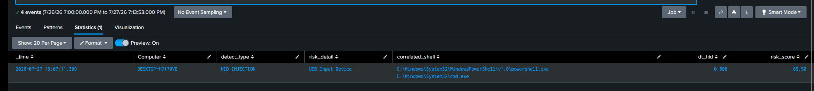

# T1200 — Hardware Additions: Device Class Is Capability, Behaviour Is Intent

**Tactic:** Initial Access · **Technique:** [T1200](https://attack.mitre.org/techniques/T1200/)
**ATT&CK version:** v19
**Lab date:** 2026-07-27 · **Host:** `DESKTOP-MJ170VE` (Windows 11)
**Rule class:** Single RBA feeder — device class × temporal correlation (streamstats, no join)

---

# 1. Scenario

A malicious USB device — a Rubber Ducky, BadUSB, or O.MG cable — is inserted. It registers as a **keyboard** (HID), and within a fraction of a second injects keystrokes that launch a shell and run a payload. The operator does nothing after insertion; the device types on its own.

The detection thesis took two iterations to get right, and the correction is the whole point of this writeup:

> **Device class is capability, not intent.** A Rubber Ducky is an HID. A Logitech mouse is also an HID. Flagging "an HID was inserted" alerts on every keyboard on the network. What separates the attack from the peripheral is not *what* was plugged in but *what happened next* — a shell spawning within seconds of insertion, faster than a human could type.

So the rule scores the **behaviour after insertion**, not the insertion itself. An HID alone is near-zero risk; an HID followed by a shell in under a second is the injection. This is built on Windows Security EID 6416 (device recognized) correlated with Sysmon EID 1 (process create), and hardened through a seven-point self-critique that reshaped the scoring, replaced `join` with `streamstats`, and dropped the HID-alone impact from 90 to 35.

---

# 2. Lab Setup

| Component | Detail |
|---|---|
| Host | Windows 11 (`DESKTOP-MJ170VE`) |
| Device telemetry | Windows Security **EID 6416** (a device was recognized by Plug and Play) |
| Process telemetry | Sysmon **EID 1** (process create) |
| Test devices | KIOXIA USB flash drive (Storage), USB mouse (HID) |
| Correlation | `streamstats time_window=5s` — no `join` |
| Risk store | `index=risk` |

### Preconditions verified

- **EID 6416 is logged** (confirmed present, ~40 events over 30 days — device insertion is inherently rare, so no data-model acceleration is needed; the raw index is already fast).
- **Kernel-PnP and USBSTOR registry auditing are NOT enabled** — 6416 is the only device-recognition source available, which shapes the whole design.

> This technique cannot be tested with a flash drive alone. A USB stick is **Storage**, not HID — it moves files, it doesn't type. Genuine HID injection needs a device that presents as a keyboard. A USB mouse was used to generate real HID telemetry; injection timing was produced by inserting the mouse and manually launching a shell within the correlation window.

---

# 3. The Telemetry — Device Class from CompatibleIds

A 30-day 6416 baseline showed the device classes actually present: `AudioEndpoint` (Realtek), `PrintQueue`, `WPD`/`Volume`/`DiskDrive` (the KIOXIA stick), `Modem` (a Samsung phone), and `USB` mass-storage containers. **No `HIDClass` appeared in 30 days** — which means any HID insertion is, by itself, anomalous against this host's baseline.

Class is derived from the USB `CompatibleIds` field rather than the friendly `ClassName`, because the USB standard class codes are stable where names vary:

| USB class code | device_class | Meaning |
|---|---|---|
| `Class_03` | HID | keyboard / mouse |
| `Class_08` | Storage | mass storage |
| `Class_02` (+SubClass_02) | Network | communications / modem |

A single insertion emits several 6416 records (the KIOXIA produced four — WPD, Volume, DiskDrive, USB). All four resolved to `Storage`; the multi-record inflation is collapsed later by `stats by Computer`.

---

# 4. The Scoring Model — and Its First Mistake

The framework is `risk = impact × confidence`. The **first** version set HID-device impact to 90 — and that was wrong. It scored *any* HID insertion at near-malware level, which would alert on every keyboard swap.

The correction, from the self-critique in §7, separates capability from evidence:

| detect_type | Impact | Meaning |
|---|---|---|
| `HID_DEVICE` (insertion only) | **35** | capability present, no evidence — `35 × 0.60 = 21`, below threshold, **silent** |
| `STORAGE_EXEC` (USB → exec from drive) | 60 | file execution from removable media |
| `NET_CONFIG` (USB NIC → netsh/route) | 75 | possible rogue gateway |
| `HID_INJECTION` (HID → shell < 3s) | 90 | the actual attack |

The number that matters is 21. A mouse plugged in scores 21 — **under the 30 threshold, so it never alerts.** That is the thesis made numeric: capability is silent, behaviour is loud.

Confidence for injection is time-graded, because real HID attacks fire almost instantly:

| dt (insertion → shell) | Confidence |
|---|---|
| 0–1 s | 0.95 |
| 1–2 s | 0.90 |
| 2–3 s | 0.80 |

---

# 5. The Rule

[Hardware-Additions_SPL-Query](../../Rules/Splunk-SPL/Initial-Access/hardware-additions.spl)

The correlation core, in plain terms:

1. Pull 6416 device events **and** EID 1 shell events (including LOLBins) into one stream.
2. `sort 0 Computer _time`, then `streamstats time_window=5s` carries the last HID/Storage/Network insertion time forward per host.
3. For each shell, `dt = shell_time − insertion_time`.
4. `HID_INJECTION` fires when an HID insertion precedes a shell by ≤3s; `STORAGE_EXEC` when the shell runs *from the removable drive*; `NET_CONFIG` when a network device is followed by `netsh`/routing changes.
5. `stats by Computer` collapses the multi-record insertion into one risk event.

The shell set includes the interpreters **and the LOLBins Rubber Ducky payloads favour** — `certutil`, `bitsadmin`, `msiexec`, `curl`, `rundll32`, `regsvr32` — not just `powershell`/`cmd`.

---

# Log Verification in Splunk



---

# 6. Validation

Three real tests, three correct outcomes:

| Test | detect_type | dt | risk_score | Verdict |
|---|---|---|---|---|
| KIOXIA flash drive inserted | Storage | — | (below threshold) | benign — a USB stick is not an attack |
| USB mouse inserted | HID_DEVICE | — | **21.00** | capability only — silent, correct |
| Mouse inserted **+ shell in 0.5s** | HID_INJECTION | **0.508** | **85.50** | injection — alerts |

The `dt=0.508` row is the proof: insertion to shell in half a second, into the 0–1s band, `90 × 0.95 = 85.50`. A human cannot plug in a device and launch a shell that fast in normal use — the temporal impossibility *is* the signal. The mouse-alone row at 21 and the flash-drive row below threshold confirm the other half: neither capability alerts without behaviour.

---

# 7. Iterative Hardening — A Seven-Point Self-Critique

The first working rule passed its test but was not sound. A structured review found seven issues; six materially changed the rule.

| # | Issue | Fix |
|---|---|---|
| 1 | `sort 0` is expensive at scale (streamstats needs sorted input) | Accept it — the feeder window is 5 min, so `sort` runs on hundreds of events, not millions. Scheduled + narrow window makes it cheap. |
| 2 | Network device alerted on insertion alone → FP (USB Ethernet/WiFi/LTE are normal) | `NET_CONFIG` now requires a **following** `netsh`/`route`/`Get-NetAdapter`, not just the device |
| 3 | **HID_DEVICE impact 90 was far too high** — a keyboard is not malware | Dropped to 35 → scores 21, below threshold. The single most important fix. |
| 4 | `dt=0` treated as a separate low-confidence tier | `dt=0` is timestamp resolution, not suspicious; folded into the 0–1s band at 0.95 |
| 5 | `EventCode=1` used where `evt_type="shell"` reads clearer | Switched to `evt_type` throughout |
| 6 | Storage correlated only on process creation | `STORAGE_EXEC` now requires the shell to run **from the removable drive** (`D:\`, `USBSTOR`), not just any shell after insertion |
| 7 | `min(dt_hid)` loses which injection it belongs to | `earliest(dt_hid)` — the first injection's timing |

The reshaping is the lesson: the original rule treated *device class* as the risk. The revision treats device class as **capability** and reserves score for **behaviour** — insertion followed by a shell, execution from the drive, or network reconfiguration. The `join` was also replaced with `streamstats` (see §8).

---

# 8. Why streamstats, Not join

The natural way to correlate two event types is `join` — pull 6416, join EID 1 on host. But `join` is RAM-heavy, capped at 50k subsearch rows, and slow at scale; `max=0` makes it worse. It's avoided in production SOC content.

`streamstats time_window=5s` does the same correlation in a single pass:

```spl
| sort 0 Computer _time
| streamstats time_window=5s
    last(eval(if(evt_type="device" AND device_class="HID", _time, null()))) as hid_time
    by Computer
| eval dt_hid = if(evt_type="shell" AND isnotnull(hid_time), _time-hid_time, null())
```

Each shell simply reads the most recent HID insertion carried forward in the window. No subsearch, no join buffer, no row cap. One correction from the review: `streamstats` requires sorted input, so `sort` is unavoidable — but on a 5-minute feeder window that cost is negligible. On a fleet, the window stays narrow and the search runs scheduled, keeping `sort` cheap.

---

# 9. What This Cannot Catch — and Why That's Correct

6416 requires a **physical** device. These evade it, and most are simply **not T1200**:

| Evades detection | Actually is | Covered by |
|---|---|---|
| `SendInput()` API | software input, T1059 | Execution feeders |
| AutoHotkey | scripted input, T1059 | Execution feeders |
| Pre-installed virtual HID driver | no new device event | — |
| VMware/Hyper-V synthetic input | hypervisor, not physical | — |
| RDP keyboard events | T1021 lateral movement | RDP feeders |
| Abuse of an existing HID | no new 6416 | — |

Missing `SendInput`/AutoHotkey is not a gap — those are software execution (T1059), and the T1200 rule correctly declines them because they aren't hardware additions. The rule holds the boundary of its technique rather than over-reaching into adjacent ones.

---

# 10. ATT&CK Mapping

| Technique | Relationship |
|---|---|
| [T1200](https://attack.mitre.org/techniques/T1200/) | Primary — physical device insertion |
| [T1059.001/.003](https://attack.mitre.org/techniques/T1059/) | The injected payload is script execution; HID_INJECTION is the delivery, T1059 the execution |
| [T1105](https://attack.mitre.org/techniques/T1105/) | LOLBin download (`certutil`, `bitsadmin`, `curl`) in Ducky payloads |
| [T1557](https://attack.mitre.org/techniques/T1557/) | Rogue USB NIC → `NET_CONFIG` as a MITM/gateway precursor |

---

# 11. Limitations & Production Readiness

**Validated:** device-class derivation from `CompatibleIds` on real KIOXIA and mouse telemetry; HID-alone kept below threshold (21); Storage benign; **HID injection correlated on real data at dt=0.508 → 85.50**; `streamstats` correlation replacing `join`.

**Not production-ready:**
- HID injection was timed by manually launching a shell after mouse insertion — a real Rubber Ducky (Digispark/Arduino Leonardo) would confirm sub-second automated timing. The mechanism is proven; the automated source is the next test.
- `Computer=` scope is single-host; fleet baselines will differ (kiosks, shared workstations rotate peripherals).
- `SubjectLogonId` on 6416 is SYSTEM (`0x3e7`), so correlation is by **host+time**, not session — on a multi-user host this could pair a device with an unrelated user's shell. Session-aware correlation needs the device event to carry the true user context.
- No Kernel-PnP / USBSTOR auditing — 6416 is the sole source; enabling those would add depth and defeat some 6416-evasion.

**Next:** Digispark/Arduino Leonardo for true automated HID timing; USB NIC for `NET_CONFIG` validation; EID 11 (file create) correlation to strengthen `STORAGE_EXEC` (USB → dropped EXE → execution).
