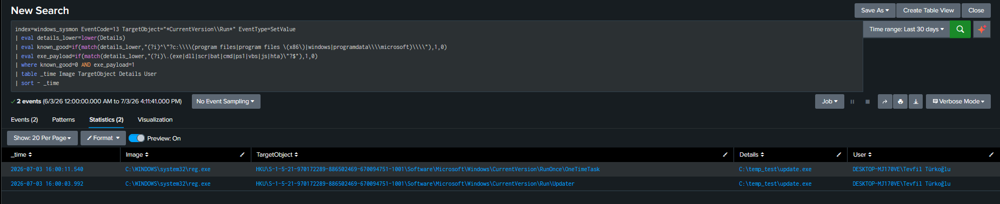

# T1547.001 — Boot or Logon Autostart Execution: Registry Run Keys

---

# 1. Scenario

An adversary establishes persistence by writing a payload path into a Registry Run key, so the binary re-executes on every logon. This is one of the most common and durable persistence techniques — a single `reg add` survives reboots and requires no elevated privileges for the `HKCU` hive.

The detection thesis is **path legitimacy, not key monitoring alone**: Sysmon already logs writes to Run keys, but a write by itself is normal — legitimate software registers autostart entries constantly. The malicious signal is *where the payload lives*: legitimate autostart binaries run from signed, protected locations (`Program Files`, `Windows`), while malware persists from user-writable directories (`Temp`, `Downloads`, `AppData`, or arbitrary paths like `C:\temp_test`). The rule is therefore built as an **allowlist of known-good locations**, flagging everything else.

---

# 2. Lab Setup

| Component | Detail |
|---|---|
| Target | Windows 11 (`DESKTOP-MJ170VE`), Sysmon (SwiftOnSecurity config) + Splunk UF |
| SIEM | Splunk, `index=windows_sysmon` |
| Persistence method | `reg add` to `HKCU\...\CurrentVersion\Run` and `\RunOnce` |
| Sysmon config | `RegistryEvent` include list already covers `CurrentVersion\Run` (verified) |

The SwiftOnSecurity config includes Run keys via a `contains` match, covering `Run`, `RunOnce`, and both hives:

```xml
<TargetObject name="T1060,RunKey" condition="contains">CurrentVersion\Run</TargetObject>
```

**Config constraint (important):** the config itself notes that Sysmon *cannot filter on the `Details` attribute* (the written value) for performance reasons. It can only include/exclude by `TargetObject` (the key). This means the payload-path analysis **must happen in Splunk**, not in Sysmon — a registry-layer echo of the general principle that behavioral detection belongs in the SIEM, not the sensor.

---

# 3. Execution

Two Run-key entries were written, both pointing at a payload in a non-standard directory:

```cmd
reg add "HKCU\Software\Microsoft\Windows\CurrentVersion\Run" /v Updater /t REG_SZ /d "C:\temp_test\update.exe" /f
reg add "HKCU\Software\Microsoft\Windows\CurrentVersion\RunOnce" /v OneTimeTask /t REG_SZ /d "C:\temp_test\update.exe" /f
```

---

# 4. Telemetry

Sysmon EID 13 (RegistryValueSet). All three real events from the window:

```
16:00:03  reg.exe    → ...\Run\Updater           Details: C:\temp_test\update.exe   SetValue
16:00:11  reg.exe    → ...\RunOnce\OneTimeTask    Details: C:\temp_test\update.exe   SetValue
16:00:14  sihost.exe → ...\RunNotification\...    Details: DWORD (0x00000001)         SetValue
```

Key fields: `TargetObject` (which key + value name), `Details` (the written payload path), `Image` (who made the change). The third event (`sihost.exe`, a Windows shell process writing a DWORD notification flag) is benign — it writes no executable path, only a `0x1` flag — and is filtered out by the `exe_payload` condition below.

---

# 5. Detection Logic

### 5.1 Design evolution — from hardcoded path to allowlist

The first draft of this rule scored on a specific suspicious directory (`temp_test`, `Downloads`, etc.). That was wrong: hardcoding the lab's own folder is brittle and would miss any directory an adversary hasn't used yet. A detection must not depend on knowing the attacker's chosen path in advance.

The corrected approach **inverts the logic** — instead of enumerating suspicious locations (infinite, unknowable), it enumerates *legitimate* locations (few, well-known) and flags everything else:

### 5.2 Writing SPL Query 
[SPL_Query](../../Rules/Splunk-SPL/Persistence/registry_run_keys.spl)


### 5.3 Log Verification in Splunk 


Two conditions:
- **`known_good`** — payload runs from `Program Files`, `Windows`, or `ProgramData\Microsoft` (signed, protected locations). These are excluded.
- **`exe_payload`** — the written value is an executable/script (`.exe`, `.dll`, `.ps1`, `.vbs`, `.js`, `.hta`, …), not a DWORD flag or a cleanup command.

Validated output — both persistence entries surface, `sihost` DWORD is excluded:

```
16:00:11  reg.exe → RunOnce\OneTimeTask   C:\temp_test\update.exe
16:00:03  reg.exe → Run\Updater           C:\temp_test\update.exe
```

The rule catches `C:\temp_test\update.exe` **without ever knowing about `temp_test`** — it simply isn't a signed system location. The same rule would catch `C:\Users\Public\evil.exe`, `D:\malware.exe`, or any future path, because the logic is "not on the allowlist," not "on a blocklist." This mirrors the known-good-parent approach used in the cmd.exe execution lab, applied to registry paths.

### 5.4 False Positive Analysis & Rule Refinement

A 30-day baseline of all Run-key writes on this host surfaced the legitimate autostart activity that the allowlist must account for:

| Image / payload | Location | Why it passed / would fail |
|---|---|---|
| `reg.exe → C:\temp_test\update.exe` | non-standard | **True positive** (risk) |
| `OneDriveSetup.exe` (Details = `cmd /c del ...`) | AppData | Passed — `Details` is a cleanup command, not an `.exe` path → `exe_payload=0` |
| `setup.exe` (EdgeWebView) | Program Files | Excluded by `known_good` |
| `sihost.exe` (DWORD flag) | — | Excluded by `exe_payload` |

**The key limitation this exposes:** legitimate updaters that *do* register an executable from `AppData` — OneDrive's normal autostart entry, and (not present on this clean lab host but ubiquitous in production) Chrome's `GoogleUpdate.exe`, Spotify, and Discord — run from user-writable directories and would score `known_good=0`. On this host they happened not to fire (OneDrive's observed writes were cleanup commands, not autostart paths), but a production endpoint will produce these false positives.

They are suppressed the same way as the cmd.exe dev-tool noise — by extending the allowlist with **observed, baseline-derived** paths (never guessed):

```spl
| eval known_good=if(known_good=1
    OR match(details_lower,"(?i)\\\\appdata\\\\local\\\\microsoft\\\\onedrive\\\\")
    OR match(details_lower,"(?i)microsoft\\\\edgewebview\\\\application\\\\.*setup\.exe"), 1, 0)
```

**Stronger long-term approach — signature over path.** The most robust suppression correlates each flagged `Details` path with the signing status of that binary from its EID 1 (process-create) record: a valid signature from a recognized publisher (Google, Spotify AB, Microsoft) is trusted; an unsigned binary from `AppData` is not. This defeats the path-based blind spot where malware simply drops into an updater-like folder — and aligns with a Risk-Based Alerting model (unsigned + non-standard path + generic value name = high score; signed + known updater = low score).

---

# 6. Detection Strategy Mapping (ATT&CK v18 — DET0365 / AN1032)

AN1032 describes correlating Run/Startup key writes carrying new or unusual binary paths, optionally followed by execution from non-standard directories.

| AN1032 element | Status | Evidence |
|---|---|---|
| Registry write under known Run/Startup key | ✅ Covered | EID 13 on `\Run` and `\RunOnce` (§4) |
| Unusual binary path in the value | ✅ Covered | `known_good=0` allowlist logic (§5.1) |
| Followed by execution from non-standard directory | ➖ Not exercised | Proactive detection targets the write itself, before any logon re-execution; correlation with the subsequent EID 1 is possible but out of scope here (see §8) |
| Abnormal parent-child for the writing process | ⚠️ Partial | `Image` captured (`reg.exe`); a `susp_actor` signal (write driven by `powershell`/`mshta`/`rundll32`) can extend this |

---

# 7. Validation

- **Path-agnostic detection confirmed:** the rule flagged `C:\temp_test\update.exe` purely because it is not a signed system location, with no lab-specific path in the query.
- **Benign events excluded:** `sihost.exe` DWORD write and Program-Files `setup.exe` did not appear in results.
- **Real FP surfaced from baseline:** OneDrive AppData activity identified as the class requiring allowlist/signature tuning — documented rather than hidden.

---

# 8. Limitations

- **Allowlist requires environment-specific tuning.** AppData-based legitimate updaters (OneDrive, Chrome, Spotify, Discord) run from user-writable paths and must be added to `known_good` per environment, ideally via signature correlation rather than static path lists.
- **Proactive-only scope.** This rule detects the persistence *write* (EID 13), not the subsequent logon execution. That is by design — catching persistence before it runs is the higher-value moment — but a fuller AN1032 implementation would correlate the written `Details` path with a later EID 1 execution from that path to confirm the chain.
- **`Details` cannot be filtered at the sensor.** Per the Sysmon config, all payload-path logic runs in Splunk; a sensor-side allowlist is not possible, so query performance and completeness depend on the SIEM.
- **Value-name spoofing.** A generic value name (`Updater`) is weakly suspicious, but malware can trivially adopt a legitimate name (`GoogleUpdate`); value name should only contribute to a score, never gate the alert alone.

---

# 9. ATT&CK Mapping

| Technique | Name | Evidence |
|---|---|---|
| **T1547.001** | **Registry Run Keys / Startup Folder** | **`reg.exe → HKCU\...\Run\Updater` = `C:\temp_test\update.exe`** |
| T1547.001 | (RunOnce variant) | `reg.exe → HKCU\...\RunOnce\OneTimeTask` |

---

# 10. Defensive Recommendations

- **Alert on Run/RunOnce writes with a payload outside signed system locations** — the core rule here.
- **Prefer signature correlation over path allowlists** for suppressing legitimate updaters, to avoid the "malware in an updater-shaped folder" blind spot.
- **Feed this into Risk-Based Alerting:** combine path legitimacy, binary signature, value-name normality, and writing-process lineage into a single score rather than a binary allow/deny.
- **Baseline Run keys periodically** — the set of legitimate autostart entries drifts as software is installed; a stale allowlist silently reopens gaps.