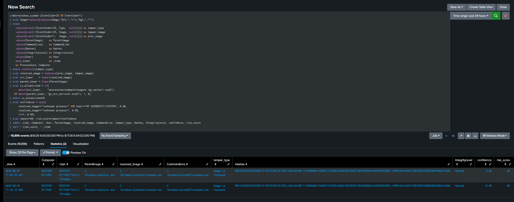

# T1055 — Process Injection: One Parent, Four Detection Clusters


# 1. Why This Technique Is Structured, Not Single

T1055 has **12 sub-techniques**, and the instinct is to write 12 detections. That is wrong, and the reason is the whole design of this entry:

> **Sub-techniques are split by *adversary method*. Detections are split by *telemetry primitive*. The two do not line up.** `.001` DLL Injection and `.002` PE Injection both produce `CreateRemoteThread` — the *same* detection. But `.003` Thread Hijacking (`SetThreadContext`) and `.004` APC (`QueueUserAPC`) **create no new thread at all** — the sensor that catches .001/.002 is completely blind to them. Same parent, opposite telemetry.

So T1055 is covered as **one parent + four detection clusters**, not 12 sub-entries:

| Cluster | Subs | Primitive | Ceiling | Status |
|---|---|---|---|---|
| **C1 Remote thread** | .001 DLL, .002 PE | Sysmon EID 8 CreateRemoteThread | 0.85 | *pending* |
| **C2 Thread-less** | .003 Thread Hijacking, .004 APC | EID 8 **blind** — only EID 10 access rights | 0.5 | *pending* |
| **C3 Create-suspended** | .012 Hollowing, .013 Doppelganging | Sysmon EID 25 + EID 1 enrichment | 0.8 | **this writeup** |
| **C4 Linux/macOS** | .008 ptrace, .009 proc mem, .014 VDSO | auditd ptrace / task_for_pid | 0.7 | out of scope (Windows lab) |

**Telemetry reality, stated up front:** Sysmon alone gives a **practical ceiling of ~0.6** on this technique, because cluster C2 is entirely invisible to it. EDR kernel callbacks and the ETW Threat-Intelligence provider are far superior. This lab runs Sysmon only, so the blindness is real and is documented rather than hidden.

This document covers **C3**. C1 and C2 are separate rule files under the same parent.

---

# 2. C3 Scenario

A process is created and its on-disk image is replaced in memory before it runs — **process hollowing**. The classic shape: launch a legitimate binary (`notepad.exe`), unmap or overwrite its image, write a malicious PE (`cmd.exe` payload) into the same address space, repoint the entry point, resume. To the OS and to a casual look at the process list, it is still `notepad.exe` — signed, correct path, correct hash on disk. The malice lives only in memory.

The detection thesis for C3, and the honest correction that came out of the lab:

> **EID 25 is the only sensor that sees this — and it only sees *one shape* of it.** Sysmon ProcessTampering fires on image replacement (hollowing) and herpaderping. It is blind to every injection that doesn't rewrite the target's image — DLL injection, shellcode into fresh RWX, APC, thread hijacking. C3 is not "process injection detection." It is "image-tampering injection detection," and it rests on a single sensor.

---

# 3. Lab Setup

| Component | Detail |
|---|---|
| Host | Windows 11 (`DESKTOP-MJ170VE`), Sysmon **v15.20** |
| Tamper telemetry | Sysmon **EID 25** (ProcessTampering) — `Type: Image is replaced` |
| Enrichment | Sysmon **EID 1** (process create), joined on `ProcessGuid` |
| Generation | Atomic Red Team **T1055.012** (FuzzySecurity `Start-Hollow.ps1`, section-based) |
| SIEM | Splunk (`index=windows_sysmon`, `sourcetype=XmlWinEventLog`) + Sentinel (parity) |
| Risk store | `index=risk` (feeder) |

### Preconditions verified

- **Sysmon ≥ 13** — confirmed v15.20; EID 25 was introduced in Sysmon 13, so anything older silently ignores the `<ProcessTampering>` config line. Verified with `Sysmon64.exe -c`.
- **EID 25 enabled** in config (SwiftOnSecurity v74 base, `onmatch="exclude"`, only Edge excluded — so it logs almost everything).
- **Generation is fragile.** The first `Invoke-AtomicTest T1055.012` run failed on all four tests: the PowerShell test threw a `ParentPID` array-transformation error, the VBA RunPE was access-denied, and both Go tests failed at `VirtualAllocEx`. **No hollow occurred, so no EID 25 was produced.** The sensor was never the problem — the attack simply hadn't happened. This is the T1055 analogue of the T1200 "test with the right device" lesson: verify the technique fired before blaming the detection.

### The generation fix

Atomic test #1's script line `$ppid = Get-Process explorer | select -expand id` returns an **array** when multiple `explorer` instances exist (normal on Win11), and `Start-Hollow` expects `[int]`. Bypassed by calling the script directly with a single PID:

```powershell
. "C:\AtomicRedTeam\atomics\T1055.012\src\Start-Hollow.ps1"
$ppid = Get-Process explorer | Select-Object -First 1 -ExpandProperty Id
Start-Hollow -Sponsor "C:\Windows\System32\notepad.exe" -Hollow "C:\Windows\System32\cmd.exe" -ParentPID $ppid -Verbose
```

`-First 1` collapses the array. The verbose output confirmed a clean hollow: `Created section from file handle` → `Duplicated .text/.data/.rdata... to the Sponsor` → `New process ImageBaseAddress => 40000000` → `Rewrote Hollow->PEB->pProcessParameters` → `Created Hollow main thread` → **True**. The window titled "Hollow" ran `cmd.exe` internally.

---

# 4. The Telemetry — and the First Trap

A single hollow produced a matched pair on the **same** `ProcessGuid` (`{0300061f-eedb-6a75-23dc-060000005000}`, PID 16732):

**EID 25 (ProcessTampering):** `Image: C:\Windows\System32\notepad.exe`, `Type: Image is replaced`, `User: <user>`.

**EID 1 (process create):** same GUID, `Image: notepad.exe`, `ParentImage: explorer.exe`, `CommandLine: notepad.exe`, `IntegrityLevel: Medium`, `Hashes:` **the genuine notepad hash**.

The trap is in the EID 1 row: **there is no mismatch.** The command line is clean, the hash is real notepad, the path is correct — because FuzzySecurity launches the *real* on-disk notepad and only rewrites memory afterward. **EID 1 is captured at process birth, when the image is still clean.** An analyst looking at EID 1 alone sees a normal Notepad launch. The entire detection rests on EID 25.

---

# 5. The Baseline — Legitimate Tampering Is Real

A one-hour EID 25 baseline on a single idle host was **not empty**. Three distinct profiles appeared:

| Source | Image | User | What it is |
|---|---|---|---|
| the hollow (×2) | `notepad.exe` | user | the attack |
| Azure Arc | `gc_worker.exe` | SYSTEM | **legitimate** self-modification |
| Azure Arc (unresolved) | `<unknown process>` | SYSTEM | **same agent**, image unresolved at tamper time |

`gc_worker.exe` is the Azure Connected Machine Agent's guest-configuration worker (`-a WindowsDefenderExploitGuard`, `-a AuditSecureProtocol`), which rewrites its own image during compliance scans. **Legitimate injection is everywhere** — the central problem of T1055 — and here it appeared on a bare lab host with nothing installed but the agent. Allowlisting is not optional; it is a prerequisite.

---

# 6. The Scoring Model — and Its Mistakes

Framework: `risk = impact × confidence`. Impact for image-tampering injection is **60** (evasion + trust inheritance). Confidence is capped at **0.8** for C3 (parent ceiling 0.85; C3 sits just under).

| Condition | Confidence | Meaning |
|---|---|---|
| Resolved image, not allowlisted | 0.80 | clear tamper, known process → `60 × 0.80 = 48` |
| `<unknown process>`, non-SYSTEM | 0.60 | unresolved, still suspicious |
| `<unknown process>`, SYSTEM | 0.40 | unresolved + system context → `60 × 0.40 = 24`, feeder-only |

**Two mistakes the first rule made — both from trusting the wrong field:**

1. **Allowlist keyed on EID 25's `Image`.** On the legitimate Arc events, `Image = <unknown process>`, not the path — so the allowlist *missed them entirely* and they scored **48, identical to the real attack.** The rule could not tell the hollow from Azure Arc.
2. **Confidence downgrade never fired.** The condition tested `Image == "<unknown process>"`, but the raw value is HTML-escaped `&lt;unknown process&gt;`. String equality failed; everything defaulted to 0.80.

Root cause of both: **EID 25's `Image` is unreliable** (it can be `<unknown process>`). The correct identity lives in EID 1. So the enrichment join must happen **before** the allowlist and confidence decisions, and both must key on the *resolved* image.

---

# 7. The Rule

[t1055-c3-hollowing.spl](../../Rules/Splunk-SPL/Privilege-Escalation/process-hollowing.spl)

Correlation core, in plain terms:

1. Pull EID 25 **and** EID 1 into one stream; unescape `&lt;`/`&gt;`.
2. `stats by ProcessGuid` — collapse both event types per process into one row (no `join`, consistent with the T1200 decision to avoid subsearch row-caps).
3. `resolved_image = coalesce(EID1_image, EID25_image)` — **EID 1 re-identifies the `<unknown>` events.**
4. Allowlist and confidence key on `resolved_image` + parent, on **path**, never on name.
5. Score, filter below threshold, emit to `index=risk`.

The enrichment does more than decorate: it **re-identifies** events EID 25 couldn't resolve. The three `<unknown process>` rows became `gc_worker.exe` once joined to their EID 1 by `ProcessGuid` — which is exactly what let the allowlist catch them.

---

# 8. Validation

| Test | resolved_image | User | risk_score | Verdict |
|---|---|---|---|---|
| Hollow #1 (notepad ← cmd) | `notepad.exe` | user | **48** | injection — alerts |
| Hollow #2 (notepad ← cmd) | `notepad.exe` | user | **48** | injection — alerts |
| Azure Arc (resolved) | `gc_worker.exe` | SYSTEM | — | allowlisted — silent |
| Azure Arc (`<unknown>` ×3) | → `gc_worker.exe` via EID 1 | SYSTEM | — | allowlisted after resolution — silent |

Five raw EID 25 events → two alerts. The three Arc events, including the two that arrived as `<unknown process>`, were resolved and suppressed. The two real hollows survived at 48.


### 8.1 Validation in Splunk



---

# 9. What This Cannot Catch — and Why It Matters

EID 25 fires on **image replacement only**. Every injection that leaves the target's on-disk image intact is invisible to C3 — and most of T1055 is that:

| Evades C3 (EID 25) | Why | Covered by |
|---|---|---|
| DLL injection (`CreateRemoteThread`+`LoadLibrary`) | target image unchanged; a DLL is *loaded* | **C1** (EID 8) |
| Shellcode into fresh RWX | writes to new allocation, not the image | **C1** (EID 8) |
| APC injection (`QueueUserAPC`) | no thread, no image change | **C2** (EID 10 only) |
| Thread hijacking (`SetThreadContext`) | no thread, no image change | **C2** (EID 10 only) |
| Doppelganging / Ghosting / Transacted Hollow | some variants avoid the unmap pattern Sysmon keys on | uncertain — variant-dependent |

**And EID 1 does not help.** In §4 the EID 1 row for the hollow was completely clean — right command line, right hash. The "suspended create + mismatch" thesis (the intended EID 1 backbone) **did not fire on this variant**, because the payload launched the genuine on-disk binary. C3 caught this attack on a single sensor, and if EID 25 had been blind — as it is for the whole first column above — there would have been nothing.

This is not a strength to advertise; it is the reason C1 and C2 exist.

---

# 10. Iterative Hardening — Self-Critique

| # | Issue | Fix |
|---|---|---|
| 1 | Allowlist keyed on EID 25 `Image` → missed Arc's `<unknown>` events → legit scored 48 | Join EID 1 first; allowlist on `resolved_image` + path |
| 2 | Confidence downgrade compared against `<unknown process>`, but value is `&lt;...&gt;` | Unescape `&lt;`/`&gt;` before comparison |
| 3 | `join type=left [EventCode=1]` — subsearch, 50k cap, inconsistent with T1200 | Single base search + `stats by ProcessGuid` |
| 4 | Allowlist by name → `gc_worker.exe`-named dropper bypasses | Path-anchored regex on the agent's full path |
| 5 | `<unknown process>` after resolution treated as noise | Kept as low-confidence (0.40) feeder — a *genuinely* unresolvable tamper is the real evasion case (fast-dying hollow target) |
| 6 | Claimed "hollowing → EID 25" as general | Corrected: only image-replacement shapes; documented in §9 |

---

# 11. ATT&CK Mapping

| Technique | Relationship |
|---|---|
| [T1055.012](https://attack.mitre.org/techniques/T1055/012/) | Primary — process hollowing |
| [T1055.013](https://attack.mitre.org/techniques/T1055/013/) | Same cluster (C3) — process doppelganging, same EID 25 primitive |
| [T1055](https://attack.mitre.org/techniques/T1055/) | Parent — this is one of four clusters |
| [T1036](https://attack.mitre.org/techniques/T1036/) | Masquerading — the hollowed process wears a legitimate name/hash |

---

# 12. Limitations & Production Readiness

**Validated:** EID 25 image-replacement detection on real hollow telemetry (2 events, risk 48); Azure Arc legitimate-tamper suppression via EID 1 re-identification of `<unknown process>`; path-anchored allowlist; `stats`-based correlation replacing `join`.

**Not production-ready:**
- **Single sensor, single variant.** Only FuzzySecurity's section-based hollow was tested. Other hollowing/doppelganging implementations may not trigger EID 25 at all — untested. A second generation method is the next step.
- **Confidence tiers unproven.** Both surviving events scored 0.80; the 0.60 and 0.40 tiers never fired (Arc events were allowlisted before scoring). To validate them, need a non-allowlisted event that resolves to `<unknown process>`.
- **EID 1 backbone did not fire.** The intended "suspended + mismatch" logic found no mismatch on this variant; C3 currently rests entirely on EID 25.
- **Single host, manual trigger, user-context only.** Fleet baselines will differ; `<unknown>`+SYSTEM volume needs measuring on real endpoints.

**Next:** second hollowing method to test EID 25 generality; produce a non-allowlisted `<unknown process>` to exercise the confidence tiers; then **C1** (EID 8, after removing the `kernel32.dll` StartModule exclude that blinds classic DLL injection) and **C2** (EID 10, documenting the thread-less blindness).