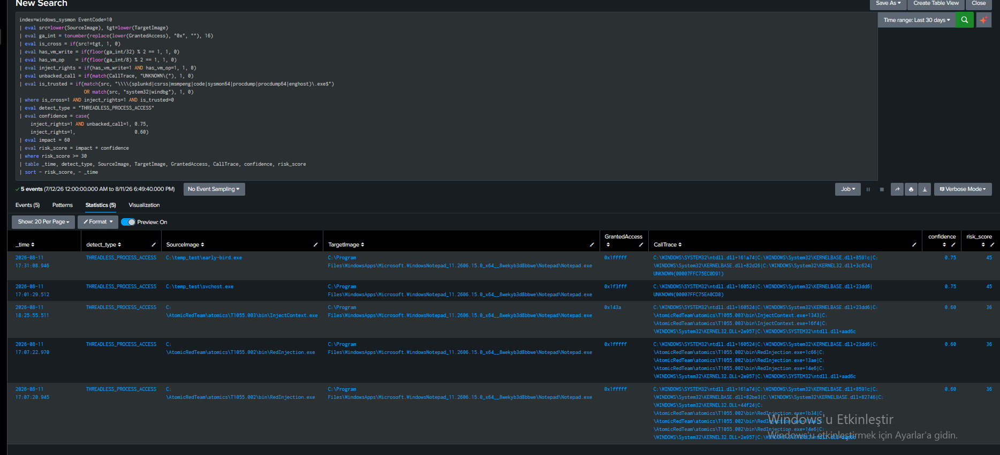
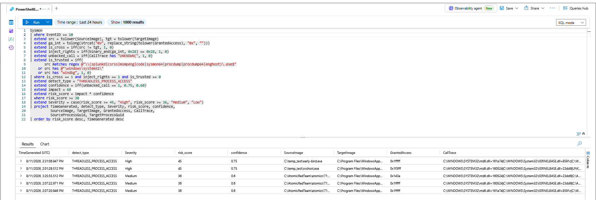

# T1055 · C2 — Thread-less Injection

## 1. Where C2 Sits

T1055 is covered as **one parent + four detection clusters**, not twelve sub-technique rules — because sub-techniques are split by *adversary method* while detections are split by *telemetry primitive*, and the two do not line up.

| Cluster | Subs | Primitive | Ceiling | Status |
|---|---|---|---|---|
| C1 Remote thread | .001, .002 | Sysmon EID 8 CreateRemoteThread | 0.85 | separate file |
| **C2 Thread-less** | **.003 hijack, .004 APC** | **EID 8 blind — EID 10 access rights only** | **0.5** | **this file** |
| C3 Image replacement | .012, .013 | Sysmon EID 25 + EID 1 | 0.8 | separate file |
| C4 Linux/macOS | .008, .009, .014 | auditd ptrace / `task_for_pid` | 0.7 | out of scope |

C2 is the cluster the parent's "~0.6 Sysmon-only ceiling" was written about. Both of its sub-techniques were generated and tested here — and the cluster's central finding is that Sysmon can *see the noise but not the signature*.

---

## 2. Scenario and Detection Thesis

An attacker runs code in a target process **without creating a thread**:

- **APC injection (`.004`, Early Bird):** queues an asynchronous procedure call onto an existing thread; it runs when the thread resumes.
- **Thread hijacking (`.003`):** suspends an existing thread, rewrites its instruction pointer with `SetThreadContext` to point at the payload, resumes it.

Neither calls `CreateRemoteThread`. That one fact defines the cluster, and it is a *negative* result stated up front:

> **EID 8 does not fire for C2 — at all.** Confirmed for both sub-techniques: the APC run and the thread-hijack run each produced zero EID 8 events. C1's entire signal set (StartModule, StartAddress) is absent. C2 begins from a blind sensor and reconstructs the attack from the one operation every injection must perform first — opening a handle to the target — which surfaces as **EID 10 (ProcessAccess)**.

But the deeper thesis, and the one the 30-day baseline forced, is about the *limit* of that reconstruction:

> **EID 10 shows the access, not the act.** It reports that a handle was opened and with what rights — but the operation that actually distinguishes hijacking (`SetThreadContext`) and APC (`QueueUserAPC`) from a legitimate memory dump is **not a Sysmon event**. A debugger and a thread-hijacker leave the *same* EID 10 footprint. C2's rule separates the attacks from most noise, but the residue it cannot separate — legitimate tools that also write to foreign process memory — is exactly the gap that requires EDR.

---

## 3. Lab Setup

| Component | Detail |
|---|---|
| Host | Windows 11, Sysmon **v15.20** |
| Blind sensor | Sysmon **EID 8** — confirmed empty for both `.003` and `.004` (§4) |
| Signal sensor | Sysmon **EID 10** (ProcessAccess) — `GrantedAccess` + `CallTrace` |
| Generation `.004` | Early Bird APC (`early-bird.exe`, hand-written C — same approach as C1) |
| Generation `.003` | Atomic Red Team `T1055.003` (`InjectContext.exe`) — real `SetThreadContext` hijack |
| Splunk | `index=windows_sysmon`, `sourcetype=XmlWinEventLog` |
| Sentinel | `Sysmon` parser — validated at full parity (§7, §8) |

### Preconditions — the EID 10 scope constraint

EID 10 is expensive and off by default. The SwiftOnSecurity base config enables it but scopes it hard, by an `onmatch="include"` on the **target**:

```xml
<ProcessAccess onmatch="include">
  <TargetImage condition="is">C:\Windows\system32\lsass.exe</TargetImage>
  <TargetImage condition="is">C:\Windows\system32\winlogon.exe</TargetImage>
  <TargetImage condition="end with">notepad.exe</TargetImage>
</ProcessAccess>
```

`notepad.exe` was added for testing. **This scope is the largest limitation of C2:** ProcessAccess is only logged when the *target* is one of these three. An APC or hijack against any other process produces no EID 10, and C2 sees nothing. Both tests targeted notepad so the access would be logged (§9).

### Generation

`.004` was hand-written (as in C1, to avoid the Atomic binaries' Win11 fragility seen in C3). `.003` used Atomic's `InjectContext.exe`, which performs a genuine `SetThreadContext` hijack — it ran cleanly where the C3 hollowing atomics had failed. Both targeted notepad. The first goal for each was the negative result: **confirm EID 8 stays silent** while EID 10 captures the handle.

---

## 4. The Telemetry — EID 8 Silent, EID 10 Speaks (Two Different Dialects)

**EID 8:** empty for both. `EventCode=8 SourceImage="*early-bird*"` and `*InjectContext*` returned nothing. Neither creates a remote thread, so no CreateRemoteThread event exists. C1's rule is structurally blind to the whole cluster.

**EID 10:** present for both — but with *different* signatures, and that difference is the story of this cluster.

**APC (`early-bird.exe`):**
```
GrantedAccess: 0x1fffff                          (PROCESS_ALL_ACCESS)
CallTrace:     ... KERNEL32.dll+3c624 | UNKNOWN(00007FFC75EC0D91)
```
Full access, and the call chain **ends in `UNKNOWN(...)`** — an address in no loaded module. This mirrors C1's empty `StartModule`: the call originated from unbacked memory.

**Thread hijack (`InjectContext.exe`):**
```
GrantedAccess: 0x143a                            (VM_WRITE|VM_OP|VM_READ|CREATE_THREAD|QUERY_INFO)
CallTrace:     ... InjectContext.exe+1343 | InjectContext.exe+16f4 | KERNEL32.DLL+2e957 | ntdll.dll+aad6c
```
**Neither signal from the APC case is present.** The mask is `0x143a` — only the rights hijacking needs, *not* `0x1fffff`. And the call trace is fully **backed** — it runs from `InjectContext.exe`'s own on-disk image, no `UNKNOWN`.

| | APC (`.004`) | Thread hijack (`.003`) |
|---|---|---|
| GrantedAccess | `0x1fffff` (all access) | `0x143a` (minimal injection rights) |
| CallTrace | ends in `UNKNOWN(...)` | fully backed, no UNKNOWN |
| Original rule (`0x1fffff` + UNKNOWN) | **caught** | **missed on both signals** |

This is the concrete proof of the limitation C1 and the first C2 draft only predicted: *minimal-rights injection with a backed call site evades a rule tuned to full-access + unbacked calls.* The rule had to be widened to catch `.003` — and widening it is what exposed the cluster's real cost (§5).

---

## 5. Baseline — Why 7 Days Lied and 30 Days Told the Truth

To catch `.003`, the mask test was broadened from exact values (`0x1fffff`, `0x1f3fff`…) to a **bitmask**: any handle carrying `VM_WRITE (0x20)` **and** `VM_OPERATION (0x8)` — the minimum any code-injection needs. `0x143a` passes this; so does `0x1fffff`. The question was what *else* passes.

**A 7-day baseline said: nothing.** Only the four test binaries matched. That was reassuring and **wrong** — an artifact of the short window.

**A 30-day baseline told the truth.** Widening the window surfaced a wall of legitimate `VM_WRITE+VM_OP` access that a bare 7-day view had missed:

| Source | GrantedAccess | What it is |
|---|---|---|
| `procdump.exe` / `procdump64.exe` | `0x1fffff` | Sysinternals memory dump — dozens of events |
| `EngHost.exe` (WinDbg) | `0x1fffff`, `0x12367b` | debugger — dozens of events |
| `Sysmon64.exe` | `0x1fffff` | the monitoring agent itself accessing processes |
| test binaries | `0x1fffff` / `0x143a` / `0x1f3fff` | early-bird, svchost, InjectContext, RedInjection |

**Legitimate software that writes to other processes' memory is real** — debuggers, dump tools, and monitoring agents all take injection-grade rights as their normal function. The 7-day window simply hadn't caught a debugging session. This is the same lesson as C3's dev-box noise, arrived at from the opposite direction: there the bare lab *had* noise (compiler, hypervisor); here the bare lab *hid* it until the window widened. **A baseline is only as trustworthy as its window is long.**

These sources were added to the allowlist (`procdump`, `procdump64`, `enghost`, `sysmon64`, `windbg`, plus the earlier `splunkd`/`csrss`/`code`/`system32`). But that allowlist is a **treadmill**, and its weakness is the heart of §9.

---

## 6. Scoring Model — Two Tiers, and a Standing Conflict With the Matrix

Framework: `risk = impact × confidence`. Impact **60**. The two EID 10 dialects (§4) map directly to two confidence tiers:

| Condition | Confidence | Risk | Which attack |
|---|---|---|---|
| injection rights **and** unbacked `CallTrace` | 0.75 | 45 | APC (`.004`) — two corroborating signals |
| injection rights, **backed** `CallTrace` | 0.60 | 36 | thread hijack (`.003`) — mask only, no call-origin corroboration |

The tiering is itself honest: thread hijacking scores **lower** not because it is less dangerous, but because Sysmon gives *less evidence* for it — only the access mask, with no unbacked-call confirmation. The rule says "I caught this, but I am less sure" — which is exactly right when the only signal is a mask that debuggers also trip.

**The 0.75 tier still exceeds the cluster's stated 0.5 ceiling, and the conflict is unresolved.** The matrix set 0.5 assuming `GrantedAccess` alone. The lab found a second dimension (`CallTrace` origin) for the APC case — but the 30-day baseline then showed even the *combination* is not airtight (the allowlist treadmill, the spoof hole in §9). So the scores are presented as-validated (0.75 / 0.60) for consistency with the figures below, but flagged as **likely over-confident** — both tiers arguably belong nearer 0.5 until the `SetThreadContext` blindness is addressed, which Sysmon cannot do. Raising a cluster ceiling on a single lab's clean-ish baseline is the move this project avoids.

---

## 7. The Rule

Splunk and Sentinel, validated on both with identical output.

[thread-less Splunk Query](../../Rules/Splunk-SPL/Privilege-Escalation/threadless.spl)

KQL port — same bitmask logic (KQL has native `binary_and`, no modulo needed), `risk_score` mapped to dynamic severity (the C1/C3 parity pattern):

[thread-less Sentinel Query](../../Rules/Sentinel-KQL/Privilege-Escalation/threadless.kql)


Two design notes:

- **`unbacked_call` drives confidence, it does not filter.** In the first draft it was a `where` condition — which would have dropped thread hijacking entirely (backed call trace). Moving it into the confidence `case` is what lets the rule catch `.003` at 0.60 while still rating `.004` at 0.75.
- **`detect_type` is `THREADLESS_PROCESS_ACCESS`, not `APC_INJECTION` or `HIJACK`.** EID 10 reports a high-rights cross-process handle — *evidence consistent with* thread-less injection, not proof of which one. The name describes the observation. (Same discipline as C1's `SUSPICIOUS_UNBACKED_THREAD`.)

**A platform note.** C2 depends entirely on `CallTrace`, and unlike EID 25's `Type` or EID 8's `StartModule` it was not obvious this field survives ingestion into Sentinel's `Sysmon` table. It does, intact — full call stack including `wow64` frames — which is why the port is a one-to-one translation rather than a degraded GrantedAccess-only rule (the noisy version the baseline already disproved).

---

## 8. Validation — Both Sub-techniques, Both Platforms

Identical results on Splunk and Sentinel:

| Test | Sub | GrantedAccess | CallTrace | risk | Severity | Verdict |
|---|---|---|---|---|---|---|
| Early Bird APC | `.004` | `0x1fffff` | UNKNOWN | 45 | High | alerts |
| Renamed-source | (spoof) | `0x1f3fff` | UNKNOWN | 45 | High | alerts despite `svchost` name |
| **InjectContext hijack** | **`.003`** | **`0x143a`** | backed | **36** | Medium | **alerts — the widened mask caught it** |
| RedInjection (×2) | `.002` | `0x1fffff` | backed | 36 | Medium | alerts (also an EID 10 emitter) |
| procdump / WinDbg / Sysmon | — | `0x1fffff` | backed | — | — | allowlisted — silenced |

Both `.003` and `.004` alert; the 30-day debugger/dump baseline is suppressed. The `svchost.exe` row is the renamed-source binary from C1's evasion test — it alerts here too, because both rules key on behaviour, not name.

`RedInjection.exe` (`.002` PE injection) also appears here: it belongs to C1 (remote thread) but *also* opens a handle, so it surfaces in EID 10 at 0.60. The same event visible in two clusters is a **dedup case** for the RBA aggregation layer, keyed on `SourceProcessGuid` — noted in C1 as well.


### 8.1 Validation in Splunk




### 8.2 Validation in Sentinel 




---

## 9. What This Cannot Catch — the SetThreadContext Blindness

C2's blind spots are wider than C1's or C3's, and they are the substance of the cluster:

| Evades C2 | Why | Mitigation |
|---|---|---|
| **Out-of-scope target** | EID 10 scoped to lsass/winlogon/notepad; a generic target emits no event | widen the ProcessAccess scope — at heavy noise cost |
| **A renamed debugger / dump tool** | the allowlist is by name/path; a dropper named `procdump.exe` is trusted | none in Sysmon — see below |
| **A minimal-rights variant below VM_WRITE+VM_OP** | e.g. a path not needing VM_WRITE | broaden the mask further — more noise |
| **`system32`-sourced injection** | `is_trusted` excludes system32 to drop legit callers | none in Sysmon |

The decisive limitation is deeper than any of these. **The signature that actually separates a thread-hijacker from a memory-dump tool is `SetThreadContext`, and Sysmon has no event for it.** Consider the 30-day baseline:

- `procdump64.exe` opens notepad with `0x1fffff`, `VM_WRITE` set, backed call trace — to *read* memory for a dump.
- `InjectContext.exe` opens notepad with `0x143a`, `VM_WRITE` set, backed call trace — to *hijack* a thread.

At the EID 10 layer these are **the same event class**. What differs is what happens next: procdump calls `MiniDumpWriteDump`; InjectContext calls `SetThreadContext` + `ResumeThread`. Sysmon sees neither. So the rule cannot distinguish them on evidence — only on the *identity* of the source, which is why the allowlist is load-bearing and why renaming defeats it. This is the precise reason the matrix rates C2 the weakest cluster: **the discriminating act is invisible to the sensor.** Closing it requires EDR kernel callbacks or the ETW Threat-Intelligence provider, both of which observe `SetThreadContext` directly.

**On widening the EID 10 scope.** Switching `ProcessAccess` from a narrow `include` to a broad `exclude` is what a production SOC needs for the first blind spot — and is why "most organizations disable EID 10." The 30-day baseline is a preview of that cost at a single-target scope; fleet-wide it multiplies. That measurement, not an assumption, is the reason the scope was left narrow here.

---

## 10. ATT&CK Mapping

| Technique | Relationship |
|---|---|
| [T1055.004](https://attack.mitre.org/techniques/T1055/004/) | APC / Early Bird — tested (`early-bird.exe`) |
| [T1055.003](https://attack.mitre.org/techniques/T1055/003/) | Thread hijacking — tested (`InjectContext.exe`, real `SetThreadContext`) |
| [T1055](https://attack.mitre.org/techniques/T1055/) | Parent — one of four clusters |
| [T1106](https://attack.mitre.org/techniques/T1106/) | Native API — `OpenProcess`/`SetThreadContext`/`QueueUserAPC` underlying the handle |
| [T1003.001](https://attack.mitre.org/techniques/T1003/001/) | The procdump/WinDbg baseline overlaps LSASS-dump tooling — same EID 10 rights, different intent |

---

## 11. Limitations & Production Readiness

**Validated.** EID 8 confirmed blind to both APC and thread hijacking on real telemetry. EID 10 signal isolated to injection-rights (bitmask) + source reputation, with `CallTrace` origin driving confidence. Both `.003` and `.004` alert; a 30-day baseline of debugger/dump/monitoring noise suppressed. Renamed-source spoofing (from C1) defeated again. **Full Splunk-Sentinel parity** — identical five alerts from independently-written queries.

**Not production-ready:**

- **The `SetThreadContext` signature is invisible to Sysmon** (§9) — the rule cannot distinguish a hijacker from a legitimate dump tool on evidence, only on source identity. This is the cluster's defining ceiling and requires EDR.
- **Allowlist is a treadmill and spoofable.** Every new debugger/dump tool must be added; a dropper renamed to `procdump.exe` bypasses it. Path-anchoring helps but a write into a trusted directory defeats it.
- **EID 10 scope dependency.** Only in-scope targets (lsass/winlogon/notepad) are seen; a generic target is invisible. Widening carries the 30-day baseline's noise, fleet-multiplied.
- **`system32` source bypass** — excluded to drop legit callers, exploitable by a system32-resident dropper.
- **Single host, manual trigger, in-scope target only.** Fleet baselines will carry far more legitimate injection-rights software (anti-cheat, DRM, RPA, installers) that this lab lacks.

